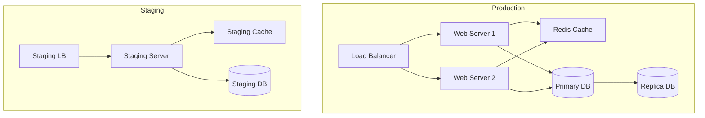

import { Callout } from 'nextra/components'
import { Steps } from 'nextra/components'

# Deployment Documentation

<Callout type="info">
  This section provides comprehensive documentation for the deployment process, including deployment strategies, configuration management, and monitoring.
</Callout>

## Deployment Strategy

### Infrastructure Overview


## Deployment Process

<Steps>
### Pre-Deployment
- Code freeze
- Final testing
- Version tagging
- Backup creation

### Deployment Steps
- Load balancer configuration
- Database migration
- Application deployment
- Cache warming

### Post-Deployment
- Health checks
- Monitoring setup
- Performance validation
- Documentation update
</Steps>

## Configuration Management

### Environment Variables
```bash
# Application
NODE_ENV=production
APP_PORT=3000
API_VERSION=v1

# Database
DB_HOST=db.example.com
DB_PORT=5432
DB_NAME=myapp
DB_USER=app_user

# Redis Cache
REDIS_HOST=cache.example.com
REDIS_PORT=6379

# Authentication
JWT_SECRET=your-secret-key
JWT_EXPIRY=24h

# External Services
API_KEY=your-api-key
STRIPE_SECRET=your-stripe-key
```

## Infrastructure Setup

### Kubernetes Configuration
```yaml
apiVersion: apps/v1
kind: Deployment
metadata:
  name: myapp
spec:
  replicas: 3
  selector:
    matchLabels:
      app: myapp
  template:
    metadata:
      labels:
        app: myapp
    spec:
      containers:
      - name: myapp
        image: myapp:1.0.0
        ports:
        - containerPort: 3000
```

## Database Migration

### Migration Script
```sql
-- Create users table
CREATE TABLE users (
  id SERIAL PRIMARY KEY,
  email VARCHAR(255) UNIQUE NOT NULL,
  name VARCHAR(255) NOT NULL,
  created_at TIMESTAMP DEFAULT CURRENT_TIMESTAMP
);

-- Create orders table
CREATE TABLE orders (
  id SERIAL PRIMARY KEY,
  user_id INTEGER REFERENCES users(id),
  status VARCHAR(50) NOT NULL,
  created_at TIMESTAMP DEFAULT CURRENT_TIMESTAMP
);
```

## Monitoring Setup

### Metrics to Track
```typescript
interface Metrics {
  // System Metrics
  cpu_usage: number;
  memory_usage: number;
  disk_usage: number;

  // Application Metrics
  request_count: number;
  error_rate: number;
  response_time: number;

  // Business Metrics
  active_users: number;
  conversion_rate: number;
  revenue: number;
}
```

## Rollback Procedures

### Rollback Steps
1. Identify failure point
2. Stop incoming traffic
3. Revert database changes
4. Deploy previous version
5. Verify system health
6. Resume traffic

## Security Measures

### Security Checklist
- [ ] SSL/TLS configuration
- [ ] Firewall rules
- [ ] Access controls
- [ ] Secrets management
- [ ] Audit logging
- [ ] Intrusion detection

## Performance Optimization

### CDN Configuration
```javascript
module.exports = {
  async headers() {
    return [
      {
        source: '/static/:path*',
        headers: [
          {
            key: 'Cache-Control',
            value: 'public, max-age=31536000, immutable',
          },
        ],
      },
    ]
  },
}
```

## Maintenance Procedures

### Routine Tasks
- Daily backups
- Log rotation
- Security updates
- Performance monitoring
- Error tracking
- User feedback collection

## Documentation

### API Documentation
```yaml
openapi: 3.0.0
info:
  title: MyApp API
  version: 1.0.0
paths:
  /users:
    get:
      summary: List users
      responses:
        '200':
          description: Success
```

## Incident Response

### Response Plan
1. Incident detection
2. Initial assessment
3. Immediate response
4. Root cause analysis
5. Resolution
6. Post-mortem
7. Prevention measures

## Next Steps
1. [ ] Review deployment checklist
2. [ ] Configure monitoring tools
3. [ ] Set up alerting
4. [ ] Document procedures
5. [ ] Train support team
``` 