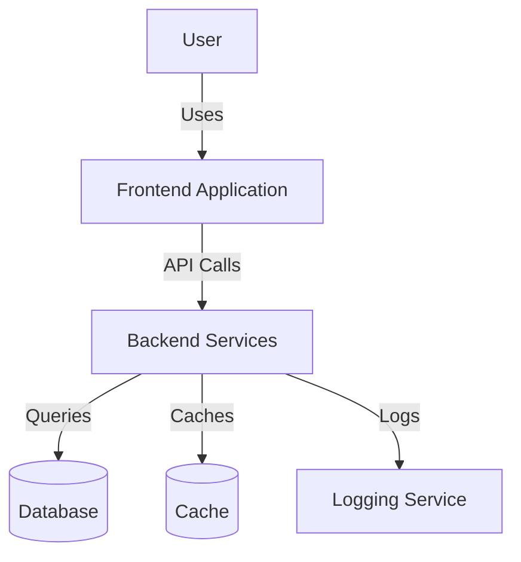
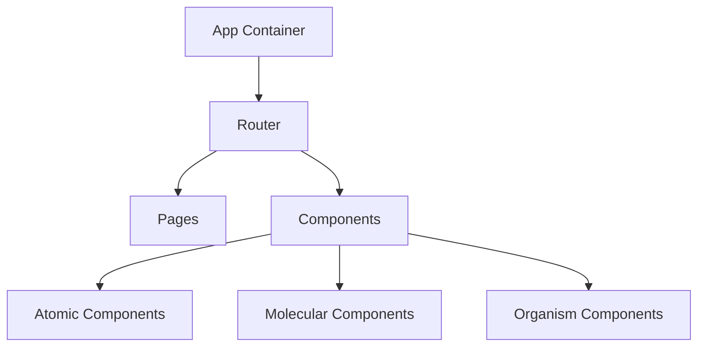
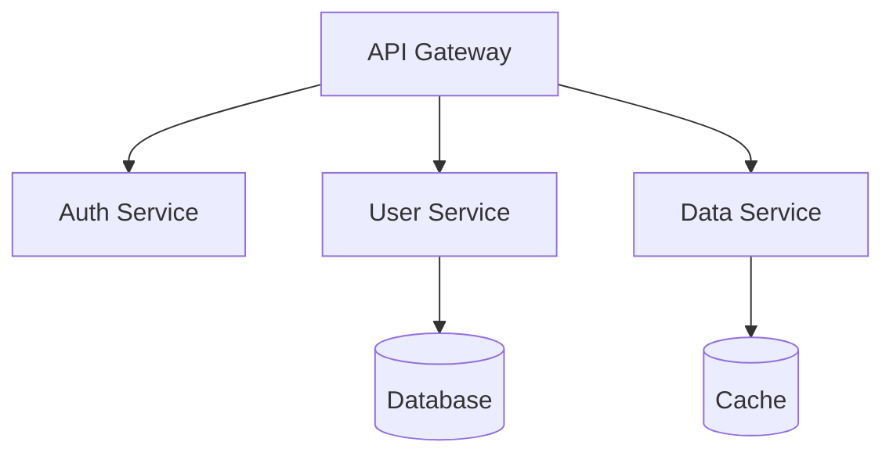
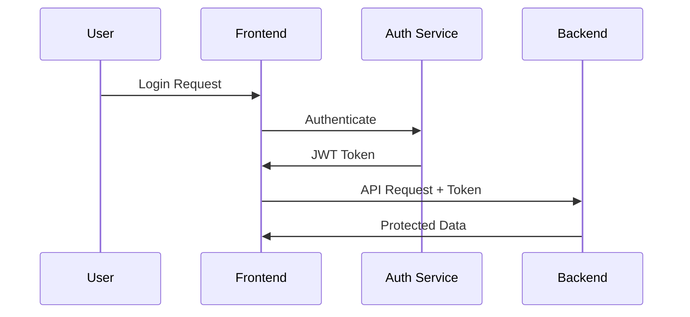
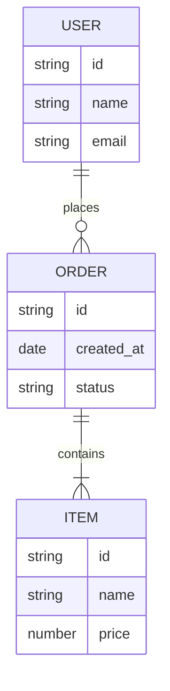
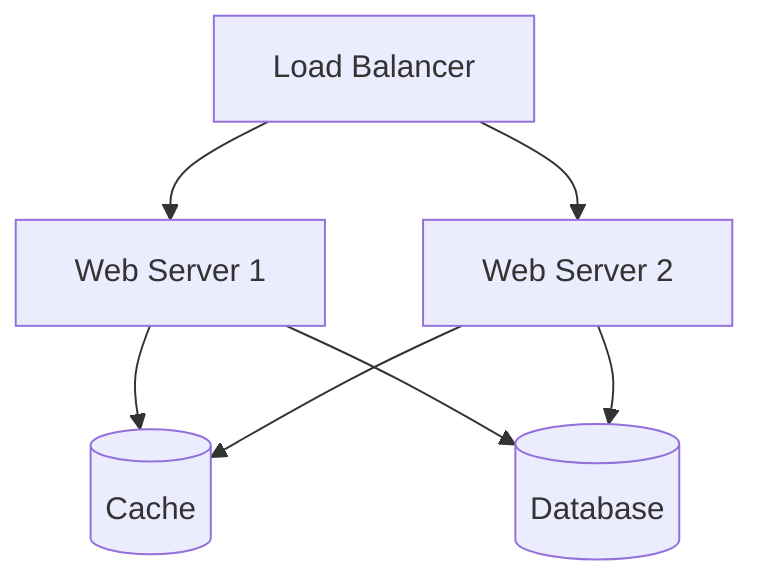

import { Callout } from 'nextra/components'
import { Steps } from 'nextra/components'

# System Architecture Design

<Callout type="info">
  This document outlines the high-level architecture of the system, including its components, interactions, and technical decisions.
</Callout>

## Architecture Overview

### System Context

## Technical Stack

<Steps>
### Frontend
- Framework: [Framework]
- State Management: [Solution]
- UI Components: [Library]
- Build Tools: [Tools]

### Backend
- Language: [Language]
- Framework: [Framework]
- API Style: [REST/GraphQL]
- Authentication: [Solution]

### Database
- Primary Database: [Database]
- Caching Solution: [Cache]
- Data Migration: [Tool]

### Infrastructure
- Cloud Provider: [Provider]
- Container Orchestration: [Solution]
- CI/CD: [Pipeline]
</Steps>

## Component Design

### Frontend Architecture

### Backend Architecture

## Security Design

### Authentication Flow

## Data Model

### Entity Relationship Diagram

## API Design

### RESTful Endpoints
| Endpoint | Method | Description | Auth Required |
|----------|--------|-------------|---------------|
| `/api/users` | GET | List users | Yes |
| `/api/users/:id` | GET | Get user | Yes |
| `/api/orders` | POST | Create order | Yes |

## Performance Considerations

### Optimization Strategies
1. CDN for static assets
2. Database indexing
3. Caching strategy
4. Load balancing

## Monitoring and Logging

### Metrics to Track
- Response times
- Error rates
- Resource usage
- User engagement

## Deployment Architecture

### Production Environment

## Next Steps
1. [ ] Review architecture with stakeholders
2. [ ] Create detailed component specifications
3. [ ] Set up development environment
4. [ ] Begin implementation planning
5. [ ] Create testing strategy 