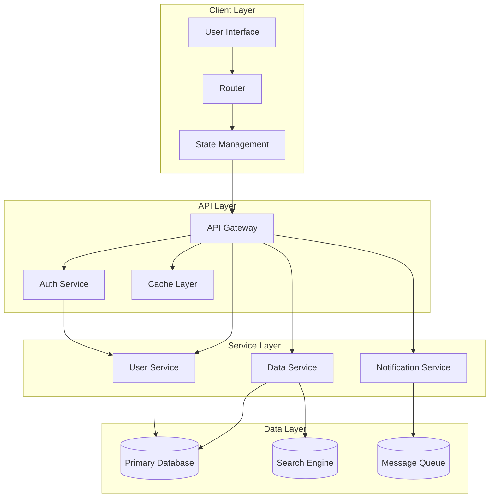
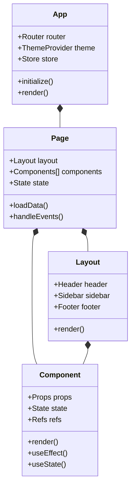
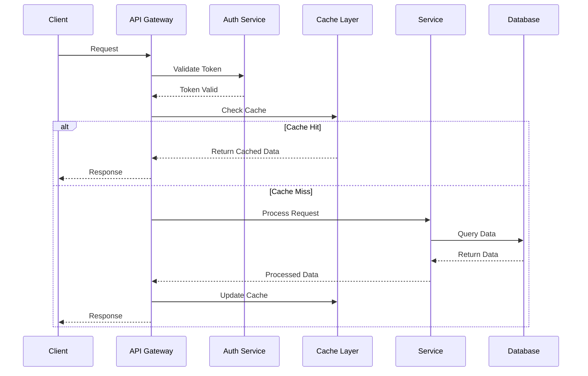
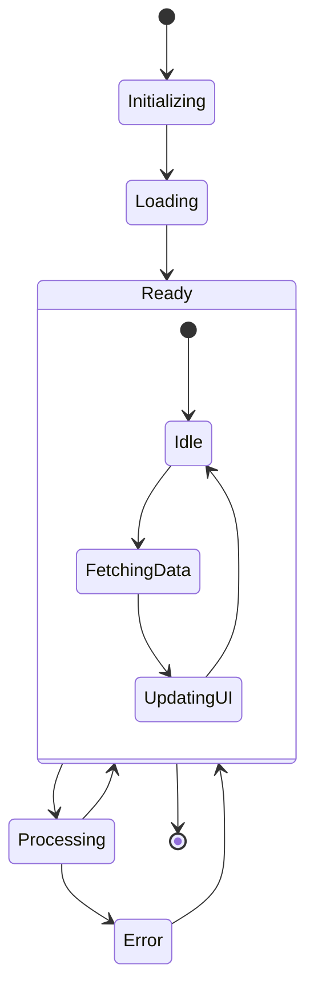
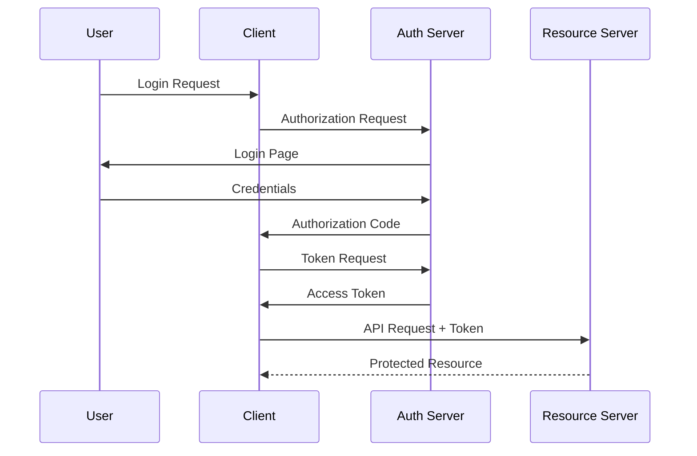
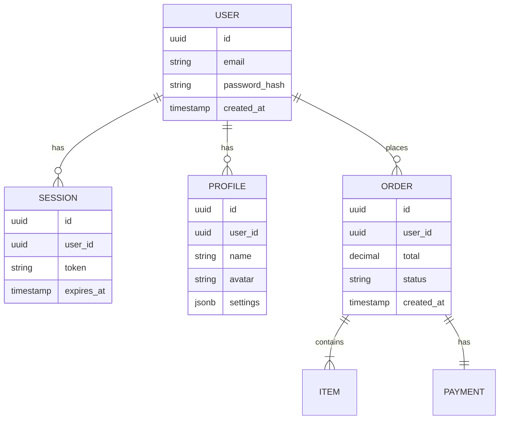
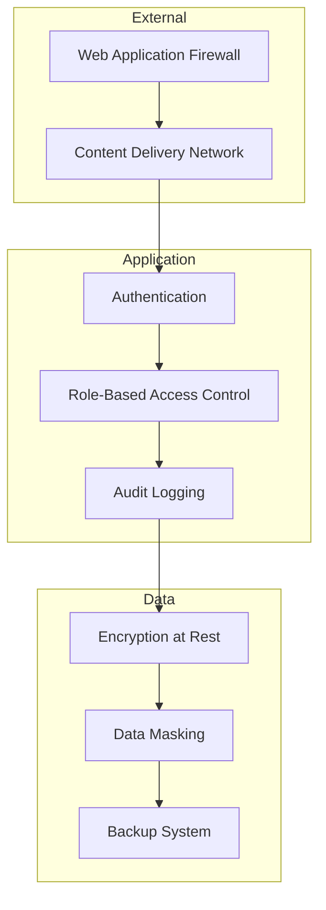
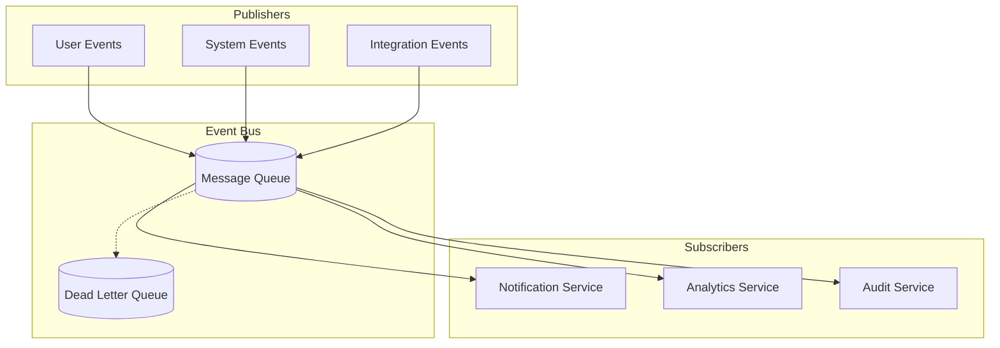
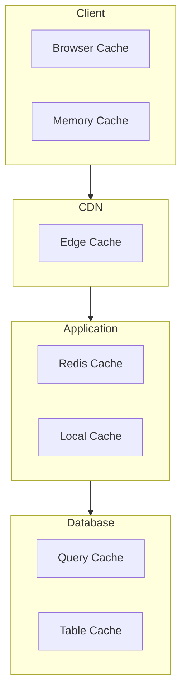

import { Callout } from 'nextra/components'

# Design Phase UML Diagrams

<Callout type="info">
  This section provides detailed UML diagrams illustrating the system architecture, component interactions, data flows, and design patterns.
</Callout>

## System Architecture

### High-Level Architecture


## Component Architecture

### Frontend Component Structure


## Data Flow Architecture

### Request-Response Flow


## State Management

### Application State Flow


## Authentication Flow

### OAuth2 Implementation


## Database Schema

### Entity Relationships


## API Design

### REST Endpoints Structure
```mermaid
graph LR
    subgraph Authentication
        auth[/auth]
        auth --> login[/login]
        auth --> register[/register]
        auth --> refresh[/refresh]
    end
    
    subgraph Users
        users[/users]
        users --> profile[/{id}/profile]
        users --> settings[/{id}/settings]
    end
    
    subgraph Orders
        orders[/orders]
        orders --> create[/create]
        orders --> status[/{id}/status]
        orders --> items[/{id}/items]
    end
```

## Security Architecture

### Security Layers


## Event Architecture

### Event Flow


## Caching Strategy

### Cache Hierarchy


## Next Steps
1. [ ] Review architecture with team
2. [ ] Validate security design
3. [ ] Performance review
4. [ ] Scalability assessment
5. [ ] Documentation update 