import { Callout, Tabs, Tab } from 'nextra/components'

# Design System Documentation

<Callout type="info">
  This section outlines our design system, including visual language, components, and UX patterns.
</Callout>

## Design Principles

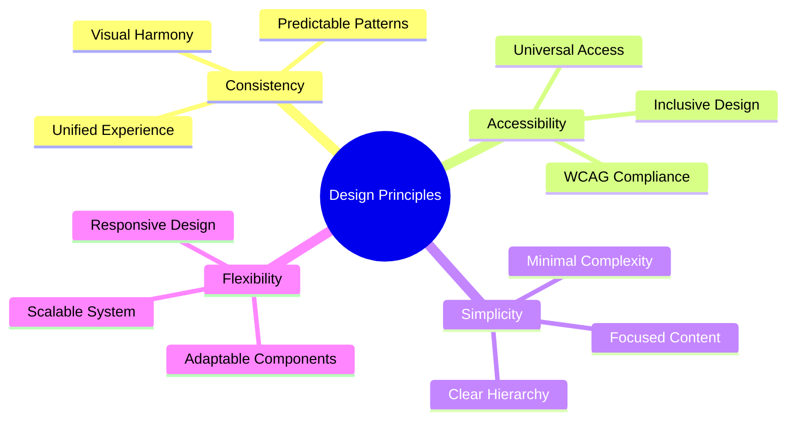

## Color System

### Primary Colors
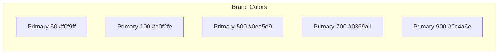

### Semantic Colors
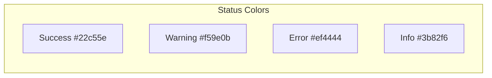

## Typography

### Type Scale
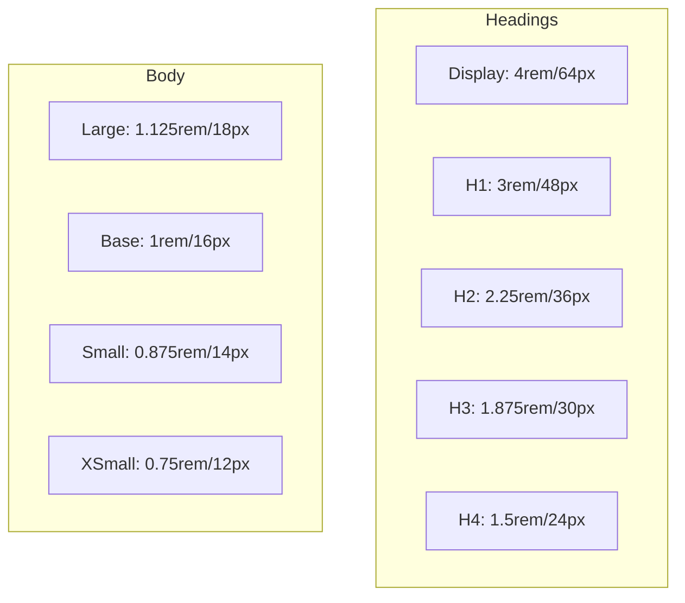

## Spacing System

### Grid System
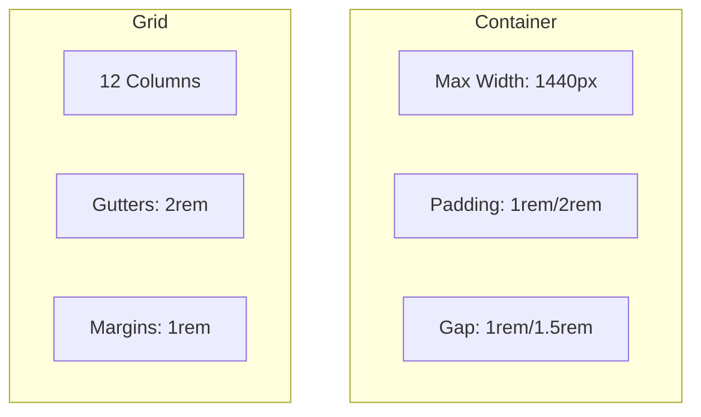

## Component Anatomy

### Button Anatomy
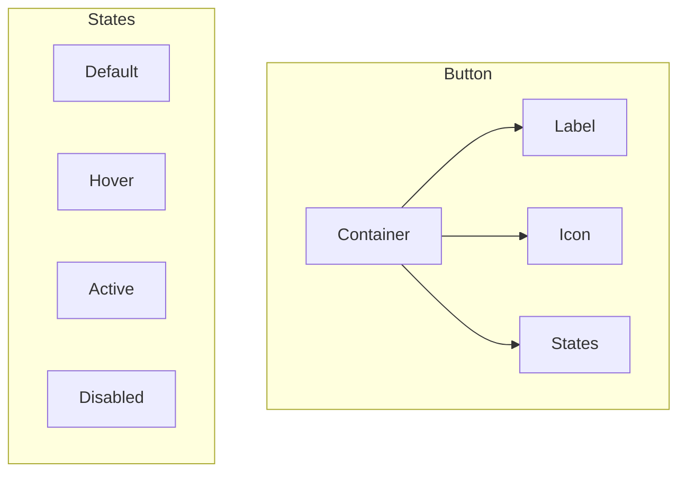

## User Interface Patterns

### Form Pattern
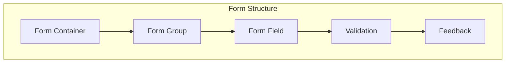

## Motion Design

### Animation Principles
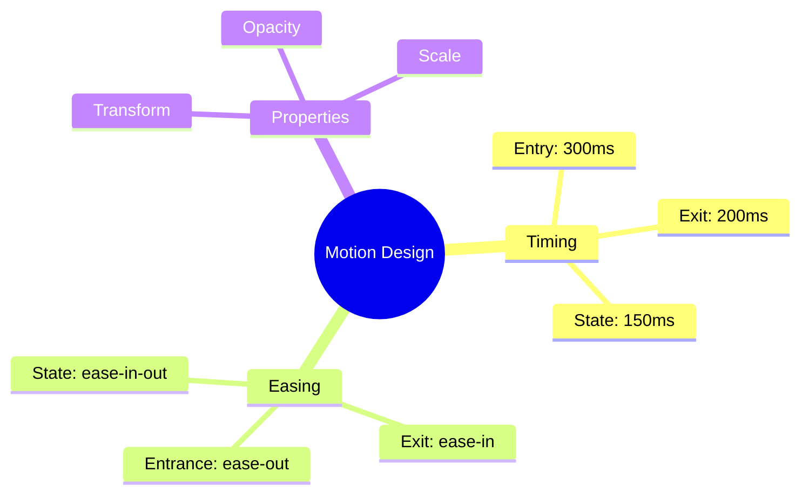

## Responsive Design

### Breakpoints
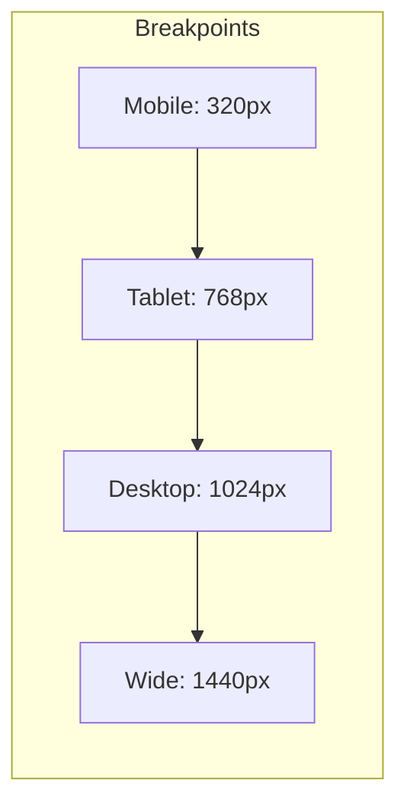

## Accessibility Guidelines

### WCAG Compliance
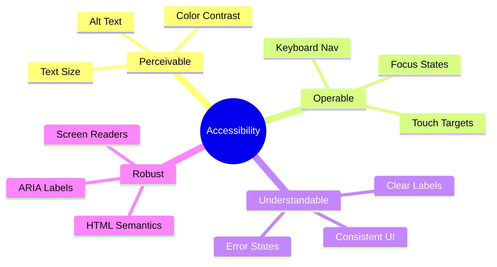

## Design Tokens

### Token Structure
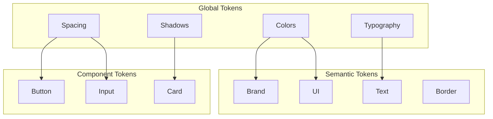

## Design-to-Development

### Implementation Flow
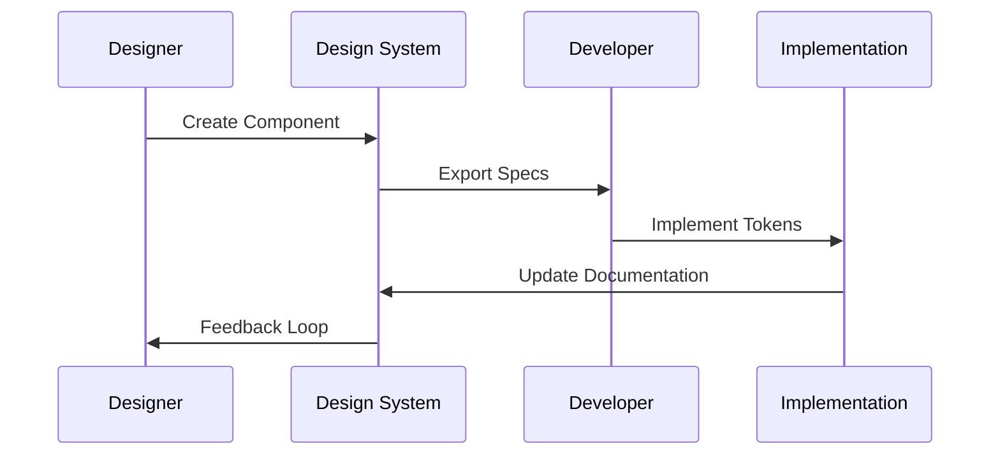

## Next Steps
1. [ ] Complete color system documentation
2. [ ] Add component variations
3. [ ] Create animation examples
4. [ ] Add accessibility guidelines
5. [ ] Update token documentation 