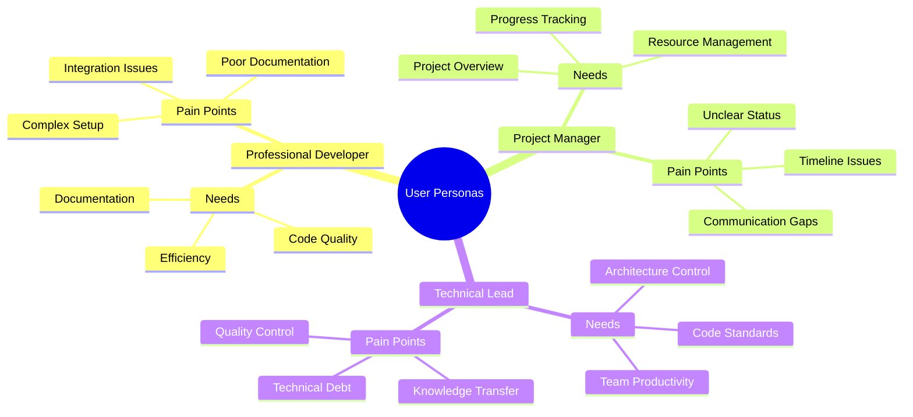
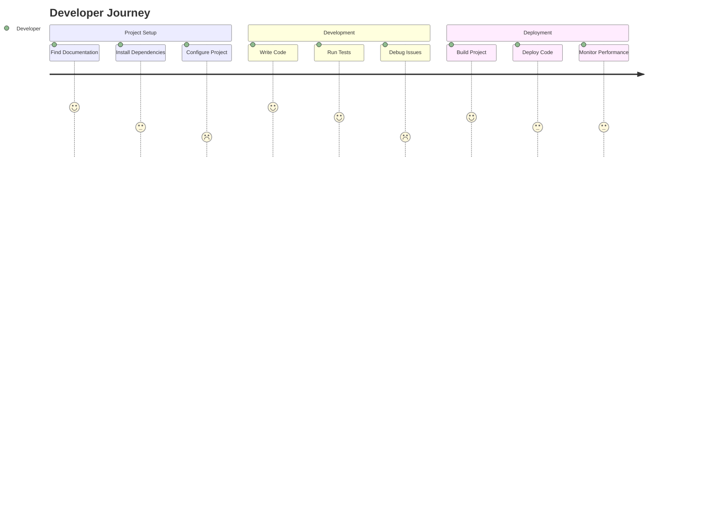
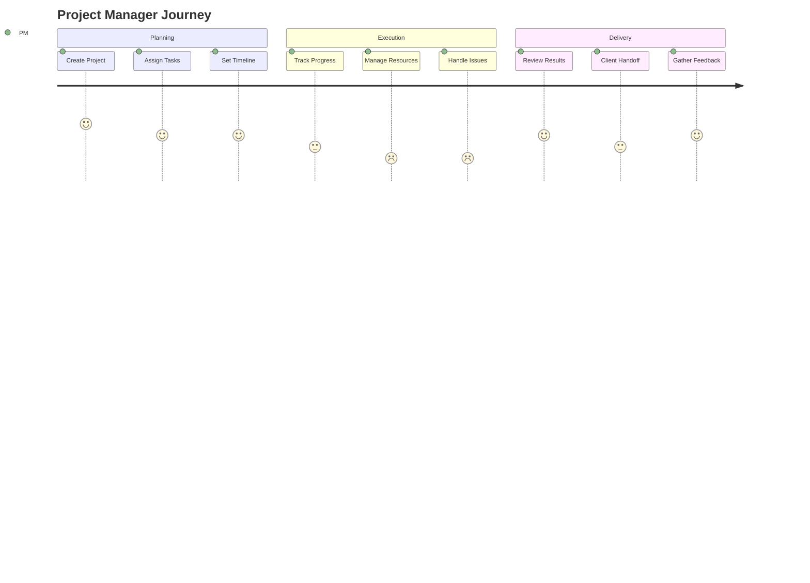
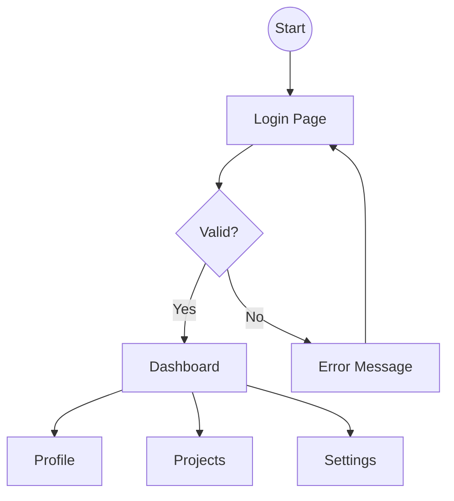
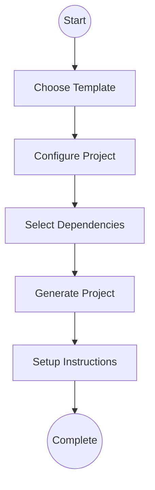
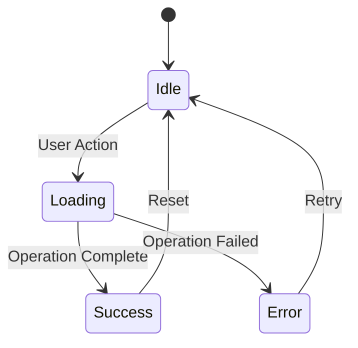
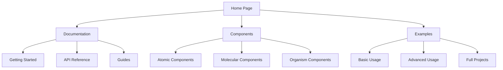
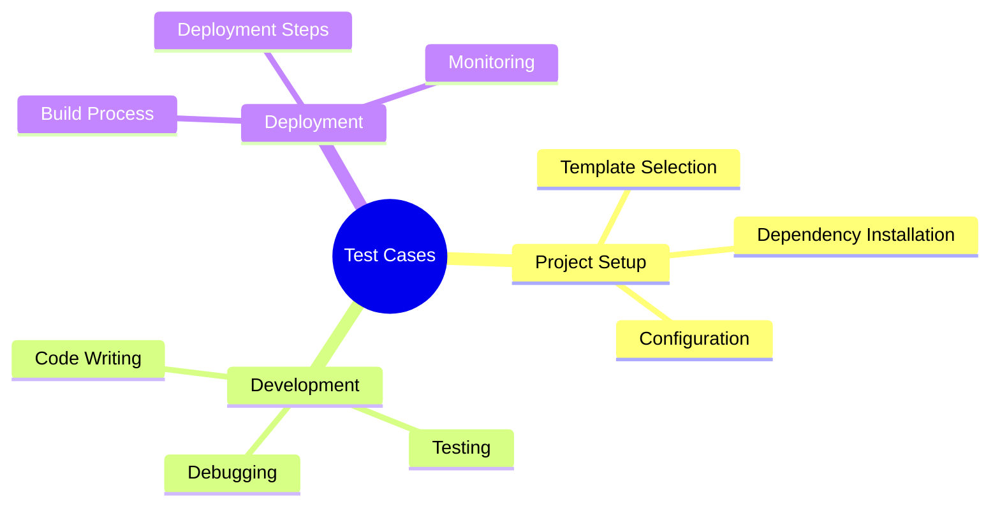
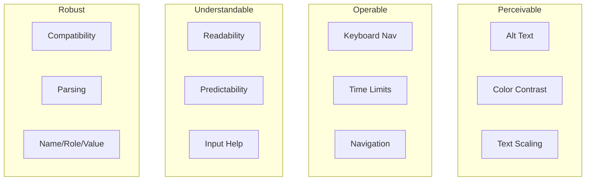
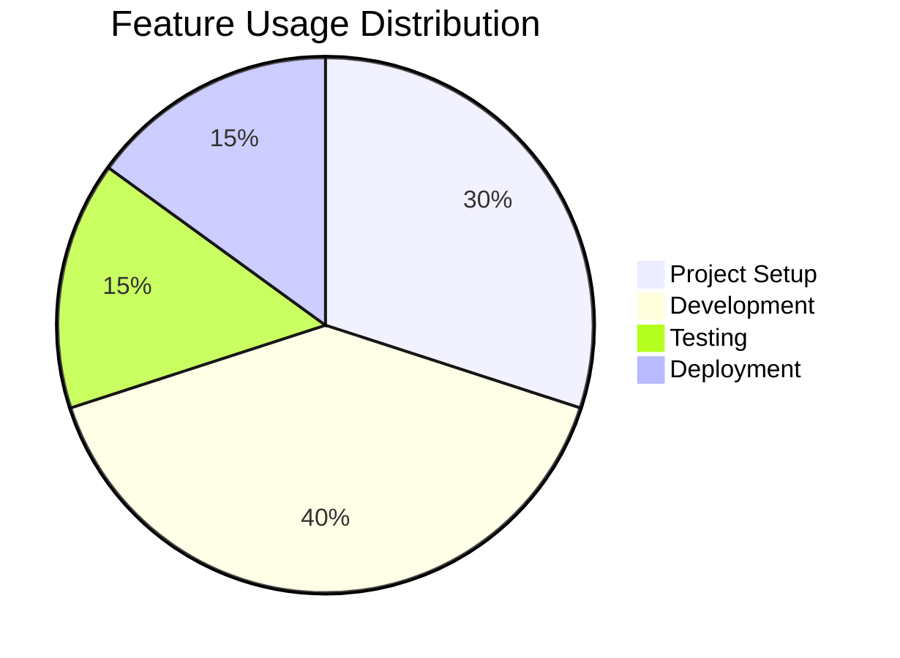

import { Callout, Tabs, Tab } from 'nextra/components'

# User Experience Documentation

<Callout type="info">
  This section details our user experience research, personas, journey maps, and interaction patterns.
</Callout>

## User Personas

### Primary Personas

## User Journey Maps

### Developer Journey

### Project Manager Journey

## User Flow Diagrams

### Authentication Flow

### Project Creation Flow

## Interaction Patterns

### Component States

## Information Architecture

### Site Structure

## Usability Testing

### Test Scenarios

## Accessibility Considerations

### WCAG Guidelines

## Research Findings

### User Testing Results

## Next Steps
1. [ ] Conduct additional user interviews
2. [ ] Refine user flows
3. [ ] Update interaction patterns
4. [ ] Enhance accessibility
5. [ ] Document best practices