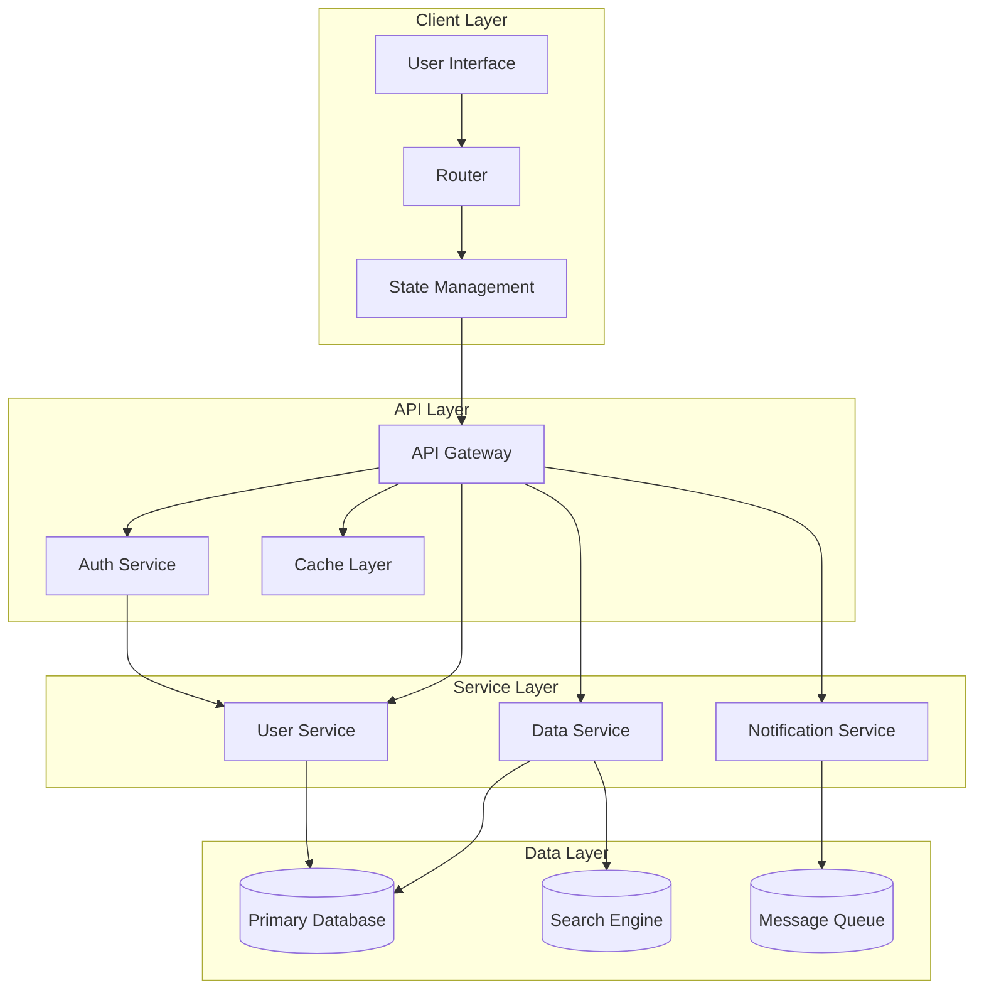
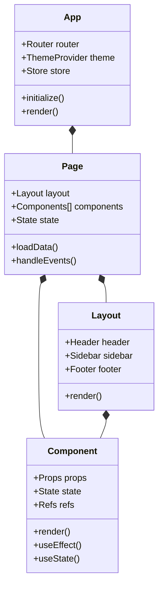
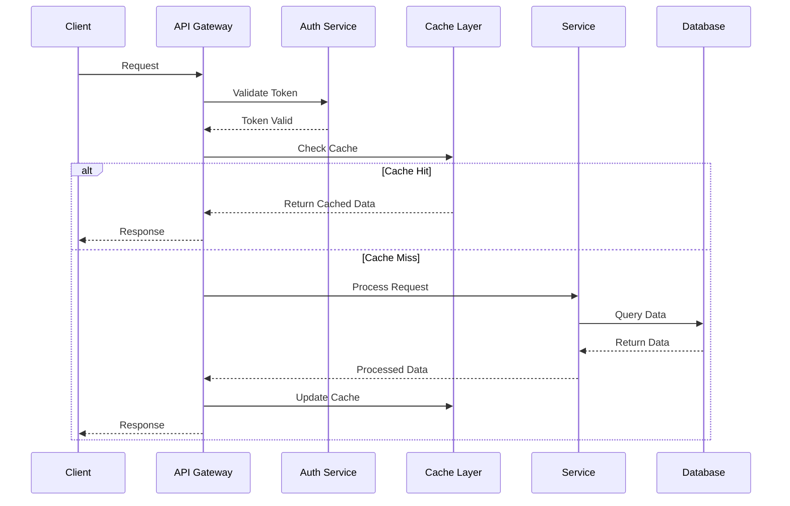
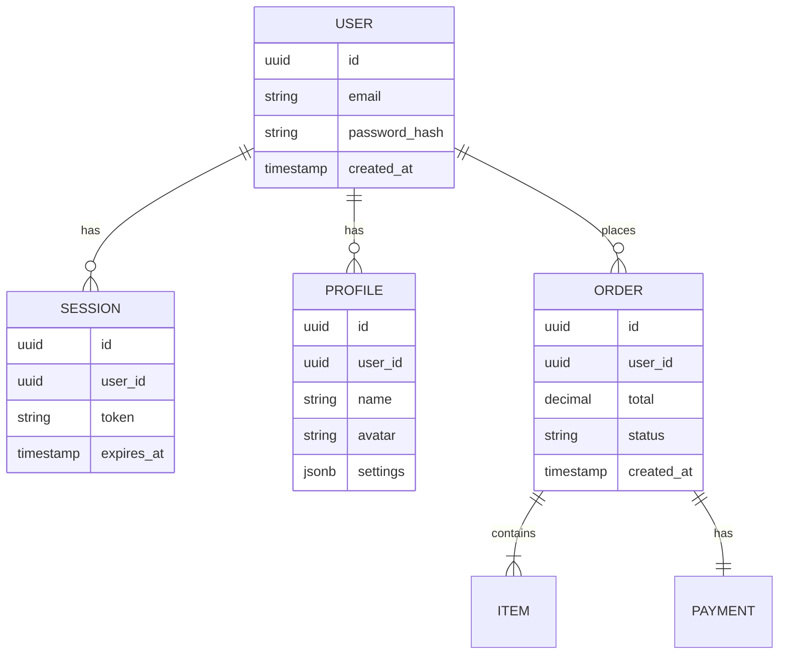
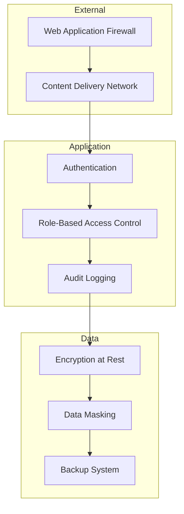
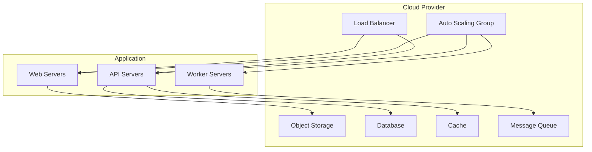
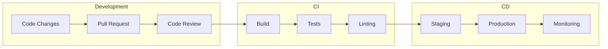
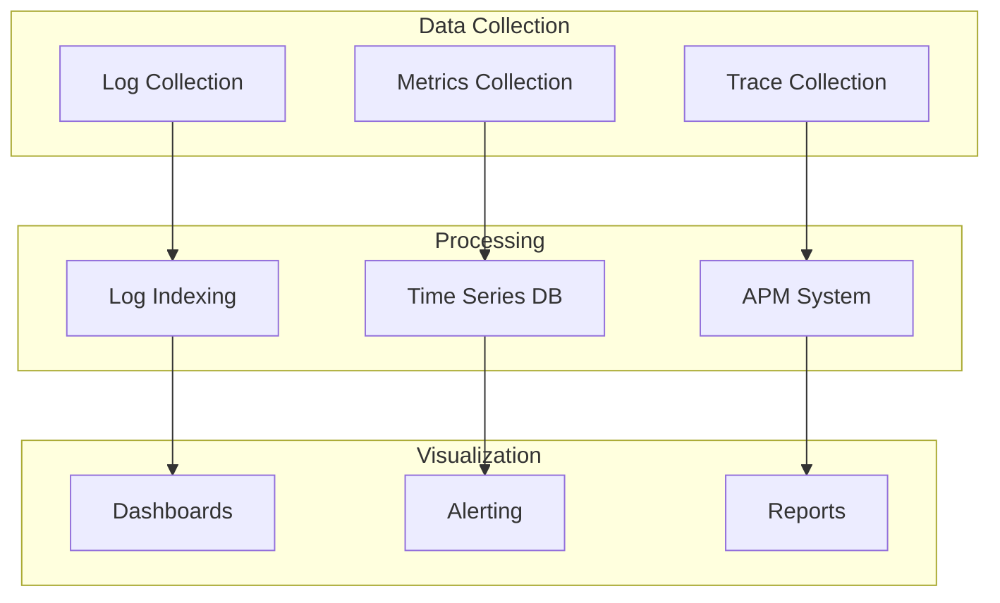

import { Callout } from 'nextra/components'

# Technical Architecture Documentation

<Callout type="info">
  This section provides comprehensive documentation of the system's technical architecture, including system design, data flows, and implementation patterns.
</Callout>

## System Architecture

### High-Level Architecture

## Component Architecture

### Frontend Component Structure

## Data Flow Architecture

### Request-Response Flow

## Database Architecture

### Schema Design

## Security Architecture

### Security Layers

## Infrastructure Architecture

### Cloud Infrastructure

## CI/CD Pipeline

### Deployment Flow

## Monitoring Architecture

### Observability Stack

## Next Steps
1. [ ] Review architecture with team
2. [ ] Document component interfaces
3. [ ] Create API specifications
4. [ ] Define security protocols
5. [ ] Set up monitoring 