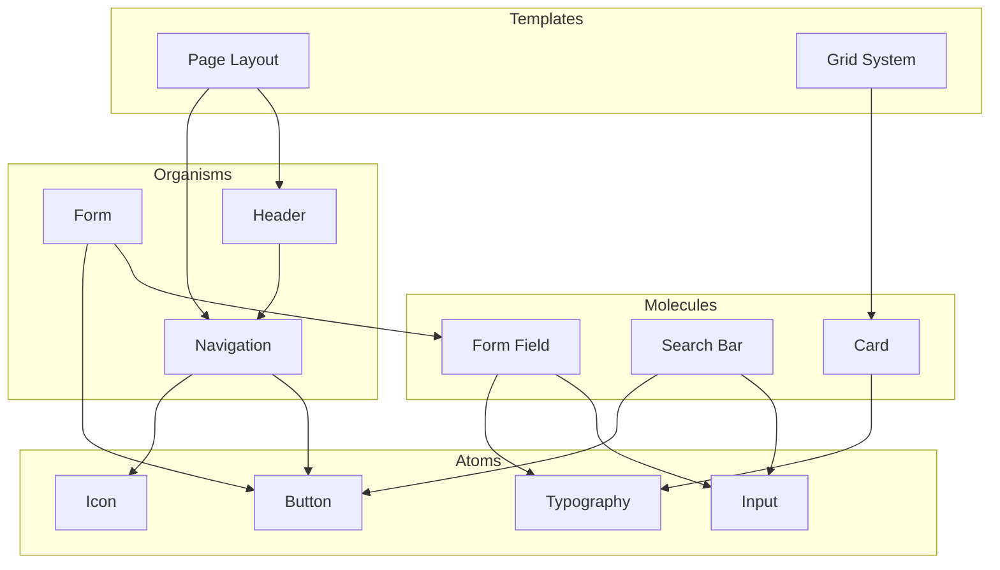
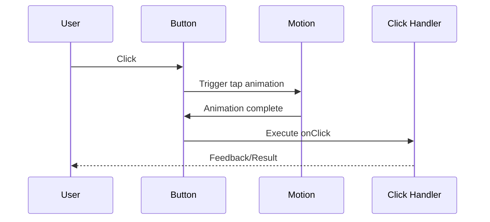
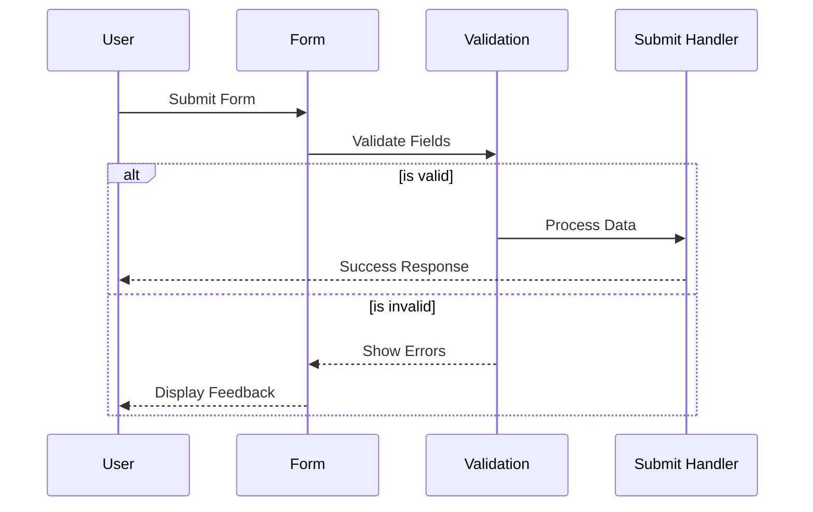
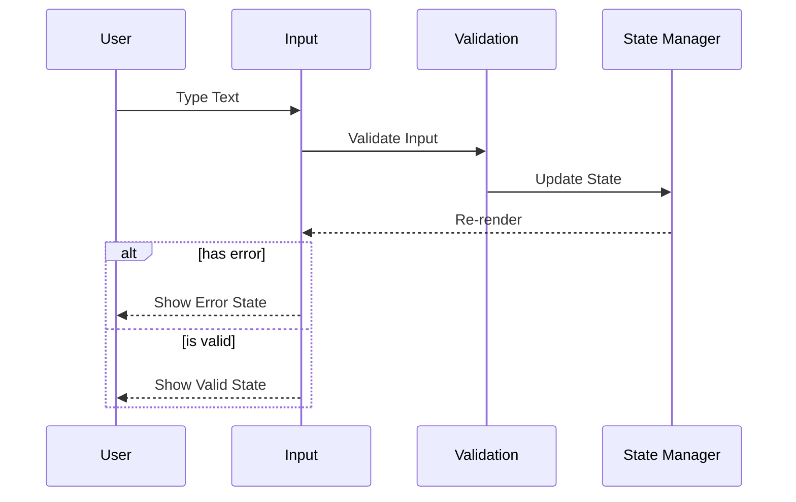
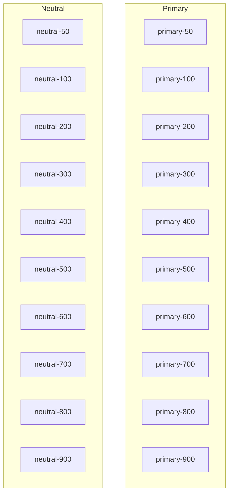
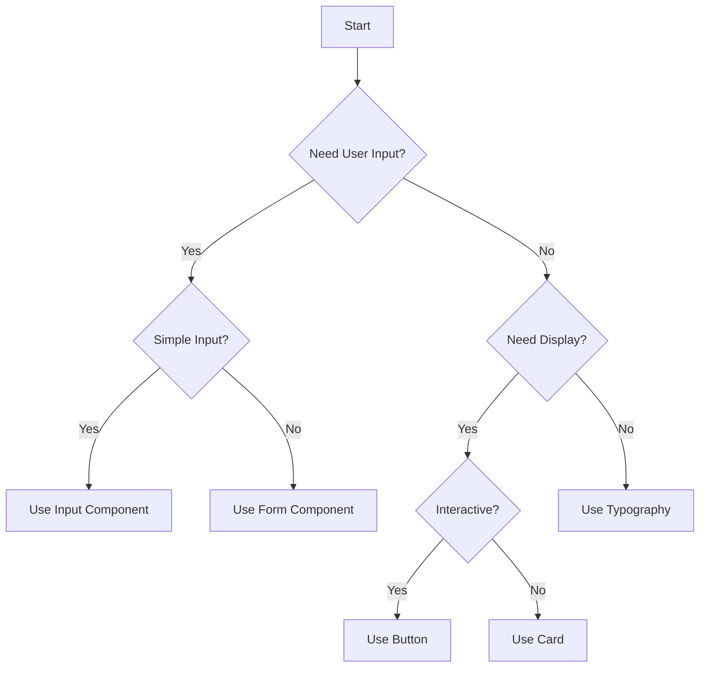
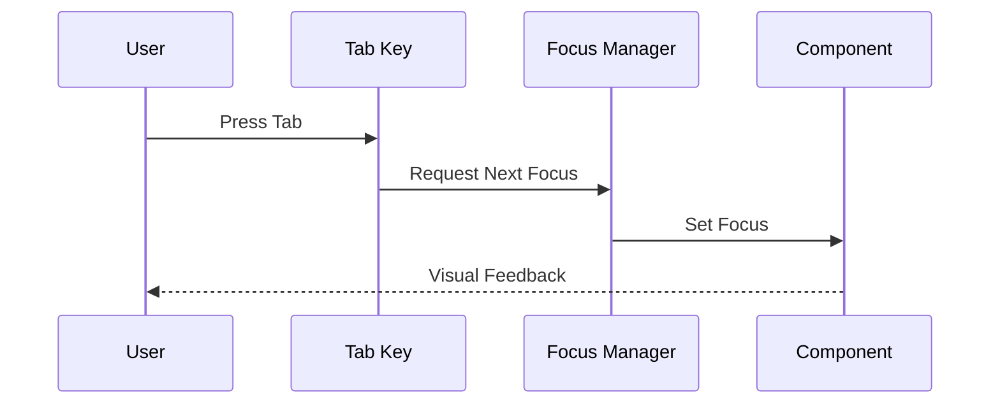

import { Callout, Tabs, Tab } from 'nextra/components'
import { Button } from '@/components/atoms/Button'
import { Input } from '@/components/atoms/Input'
import { FormField } from '@/components/molecules/FormField'
import { Form } from '@/components/organisms/Form'

# Atomic Design System Showcase

<Callout type="info">
  This section showcases our Atomic Design System components with live examples, documentation, and usage patterns.
</Callout>

## Component Hierarchy



## Atoms

### Button Component

<Tabs items={['Preview', 'Code', 'Usage']}>
  <Tab>
    <div className="flex gap-4 p-4">
      <Button variant="default">Default</Button>
      <Button variant="destructive">Destructive</Button>
      <Button variant="outline">Outline</Button>
      <Button variant="secondary">Secondary</Button>
      <Button variant="ghost">Ghost</Button>
      <Button variant="link">Link</Button>
    </div>
  </Tab>
  <Tab>
    ```tsx
    <Button variant="default">Default</Button>
    <Button variant="destructive">Destructive</Button>
    <Button variant="outline">Outline</Button>
    <Button variant="secondary">Secondary</Button>
    <Button variant="ghost">Ghost</Button>
    <Button variant="link">Link</Button>
    ```
  </Tab>
  <Tab>
    ```tsx
    import { Button } from '@/components/atoms/Button'
    
    export const MyComponent = () => {
      return (
        <Button 
          variant="default"
          onClick={() => console.log('Clicked!')}
        >
          Click Me
        </Button>
      )
    }
    ```
  </Tab>
</Tabs>

### Input Component

<Tabs items={['Preview', 'Code', 'Usage']}>
  <Tab>
    <div className="flex flex-col gap-4 p-4">
      <Input placeholder="Default input" />
      <Input type="password" placeholder="Password input" />
      <Input disabled placeholder="Disabled input" />
      <Input error placeholder="Error input" />
    </div>
  </Tab>
  <Tab>
    ```tsx
    <Input placeholder="Default input" />
    <Input type="password" placeholder="Password input" />
    <Input disabled placeholder="Disabled input" />
    <Input error placeholder="Error input" />
    ```
  </Tab>
  <Tab>
    ```tsx
    import { Input } from '@/components/atoms/Input'
    
    export const MyComponent = () => {
      const [value, setValue] = useState('')
      
      return (
        <Input 
          value={value}
          onChange={(e) => setValue(e.target.value)}
          placeholder="Enter text"
        />
      )
    }
    ```
  </Tab>
</Tabs>

## Molecules

### Form Field Component

<Tabs items={['Preview', 'Code', 'Usage']}>
  <Tab>
    <div className="p-4">
      <FormField label="Email">
        <Input placeholder="Enter your email" />
      </FormField>
      <FormField label="Password" error="Password is required">
        <Input type="password" placeholder="Enter password" error />
      </FormField>
    </div>
  </Tab>
  <Tab>
    ```tsx
    <FormField label="Email">
      <Input placeholder="Enter your email" />
    </FormField>
    <FormField label="Password" error="Password is required">
      <Input type="password" placeholder="Enter password" error />
    </FormField>
    ```
  </Tab>
  <Tab>
    ```tsx
    import { FormField } from '@/components/molecules/FormField'
    import { Input } from '@/components/atoms/Input'
    
    export const MyForm = () => {
      return (
        <FormField 
          label="Username"
          error={errors.username}
        >
          <Input 
            value={username}
            onChange={setUsername}
            error={!!errors.username}
          />
        </FormField>
      )
    }
    ```
  </Tab>
</Tabs>

## Organisms

### Form Component

<Tabs items={['Preview', 'Code', 'Usage']}>
  <Tab>
    <div className="p-4">
      <Form onSubmit={(data) => console.log(data)}>
        <FormField label="Email">
          <Input name="email" placeholder="Enter your email" />
        </FormField>
        <FormField label="Password">
          <Input name="password" type="password" placeholder="Enter password" />
        </FormField>
        <Button type="submit">Submit</Button>
      </Form>
    </div>
  </Tab>
  <Tab>
    ```tsx
    <Form onSubmit={(data) => console.log(data)}>
      <FormField label="Email">
        <Input name="email" placeholder="Enter your email" />
      </FormField>
      <FormField label="Password">
        <Input name="password" type="password" placeholder="Enter password" />
      </FormField>
      <Button type="submit">Submit</Button>
    </Form>
    ```
  </Tab>
  <Tab>
    ```tsx
    import { Form } from '@/components/organisms/Form'
    import { FormField } from '@/components/molecules/FormField'
    import { Input } from '@/components/atoms/Input'
    import { Button } from '@/components/atoms/Button'
    
    export const LoginForm = () => {
      const handleSubmit = (data: FormData) => {
        // Handle form submission
      }
      
      return (
        <Form onSubmit={handleSubmit}>
          {/* Form fields */}
        </Form>
      )
    }
    ```
  </Tab>
</Tabs>

## Component Flow Diagrams

### Button Component Flow


### Form Component Flow


### Input Component Flow


## Design Tokens

### Color System


## Usage Guidelines

### Component Selection Guide


## Accessibility Features

### Focus Management


## Next Steps
1. [ ] Review component usage
2. [ ] Test accessibility
3. [ ] Add more examples
4. [ ] Update documentation
5. [ ] Gather feedback 