import { Callout, Steps } from 'nextra/components'

# Business Requirements Document (BRD)

<Callout type="info">
  This document outlines the business requirements, objectives, and scope for the project.
</Callout>

## 1. Executive Summary

### 1.1 Project Overview
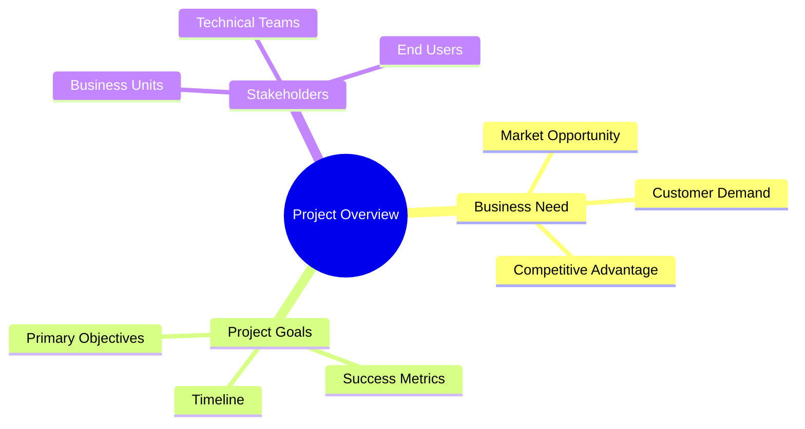

### 1.2 Business Opportunity
- Market Analysis
- Target Audience
- Value Proposition

## 2. Business Requirements

### 2.1 Business Objectives
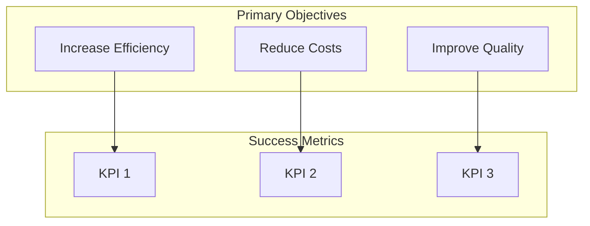

### 2.2 Business Process Impact
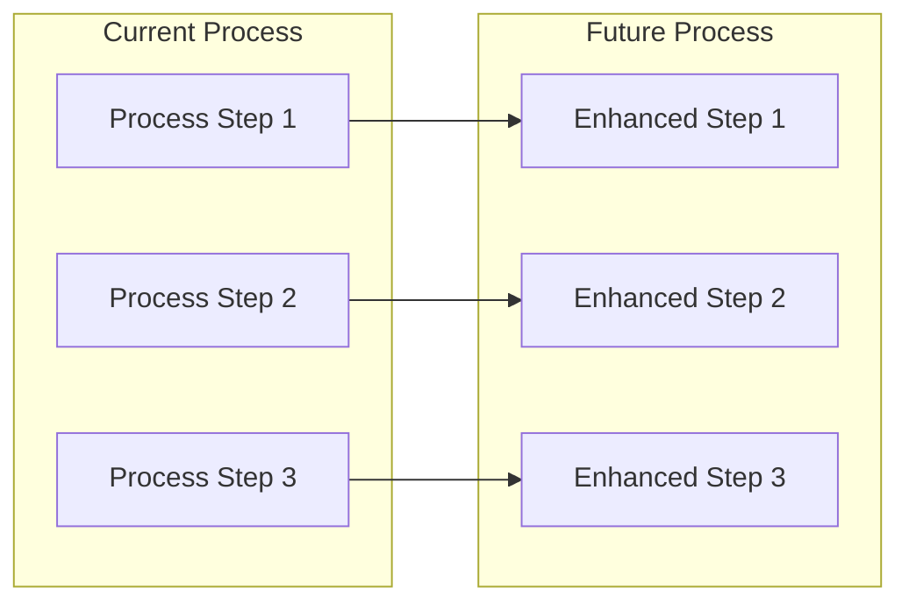

## 3. Stakeholder Analysis

### 3.1 Stakeholder Map
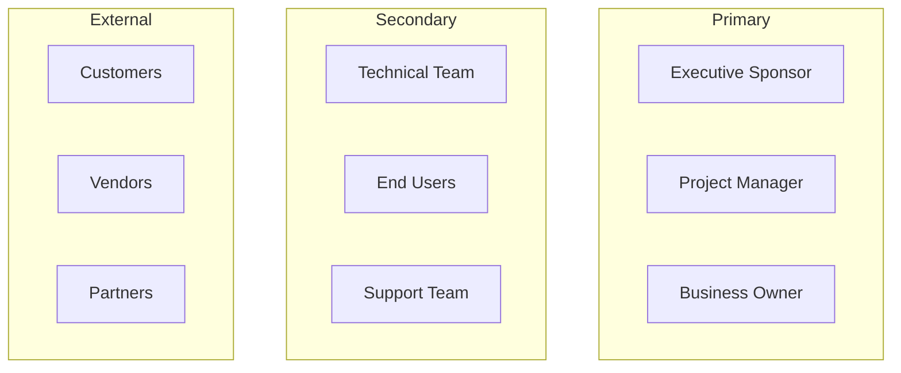

### 3.2 Roles and Responsibilities
| Role | Responsibilities | Decision Authority |
|------|-----------------|-------------------|
| Executive Sponsor | Strategic oversight | High |
| Project Manager | Day-to-day management | Medium |
| Business Owner | Requirements definition | High |

## 4. Market Analysis

### 4.1 Market Overview
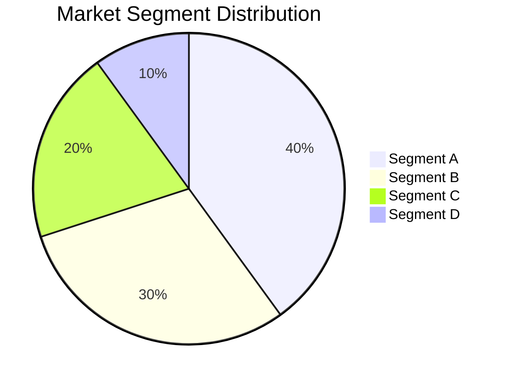

### 4.2 Competitive Analysis
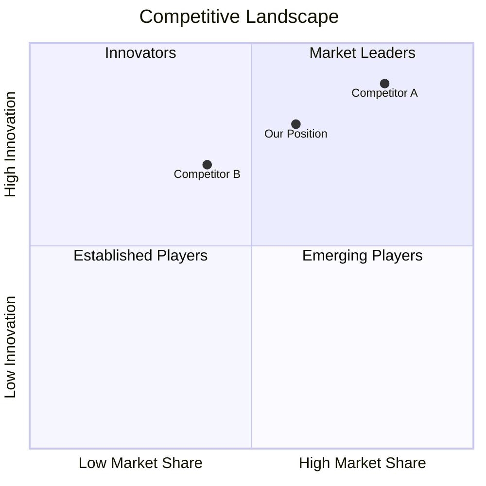

## 5. Requirements Overview

### 5.1 Functional Requirements
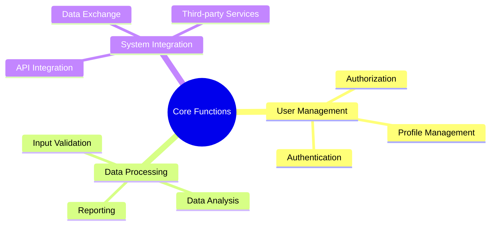

### 5.2 Non-Functional Requirements
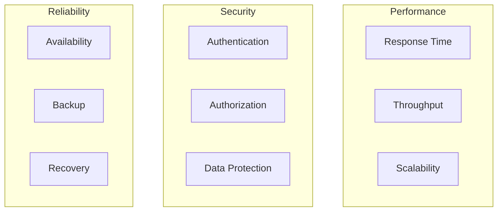

## 6. Cost-Benefit Analysis

### 6.1 Cost Breakdown
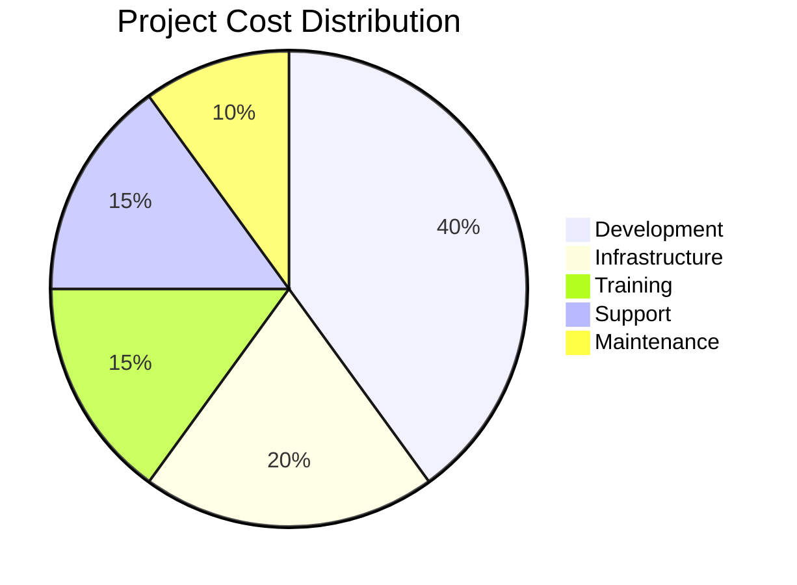

### 6.2 Benefits Analysis
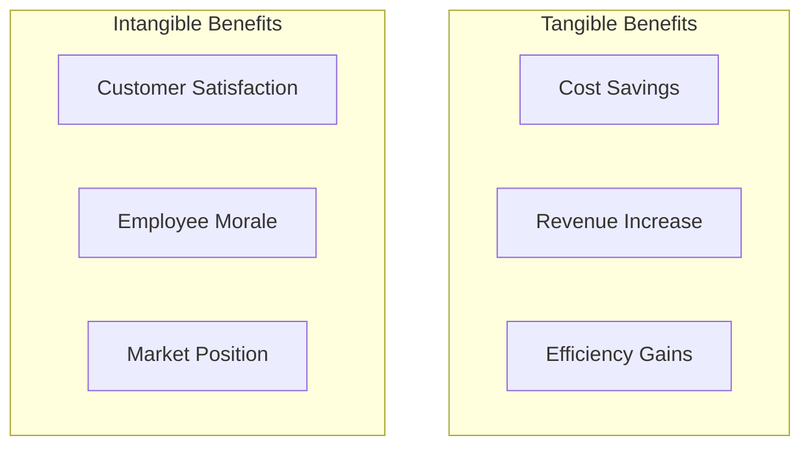

## 7. Risk Assessment

### 7.1 Risk Matrix
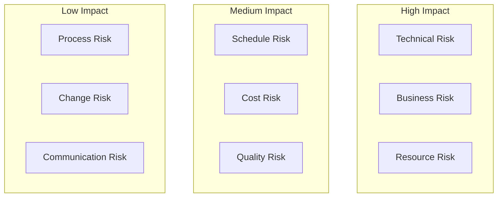

## 8. Implementation Strategy

### 8.1 Implementation Phases
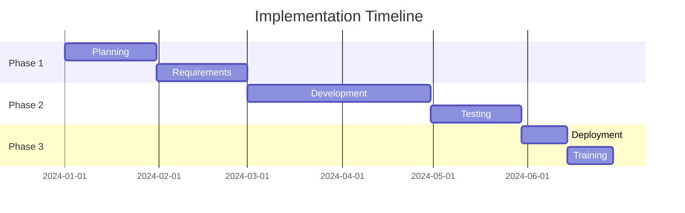

## 9. Success Criteria

### 9.1 Key Performance Indicators
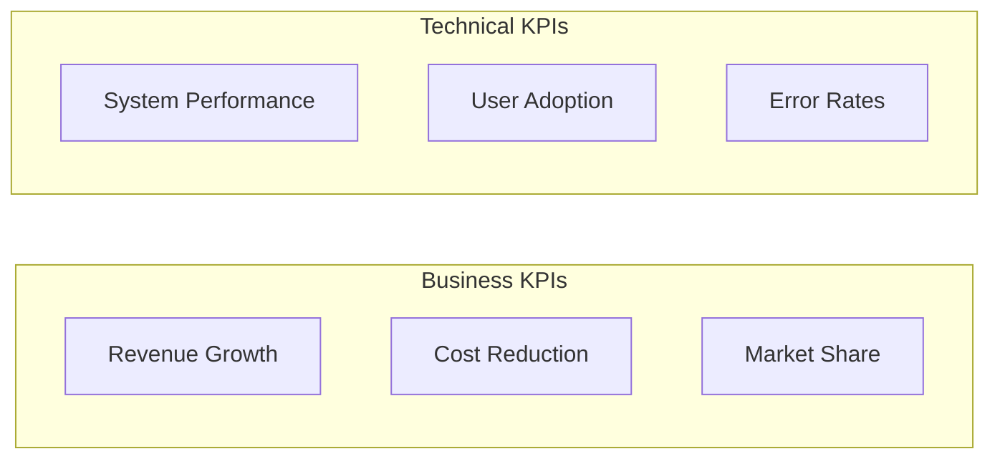

## Next Steps
1. [ ] Review with stakeholders
2. [ ] Gather feedback
3. [ ] Update requirements
4. [ ] Begin technical planning
5. [ ] Create project timeline 