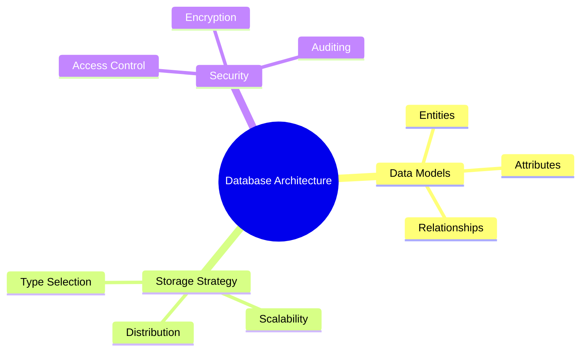
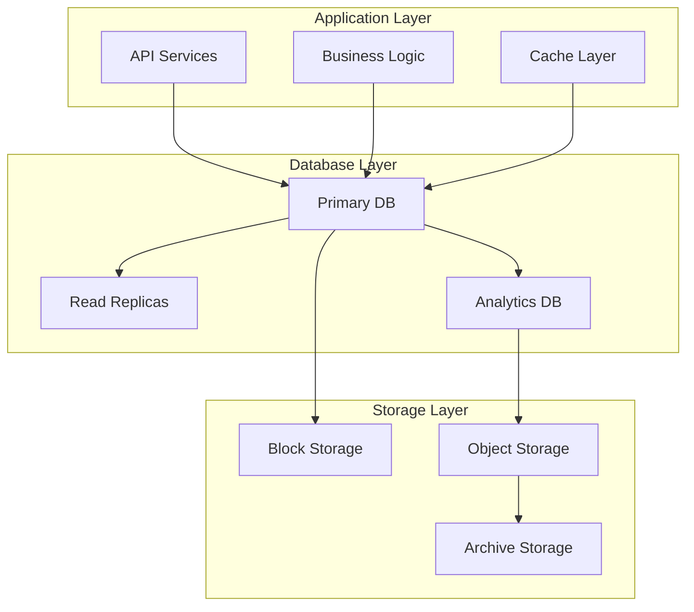
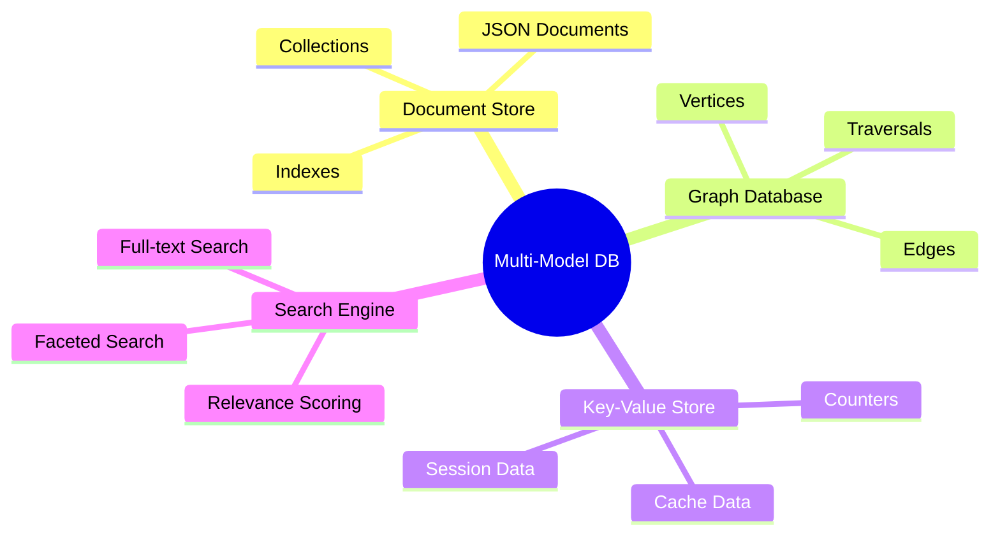
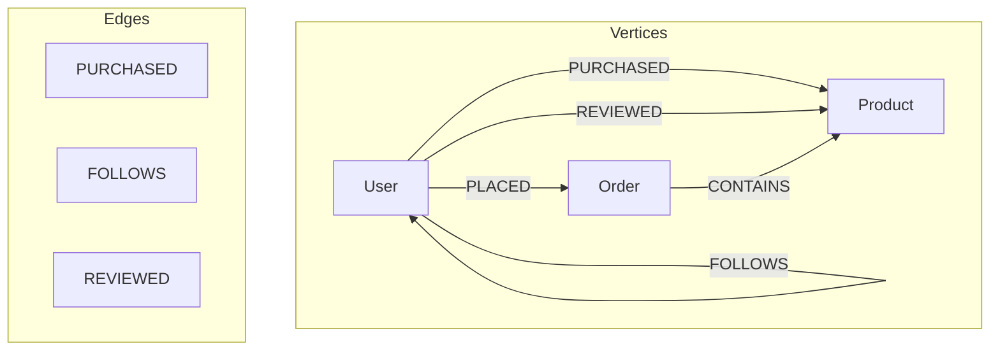
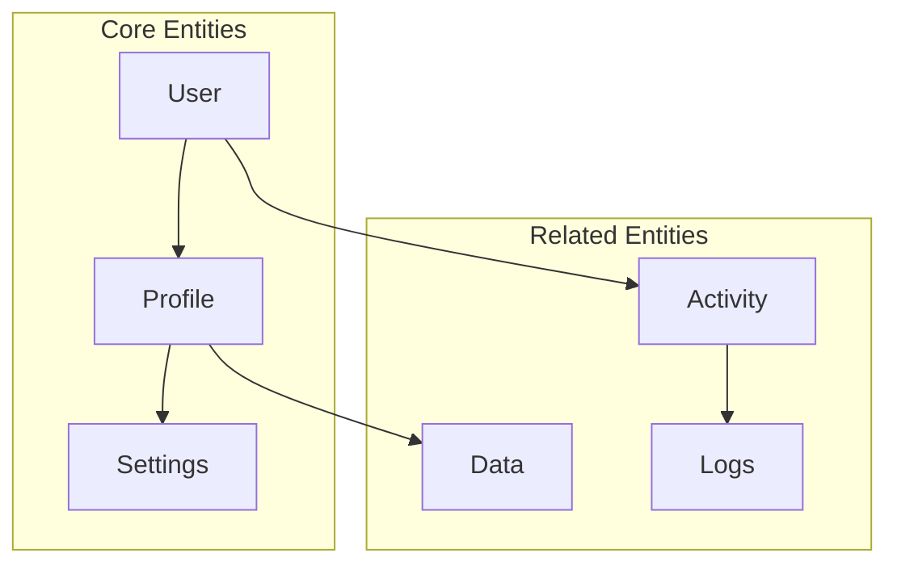
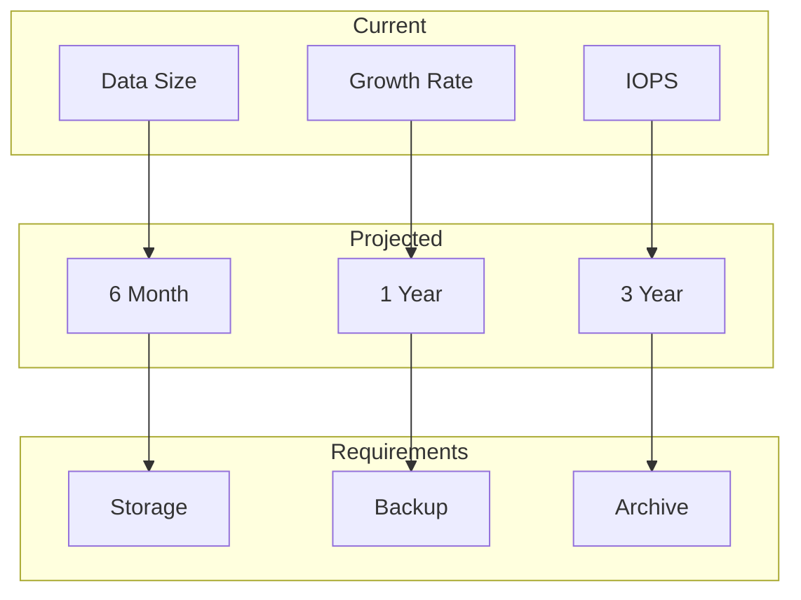
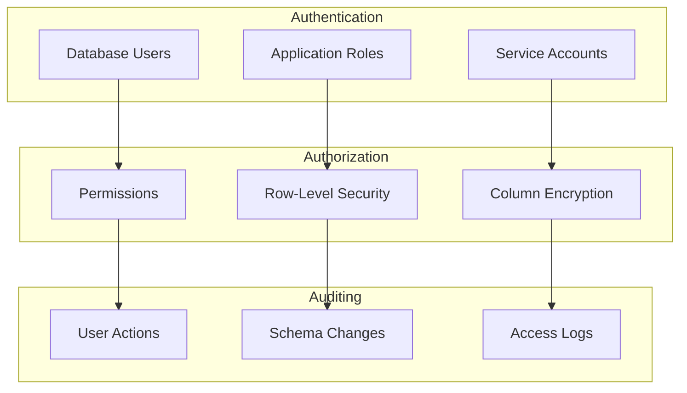
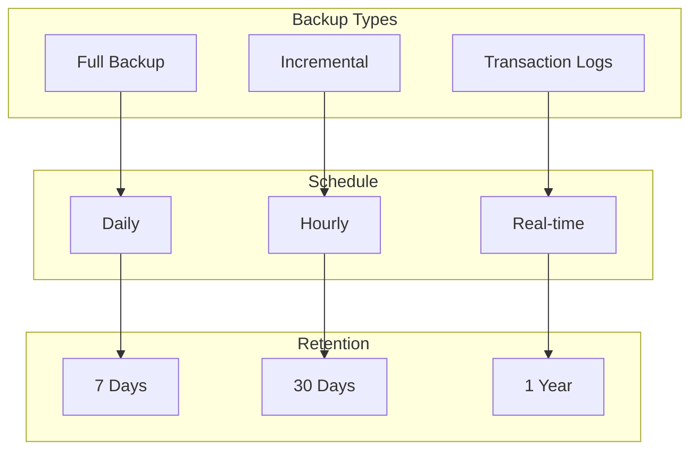
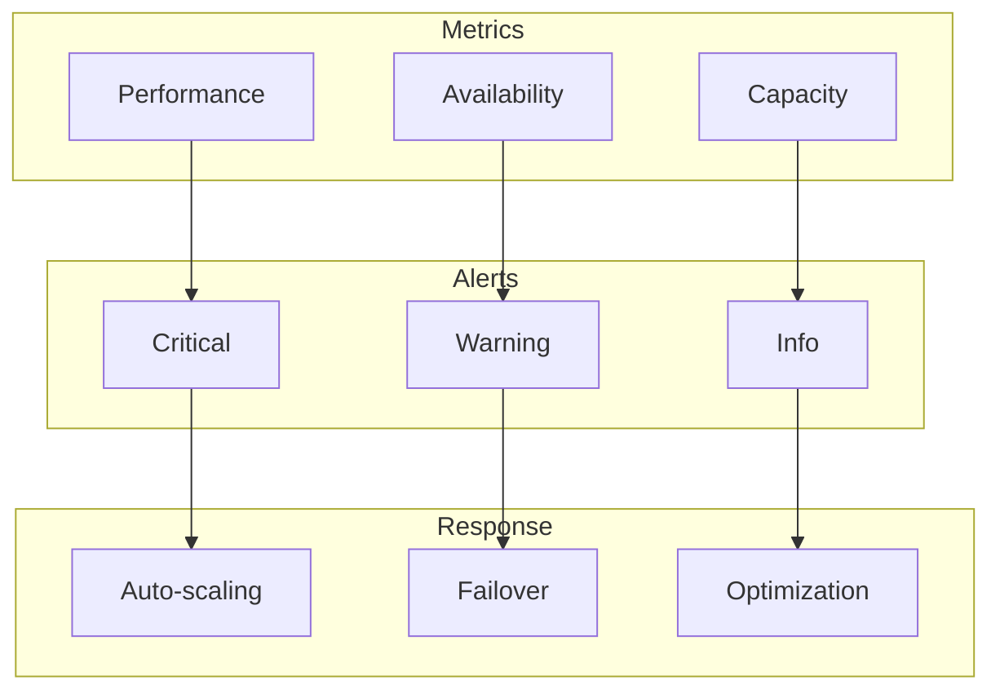
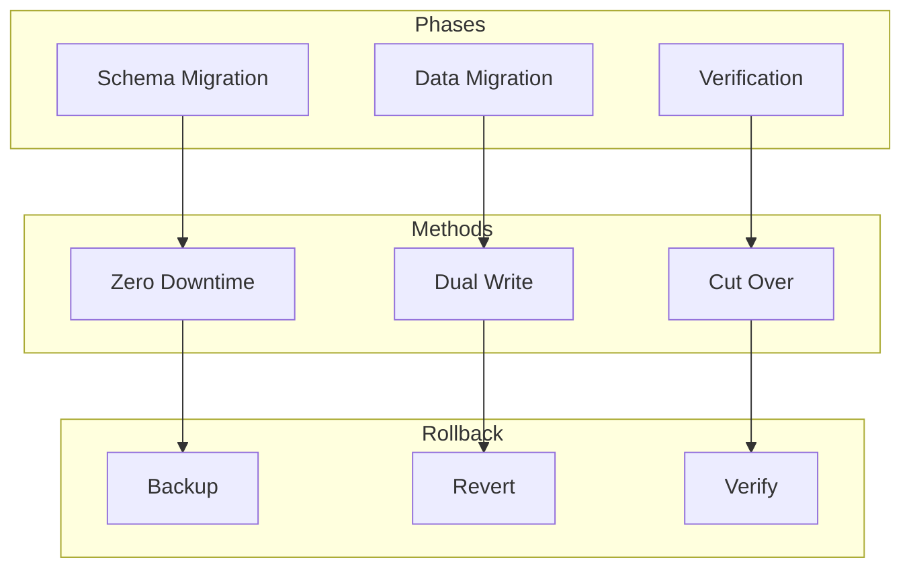

import { Callout, Steps } from 'nextra/components'

# Database Requirements Document (DBRD)

<Callout type="info">
  This document specifies the database architecture, data models, relationships, and technical requirements for the system.
</Callout>

## 1. Executive Summary

### 1.1 Overview


### 1.2 Document Control
| Attribute | Value |
|-----------|-------|
| Version | 1.0.0 |
| Status | Draft |
| Last Updated | [Date] |
| Approved By | [Name] |

## 2. Database Architecture

### 2.1 System Overview


### 2.2 Database Type Selection
| Type | Purpose | Justification |
|------|---------|--------------|
| Primary DB | Core transactions | ACID compliance |
| Read Replicas | Query scaling | Load distribution |
| Analytics DB | Data warehouse | Query optimization |

## 3. Data Models

### 3.1 Multi-Model Schema Overview


### 3.2 Document Model (JSON/JSONB)
```json
{
  "users": {
    "type": "collection",
    "schema": {
      "required": ["_key", "email"],
      "properties": {
        "_key": { "type": "string" },
        "email": { "type": "string" },
        "profile": {
          "type": "object",
          "properties": {
            "name": { "type": "string" },
            "preferences": { "type": "object" }
          }
        },
        "created_at": { "type": "string", "format": "date-time" }
      }
    }
  }
}
```

### 3.3 Graph Model


### 3.4 ArangoDB Schema Example
```javascript
// Collection Definition
{
  "users": {
    "_key": "users",
    "type": "document",
    "indexes": [
      {
        "type": "hash",
        "fields": ["email"],
        "unique": true
      },
      {
        "type": "persistent",
        "fields": ["created_at"]
      }
    ]
  },
  "relationships": {
    "_key": "relationships",
    "type": "edge",
    "indexes": [
      {
        "type": "persistent",
        "fields": ["_from", "_to"]
      }
    ]
  }
}

// Graph Definition
{
  "social_graph": {
    "edgeDefinitions": [
      {
        "collection": "relationships",
        "from": ["users"],
        "to": ["users"]
      }
    ]
  }
}
```

### 3.5 Search Model
```json
{
  "search_config": {
    "analyzers": {
      "text_analyzer": {
        "type": "text",
        "features": ["position", "norm", "frequency"],
        "properties": {
          "locale": "en",
          "case": "lower",
          "stopwords": ["the", "and", "or"]
        }
      }
    },
    "views": {
      "product_view": {
        "type": "arangosearch",
        "links": {
          "products": {
            "analyzers": ["text_analyzer"],
            "includeAllFields": true,
            "fields": {
              "name": {
                "analyzers": ["text_analyzer"]
              },
              "description": {
                "analyzers": ["text_analyzer"]
              }
            }
          }
        }
      }
    }
  }
}
```

### 3.2 Data Dictionary
| Entity | Attribute | Type | Constraints | Description |
|--------|-----------|------|-------------|-------------|
| User | id | UUID | PK, NOT NULL | Unique identifier |
| User | email | VARCHAR(255) | UK, NOT NULL | User email |
| Profile | user_id | UUID | FK, NOT NULL | Reference to User |

## 4. Data Relationships

### 4.1 Relationship Map


### 4.2 Constraints
| Relationship | Type | Cascade | Description |
|--------------|------|---------|-------------|
| User-Profile | 1:1 | CASCADE | User must have profile |
| Profile-Settings | 1:N | CASCADE | Profile can have multiple settings |
| User-Activity | 1:N | SET NULL | User can have multiple activities |

## 5. Storage Requirements

### 5.1 Capacity Planning


### 5.2 Performance Requirements
| Metric | Target | Measurement |
|--------|--------|-------------|
| Read Latency | < 10ms | P95 |
| Write Latency | < 20ms | P95 |
| IOPS | 10K/s | Peak |

## 6. Security Requirements

### 6.1 Access Control


### 6.2 Data Protection
| Requirement | Implementation | Validation |
|-------------|---------------|------------|
| Encryption at Rest | AES-256 | Security audit |
| Encryption in Transit | TLS 1.3 | SSL check |
| Access Control | RBAC | Permission matrix |

## 7. Backup & Recovery

### 7.1 Backup Strategy


### 7.2 Recovery Objectives
| Metric | Target | Strategy |
|--------|--------|----------|
| RPO | < 1 hour | Transaction logs |
| RTO | < 4 hours | Automated recovery |
| Data Loss | Zero | Multi-region replication |

## 8. Monitoring & Maintenance

### 8.1 Monitoring Strategy


### 8.2 Maintenance Schedule
| Task | Frequency | Impact |
|------|-----------|--------|
| Index Rebuild | Weekly | Low |
| Vacuum | Daily | Low |
| Backup Verify | Weekly | None |

## 9. Migration & Scaling

### 9.1 Migration Strategy


### 9.2 Scaling Plan
| Dimension | Strategy | Trigger |
|-----------|----------|---------|
| Vertical | Instance upgrade | CPU > 70% |
| Horizontal | Read replicas | Load > 5000 qps |
| Storage | Auto-scaling | Usage > 80% |

## Next Steps
1. [ ] Review with database team
2. [ ] Validate capacity planning
3. [ ] Test backup procedures
4. [ ] Implement monitoring
5. [ ] Plan migration strategy 