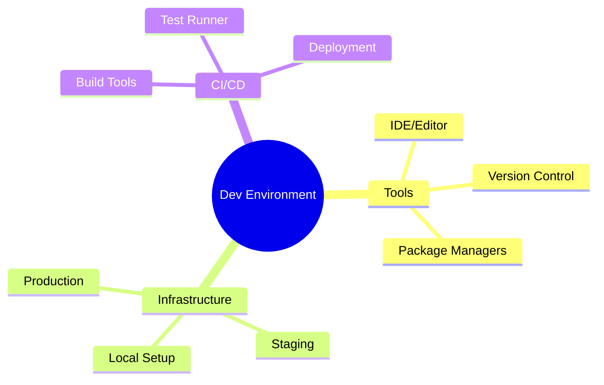
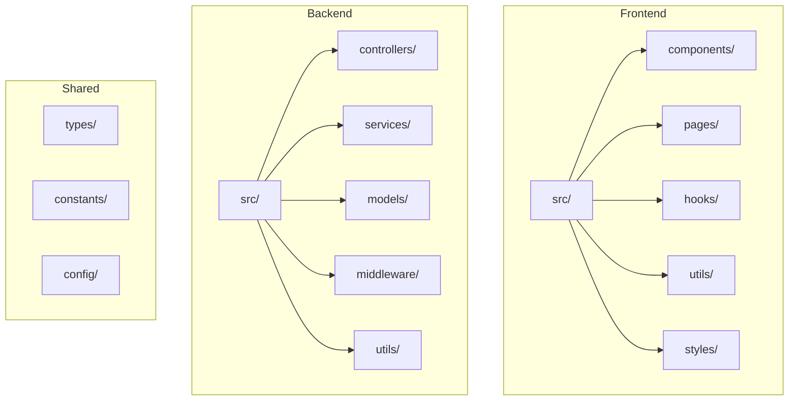
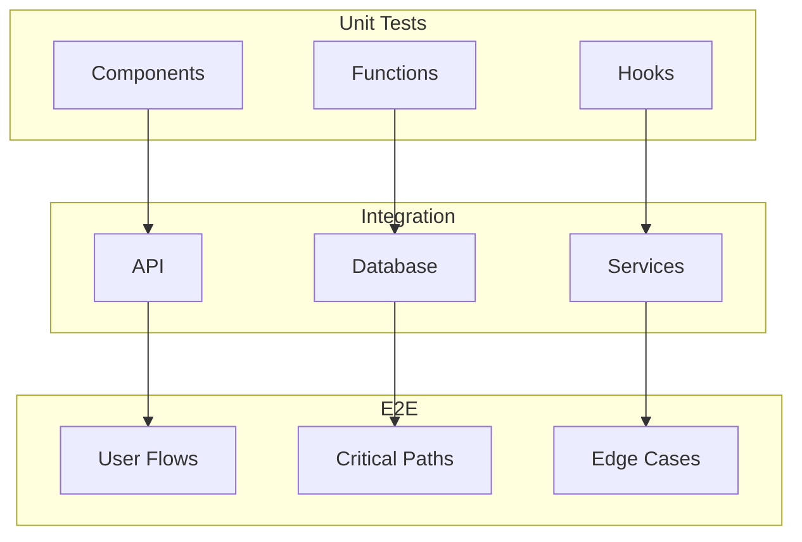
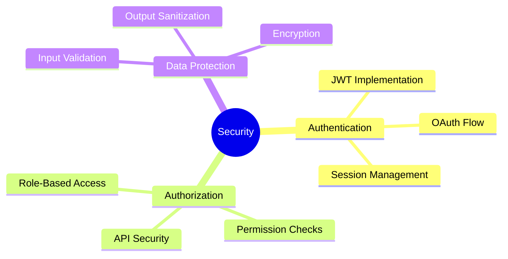
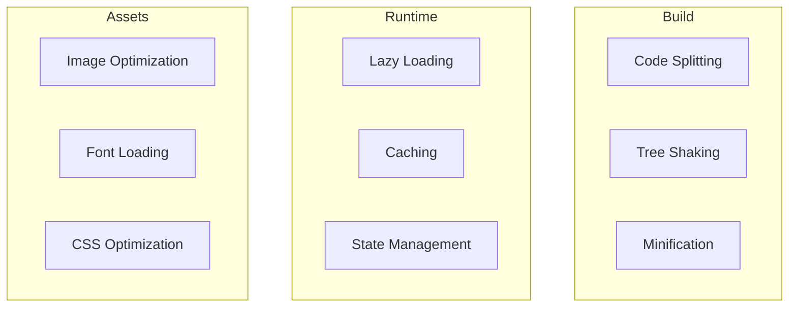
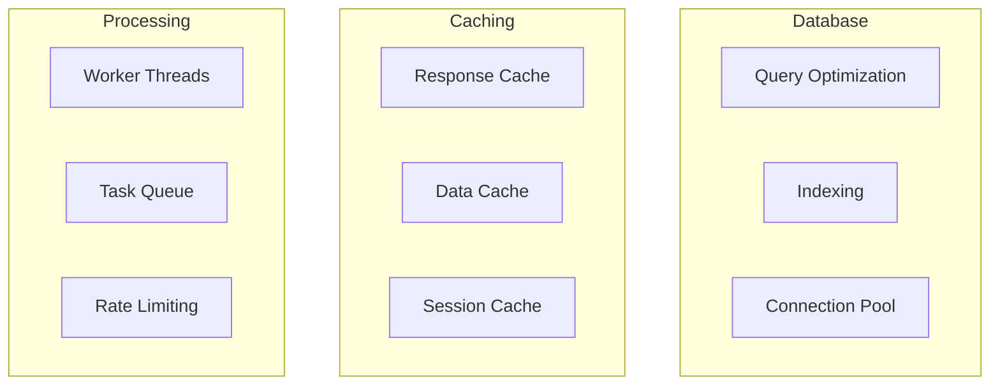
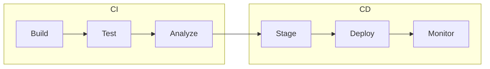
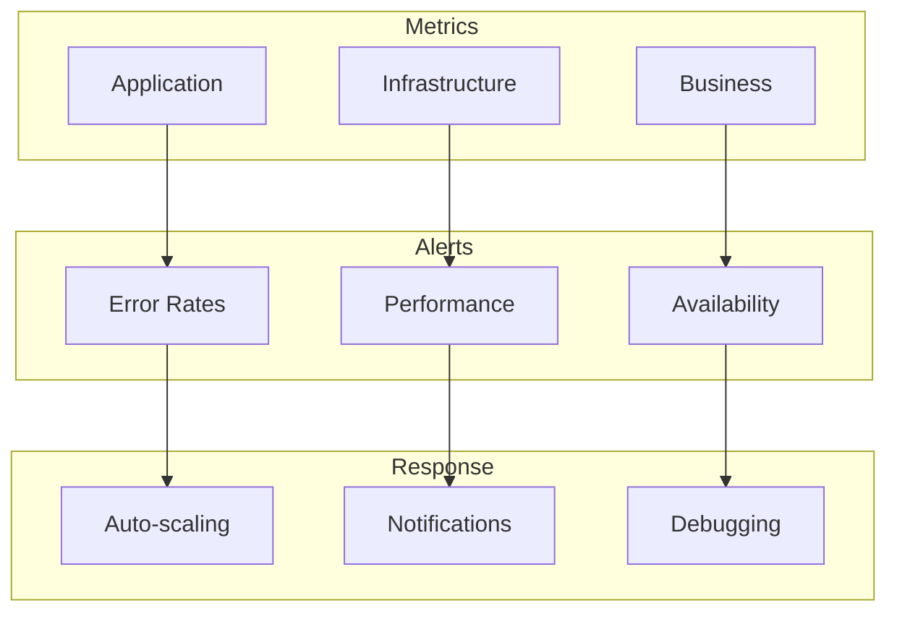

import { Callout, Steps } from 'nextra/components'

# Development Requirements Document (DRD)

<Callout type="info">
  This document outlines the development standards, practices, and technical requirements for implementing the software system.
</Callout>

## 1. Development Environment

### 1.1 Environment Setup


### 1.2 Technology Stack
| Layer | Technology | Version | Purpose |
|-------|------------|---------|----------|
| Frontend | React | 18.x | UI Framework |
| Backend | Node.js | 20.x | Server Runtime |
| Database | PostgreSQL | 15.x | Data Storage |
| Cache | Redis | 7.x | Caching Layer |

## 2. Code Organization

### 2.1 Project Structure


### 2.2 Naming Conventions
```typescript
// Component Names
interface UserProfileProps {
  userId: string;
  onUpdate: (user: User) => void;
}

// File Names
user-profile.tsx
UserProfile.tsx
user.service.ts
user.model.ts

// CSS Classes
.user-profile-container
.user-profile__header
.user-profile__content
```

## 3. Coding Standards

### 3.1 TypeScript Guidelines
```typescript
// Types and Interfaces
interface User {
  id: string;
  email: string;
  profile?: UserProfile;
  createdAt: Date;
}

// Function Signatures
async function fetchUser(
  id: string,
  options?: FetchOptions
): Promise<Result<User>> {
  try {
    // Implementation
  } catch (error) {
    // Error handling
  }
}

// Error Handling
class ApiError extends Error {
  constructor(
    message: string,
    public statusCode: number,
    public code: string
  ) {
    super(message);
    this.name = 'ApiError';
  }
}
```

### 3.2 React Guidelines
```typescript
// Component Structure
const UserProfile: React.FC<UserProfileProps> = ({
  userId,
  onUpdate
}) => {
  const [user, setUser] = useState<User | null>(null);
  const { data, error } = useQuery(['user', userId]);

  useEffect(() => {
    // Side effects
  }, [userId]);

  return (
    <div className="user-profile">
      {/* Component JSX */}
    </div>
  );
};

// Custom Hooks
function useUser(userId: string) {
  // Hook implementation
}
```

## 4. Testing Requirements

### 4.1 Testing Strategy


### 4.2 Test Examples
```typescript
// Component Tests
describe('UserProfile', () => {
  it('should render user information', () => {
    render(<UserProfile userId="123" />);
    expect(screen.getByText('User Profile')).toBeInTheDocument();
  });
});

// API Tests
describe('UserService', () => {
  it('should fetch user by id', async () => {
    const user = await userService.findById('123');
    expect(user).toBeDefined();
  });
});
```

## 5. API Development

### 5.1 REST API Standards
```typescript
// Request/Response Types
interface ApiResponse<T> {
  data: T;
  meta?: {
    page: number;
    limit: number;
    total: number;
  };
}

// Endpoint Structure
GET    /api/v1/users
POST   /api/v1/users
GET    /api/v1/users/:id
PUT    /api/v1/users/:id
DELETE /api/v1/users/:id

// Error Responses
{
  "error": {
    "code": "INVALID_INPUT",
    "message": "Email is required",
    "details": { "field": "email" }
  }
}
```

### 5.2 GraphQL Schema
```graphql
type User {
  id: ID!
  email: String!
  profile: Profile
  posts: [Post!]
}

type Query {
  user(id: ID!): User
  users(
    page: Int
    limit: Int
    filter: UserFilter
  ): UserConnection!
}

type Mutation {
  createUser(input: CreateUserInput!): User!
  updateUser(id: ID!, input: UpdateUserInput!): User!
}
```

## 6. Security Implementation

### 6.1 Security Measures


### 6.2 Security Examples
```typescript
// Authentication Middleware
const authenticate = async (
  req: Request,
  res: Response,
  next: NextFunction
) => {
  try {
    const token = extractToken(req);
    const user = await verifyToken(token);
    req.user = user;
    next();
  } catch (error) {
    next(new AuthError('Invalid token'));
  }
};

// Authorization Guard
const requireRole = (role: UserRole) => {
  return (req: Request, res: Response, next: NextFunction) => {
    if (!req.user?.hasRole(role)) {
      throw new ForbiddenError('Insufficient permissions');
    }
    next();
  };
};
```

## 7. Performance Optimization

### 7.1 Frontend Optimization


### 7.2 Backend Optimization


## 8. Deployment Process

### 8.1 CI/CD Pipeline


### 8.2 Environment Configuration
```yaml
# Development
development:
  API_URL: http://localhost:3000
  DB_HOST: localhost
  REDIS_URL: redis://localhost

# Staging
staging:
  API_URL: https://staging-api.example.com
  DB_HOST: staging-db.example.com
  REDIS_URL: redis://staging-cache

# Production
production:
  API_URL: https://api.example.com
  DB_HOST: production-db.example.com
  REDIS_URL: redis://production-cache
```

## 9. Monitoring & Logging

### 9.1 Monitoring Setup


### 9.2 Logging Standards
```typescript
// Log Levels
enum LogLevel {
  ERROR = 'error',
  WARN = 'warn',
  INFO = 'info',
  DEBUG = 'debug'
}

// Log Format
interface LogEntry {
  timestamp: string;
  level: LogLevel;
  message: string;
  context: {
    service: string;
    traceId: string;
    userId?: string;
    [key: string]: any;
  };
}
```

## Next Steps
1. [ ] Set up development environment
2. [ ] Configure CI/CD pipeline
3. [ ] Implement core architecture
4. [ ] Set up monitoring
5. [ ] Begin development sprints