import { Callout, Steps } from 'nextra/components'

# Product Requirements Document (PRD)

<Callout type="info">
  This document details the product specifications, features, and technical requirements.
</Callout>

## 1. Product Overview

### 1.1 Product Vision
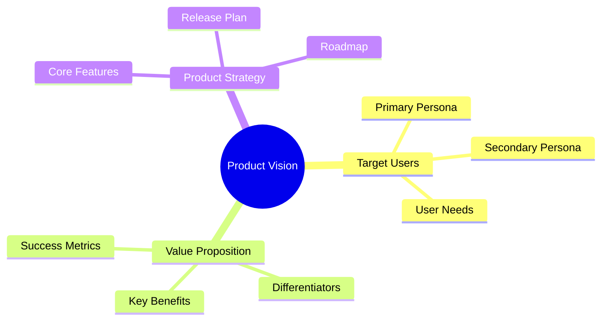

### 1.2 Product Goals
- Primary Objectives
- Success Metrics
- Target Timeline

## 2. User Stories and Requirements

### 2.1 User Personas
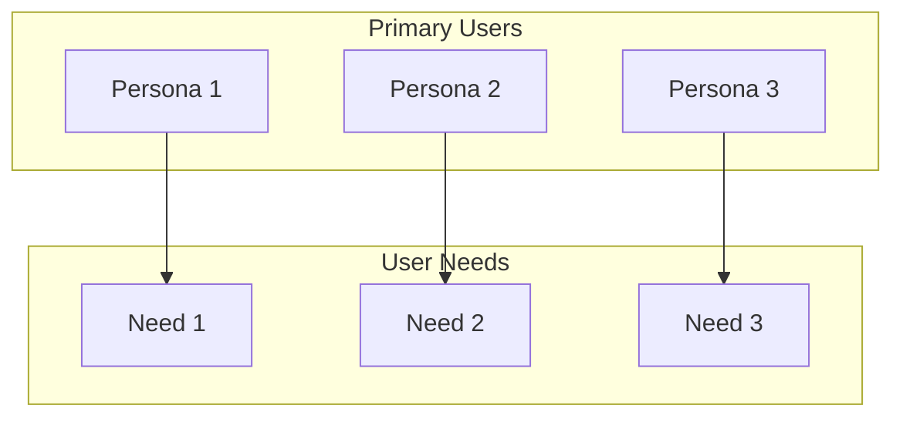

### 2.2 User Journey Map
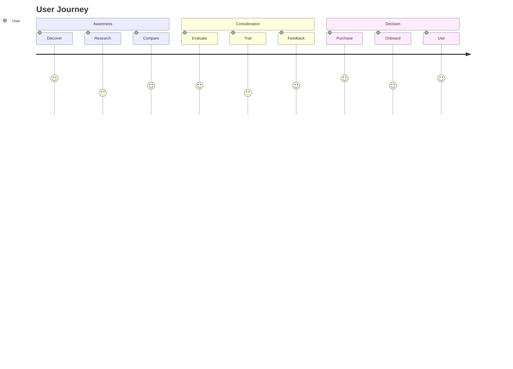

## 3. Feature Specifications

### 3.1 Feature Overview
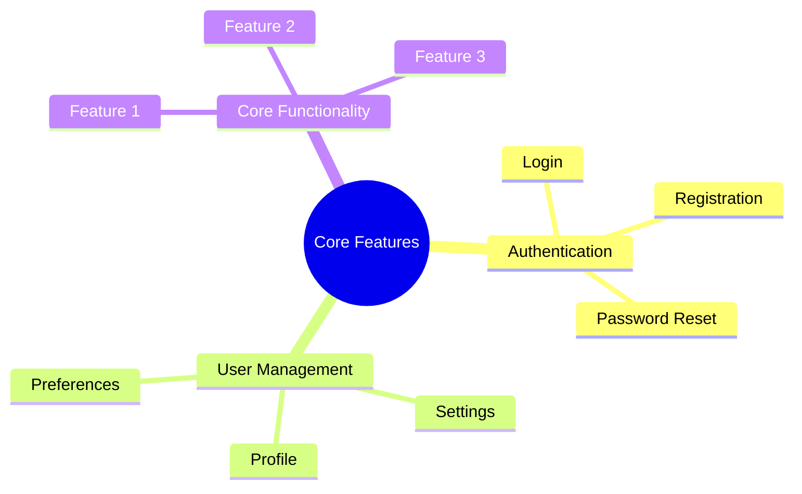

### 3.2 Feature Details
| Feature | Priority | Complexity | Dependencies |
|---------|----------|------------|--------------|
| Auth | High | Medium | Identity Provider |
| User Mgmt | High | Medium | Database |
| Core Func | High | High | APIs |

## 4. Technical Requirements

### 4.1 System Architecture
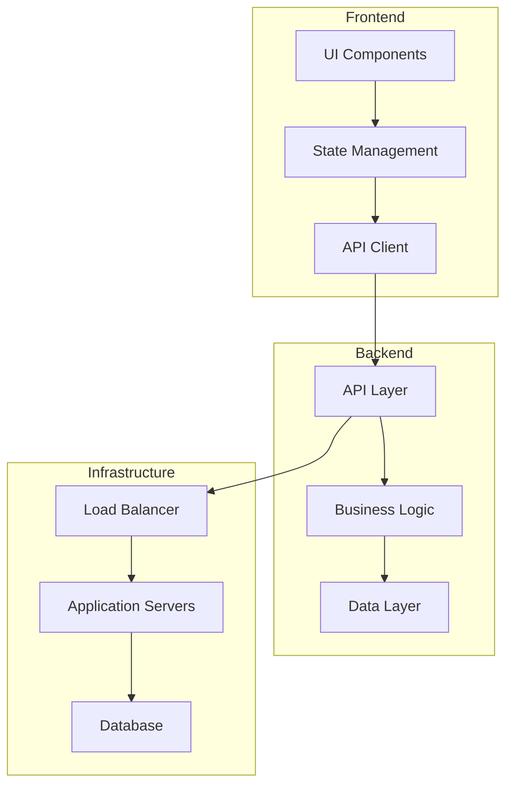

### 4.2 Data Model
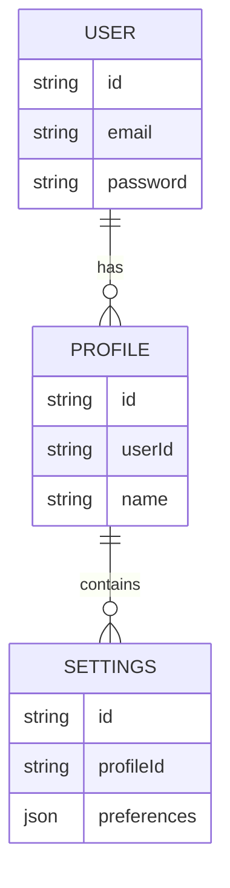

## 5. User Interface

### 5.1 UI Components
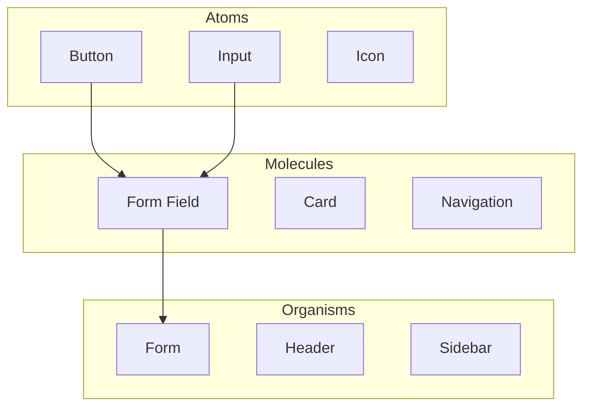

### 5.2 User Flows
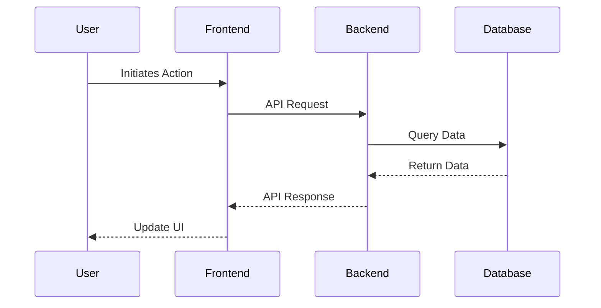

## 6. Performance Requirements

### 6.1 Performance Metrics
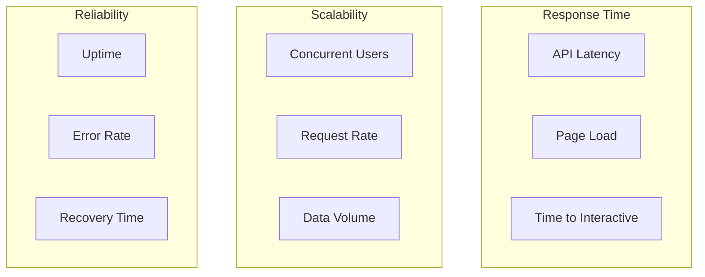

## 7. Security Requirements

### 7.1 Security Architecture
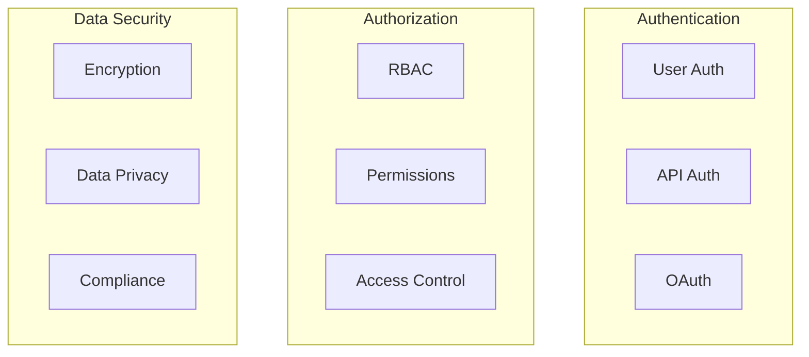

## 8. Testing Requirements

### 8.1 Test Strategy
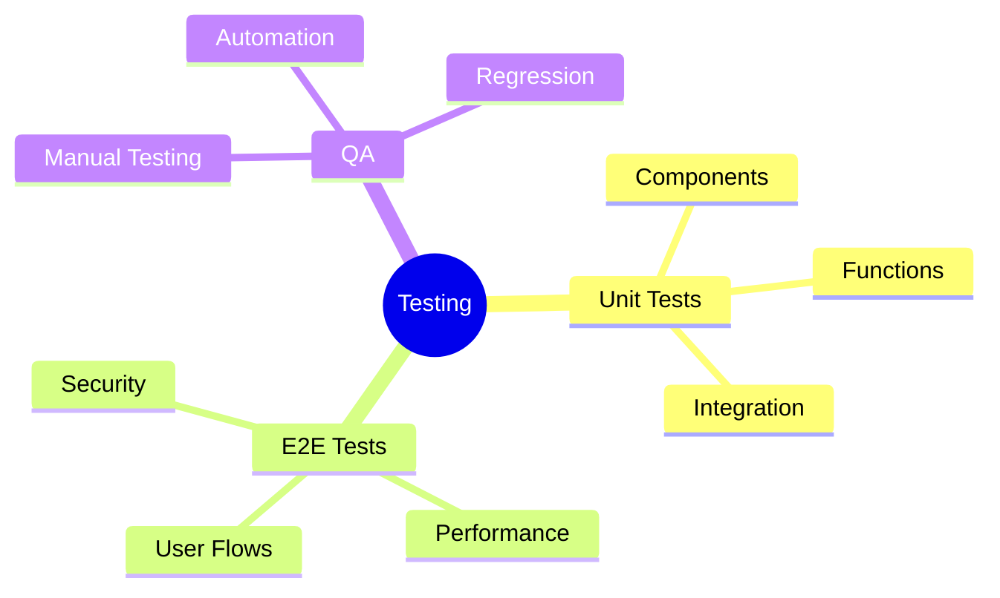

## 9. Deployment Requirements

### 9.1 Deployment Strategy
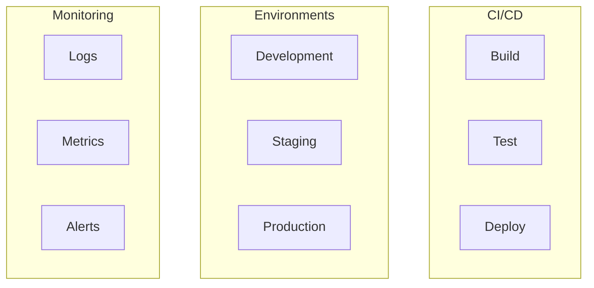

## Next Steps
1. [ ] Review with stakeholders
2. [ ] Prioritize features
3. [ ] Create technical specifications
4. [ ] Begin development planning
5. [ ] Set up development environment 