import { Callout, Steps } from 'nextra/components'

# Software Requirements Specification (SRS)

<Callout type="info">
  This document provides a detailed description of the software system's functional and non-functional requirements.
</Callout>

## 1. Introduction

### 1.1 Purpose & Scope
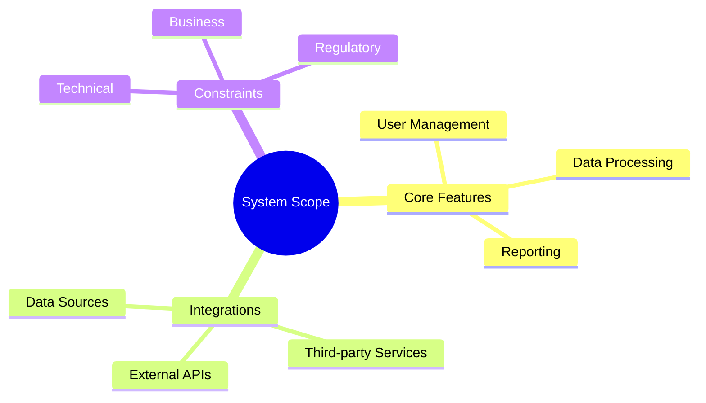

### 1.2 Document Control
| Attribute | Value |
|-----------|-------|
| Version | 1.0.0 |
| Status | Draft |
| Last Updated | [Date] |
| Approved By | [Name] |

## 2. System Overview

### 2.1 System Context
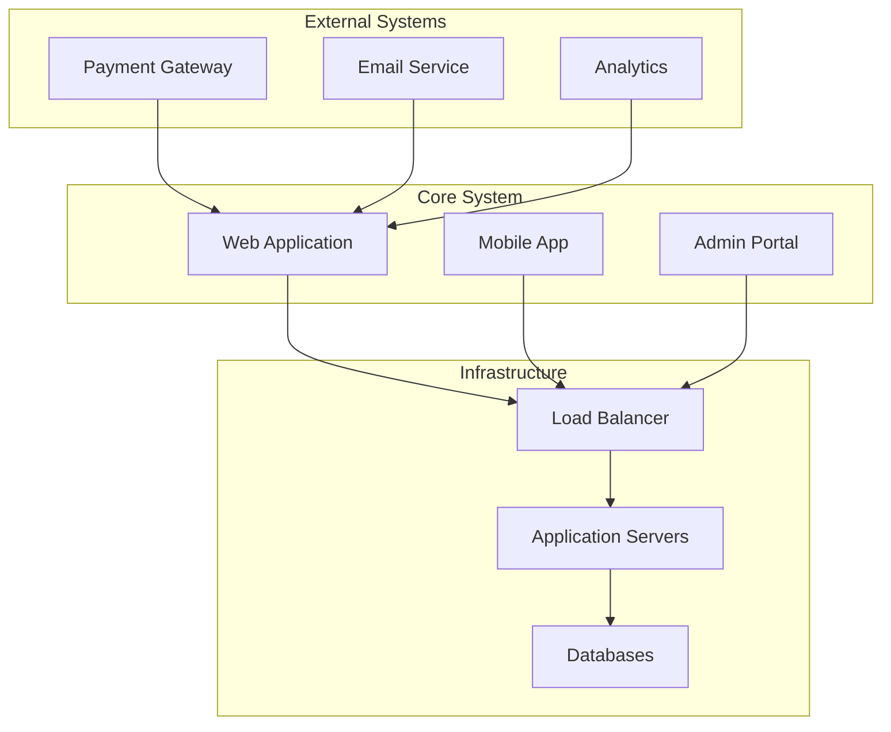

### 2.2 System Interfaces
| Interface | Type | Protocol | Data Format |
|-----------|------|----------|-------------|
| Web API | REST | HTTPS | JSON |
| Mobile API | GraphQL | HTTPS | JSON |
| Admin API | gRPC | HTTP/2 | Protocol Buffers |

## 3. Functional Requirements

### 3.1 User Management
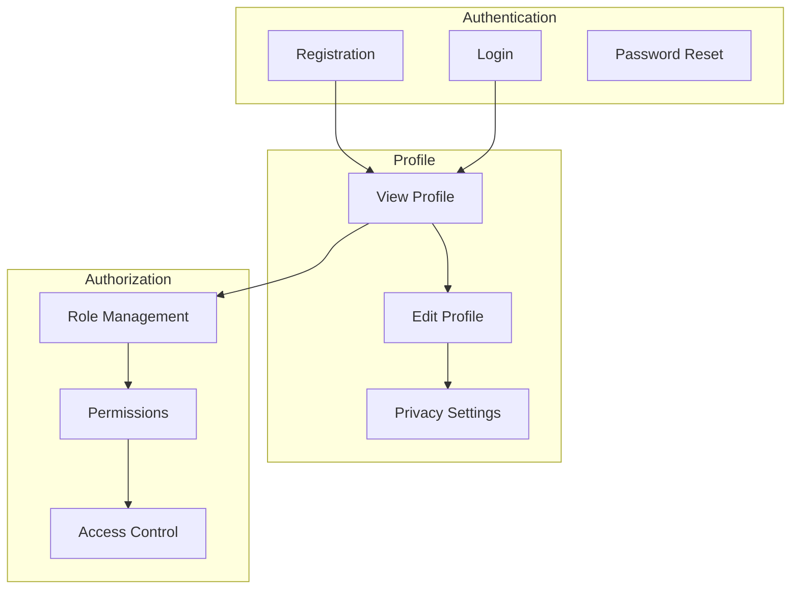

### 3.2 Core Features
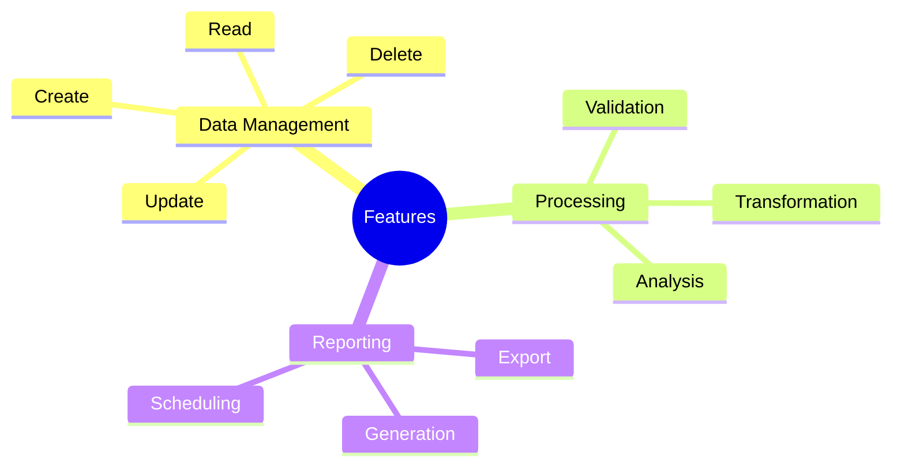

## 4. Non-Functional Requirements

### 4.1 Performance Requirements
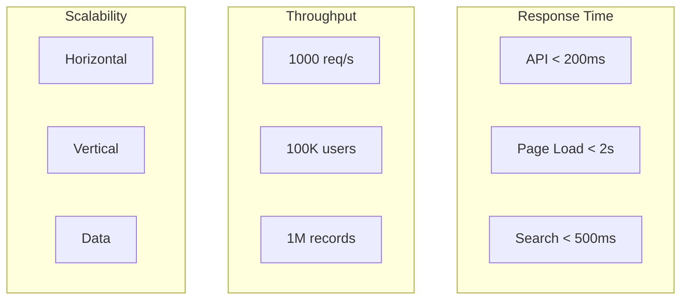

### 4.2 Security Requirements
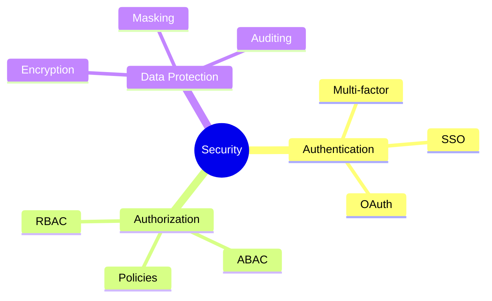

## 5. System Architecture

### 5.1 High-Level Architecture
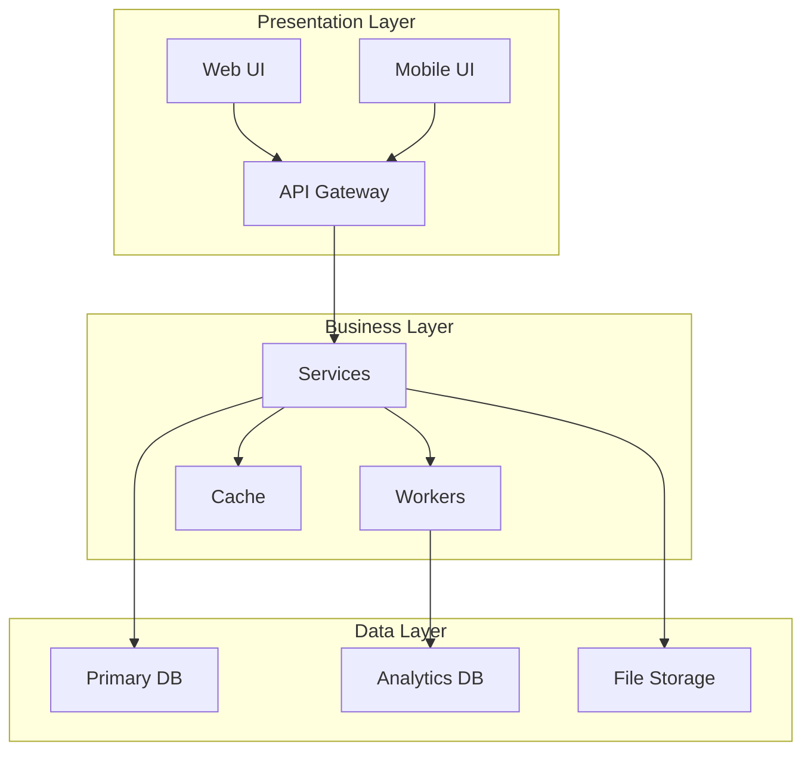

### 5.2 Component Diagram
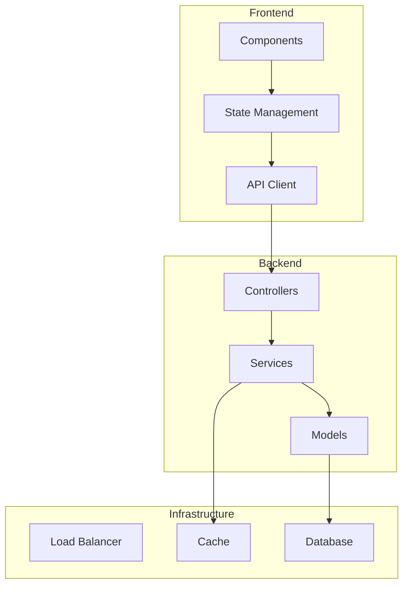

## 6. Data Requirements

### 6.1 Data Flow
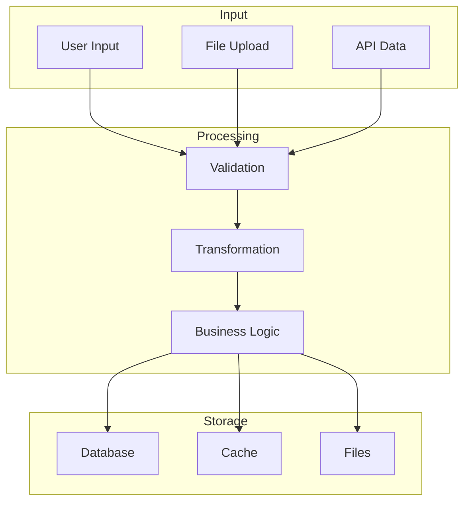

### 6.2 Data Models
| Entity | Attributes | Relationships | Constraints |
|--------|------------|---------------|-------------|
| User | id, email, name | Profile, Orders | Unique email |
| Order | id, total, status | User, Items | Valid status |
| Item | id, name, price | Orders | Positive price |

## 7. Interface Requirements

### 7.1 User Interfaces
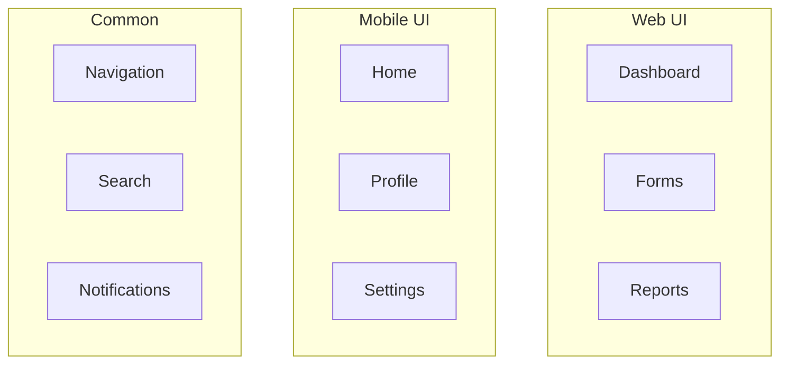

### 7.2 API Interfaces
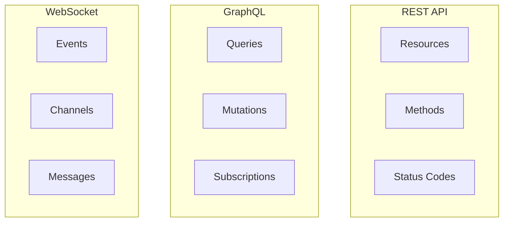

## 8. Quality Requirements

### 8.1 Quality Attributes
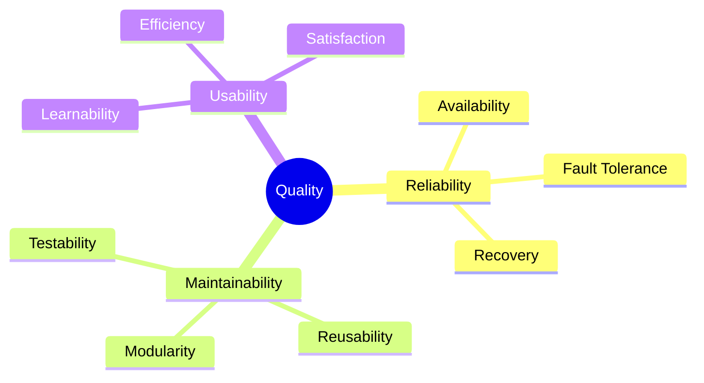

### 8.2 Quality Metrics
| Attribute | Metric | Target |
|-----------|--------|--------|
| Availability | Uptime | 99.9% |
| Performance | Response Time | < 200ms |
| Security | Vulnerabilities | Zero Critical |

## 9. Constraints & Assumptions

### 9.1 Technical Constraints
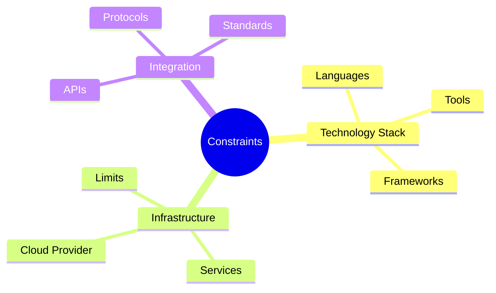

### 9.2 Business Constraints
| Constraint | Impact | Mitigation |
|------------|--------|------------|
| Budget | Resource limits | Cloud optimization |
| Timeline | Feature scope | Agile prioritization |
| Compliance | Implementation | Security reviews |

## Next Steps
1. [ ] Review with stakeholders
2. [ ] Technical team validation
3. [ ] Security review
4. [ ] Performance testing plan
5. [ ] Implementation roadmap