import { Callout, Steps } from 'nextra/components'

# User Experience Design Document (UXDD)

<Callout type="info">
  This document aggregates all user experience design specifications, including user research, personas, journey maps, wireframes, and design systems.
</Callout>

## 1. User Research & Analysis

### 1.1 User Personas

```mermaid
mindmap
  root((User Personas))
    Primary Users
      Demographics
      Goals
      Pain Points
      Behaviors
    Secondary Users
      Demographics
      Goals
      Pain Points
      Behaviors
    Edge Cases
      Special Needs
      Accessibility
      Edge Scenarios
```


### 1.2 User Journey Maps


## 2. Information Architecture

### 2.1 Site Map Structure


### 2.2 Content Hierarchy


## 3. Wireframe Specifications

### 3.1 Component Library


### 3.2 Layout Grid System


### 3.3 Wireframe Examples


### 3.4 Component States
```tsx
// Button Component States
interface ButtonStates {
  default: {
    background: 'bg-primary',
    text: 'text-white',
    padding: 'px-4 py-2'
  },
  hover: {
    background: 'bg-primary-dark',
    transform: 'scale(1.02)',
    transition: 'all 0.2s'
  },
  active: {
    background: 'bg-primary-darker',
    transform: 'scale(0.98)'
  },
  disabled: {
    background: 'bg-gray-300',
    cursor: 'not-allowed',
    opacity: '0.6'
  }
}

// Form Field States
interface FormFieldStates {
  default: {
    border: 'border-gray-300',
    background: 'bg-white'
  },
  focus: {
    border: 'border-primary',
    ring: 'ring-2 ring-primary-light'
  },
  error: {
    border: 'border-red-500',
    background: 'bg-red-50',
    text: 'text-red-600'
  },
  success: {
    border: 'border-green-500',
    background: 'bg-green-50',
    text: 'text-green-600'
  }
}
```

## 9. User Research Templates

### 9.1 User Interview Template
```markdown
# User Interview Guide

## Introduction
- Welcome participant
- Explain session purpose
- Get consent for recording
- Explain confidentiality

## Background Questions
1. Role and responsibilities
2. Industry experience
3. Current tools and processes
4. Pain points and challenges

## Task-Specific Questions
1. Walk me through how you...
2. What challenges do you face when...
3. How do you currently solve...
4. What would make this process better...

## Feature Exploration
1. Most important features
2. Missing functionality
3. Improvement suggestions
4. Priority ranking

## Wrap-up
- Additional thoughts
- Next steps
- Thank participant
```

### 9.2 Usability Test Script
```markdown
# Usability Test Script

## Test Setup
- Task scenarios
- Success criteria
- Time estimates
- Required resources

## Introduction Script
"Thank you for participating. We're testing the application, not you.
Please think aloud as you work through the tasks..."

## Tasks
1. Task: [Description]
   - Success criteria
   - Expected path
   - Potential issues
   
2. Task: [Description]
   - Success criteria
   - Expected path
   - Potential issues

## Follow-up Questions
1. Overall experience
2. Most difficult aspects
3. Most useful features
4. Suggested improvements

## Metrics Collection
- Task completion rates
- Time on task
- Error rates
- Satisfaction scores
```

### 9.3 User Survey Template
```typescript
interface UserSurvey {
  demographics: {
    role: string;
    experience: number;
    industry: string;
    tooling: string[];
  };
  
  usage: {
    frequency: 'daily' | 'weekly' | 'monthly';
    primaryTasks: string[];
    timeSpent: number;
    painPoints: string[];
  };
  
  satisfaction: {
    overall: number; // 1-5 scale
    features: {
      [feature: string]: {
        usage: number;
        satisfaction: number;
        importance: number;
      };
    };
    nps: number; // 0-10 scale
  };
  
  feedback: {
    improvements: string[];
    missingFeatures: string[];
    barriers: string[];
    openFeedback: string;
  };
}
```

### 9.4 Research Analysis Template


### 9.5 Research Report Template
```markdown
# UX Research Report

## Executive Summary
- Key findings
- Critical insights
- Recommendations

## Research Goals
- Objectives
- Research questions
- Success metrics

## Methodology
- Research methods
- Participant demographics
- Data collection process

## Key Findings
1. Finding One
   - Supporting data
   - User quotes
   - Impact assessment

2. Finding Two
   - Supporting data
   - User quotes
   - Impact assessment

## Recommendations
1. Short-term actions
2. Medium-term improvements
3. Long-term strategy

## Next Steps
- Implementation plan
- Success metrics
- Timeline
```

## 4. Design System

### 4.1 Visual Language


### 4.2 Component Specifications
| Component | States | Variants | Responsive Behavior |
|-----------|--------|----------|-------------------|
| Buttons | Normal, Hover, Active, Disabled | Primary, Secondary, Text | Scale touch targets |
| Inputs | Empty, Filled, Error, Disabled | Text, Number, Select | Full width on mobile |
| Cards | Default, Hover, Selected | Basic, Interactive, Featured | Stack vertically |

## 5. Interaction Design

### 5.1 Navigation Patterns


### 5.2 Interaction States


## 6. Accessibility Guidelines

### 6.1 WCAG Compliance


### 6.2 Implementation Checklist
| Category | Requirement | Implementation |
|----------|-------------|----------------|
| Semantic HTML | Use proper elements | `<nav>`, `<main>`, `<article>` |
| ARIA | Add missing semantics | `aria-label`, `role` |
| Focus Management | Keyboard navigation | Focus indicators, trap focus |

## 7. Prototypes & Testing

### 7.1 Prototype Workflow


### 7.2 Testing Matrix
| Test Type | Method | Success Criteria |
|-----------|--------|-----------------|
| Usability | Task completion | 90% success rate |
| A11y | Screen reader | WCAG AA compliance |
| Performance | Load time | < 3s initial load |

## 8. Design Management

### 8.1 Design Workflow


### 8.2 Asset Management
| Asset Type | Format | Storage | Usage |
|------------|--------|---------|-------|
| Icons | SVG | Design System | UI elements |
| Images | WebP | CDN | Content |
| Illustrations | SVG | Component Library | Marketing |

## 10. Common Layout Patterns

### 10.1 Layout Components


### 10.2 Layout Implementation
```typescript
// Layout Component Types
interface LayoutProps {
  // Navigation
  fixedNav: {
    classes: 'fixed top-0 w-full bg-white shadow-md',
    component: NavigationMenu,
    level: 'organism'
  },
  sideNav: {
    classes: 'fixed left-0 h-full w-64 bg-slate-800',
    component: Sheet,
    level: 'organism'
  },
  
  // Content
  cardGrid: {
    classes: 'grid grid-cols-1 md:grid-cols-3 gap-4',
    component: Card,
    level: 'molecule'
  },
  dashboard: {
    classes: 'grid grid-cols-12 gap-4',
    component: null,
    level: 'template'
  },
  
  // Interactive
  modal: {
    classes: 'fixed inset-0 bg-black bg-opacity-50 flex items-center justify-center',
    component: Dialog,
    level: 'molecule'
  }
}

// Responsive Patterns
interface ResponsiveBreakpoints {
  mobile: 'sm:', // < 640px
  tablet: 'md:', // ≥ 768px
  desktop: 'lg:', // ≥ 1024px
  large: 'xl:'  // ≥ 1280px
}
```

### 10.3 Common Patterns
```html
<!-- Flex Patterns -->
<div class="flex items-center justify-center">
  <!-- Center Content -->
</div>

<div class="flex flex-col space-y-4">
  <!-- Vertical Stack -->
</div>

<div class="flex space-x-4">
  <!-- Horizontal Row -->
</div>

<!-- Grid Patterns -->
<div class="grid grid-cols-4 gap-4">
  <!-- Basic Grid -->
</div>

<div class="grid grid-cols-1 md:grid-cols-2 lg:grid-cols-4 gap-4">
  <!-- Responsive Grid -->
</div>
```

## 11. Design System Specifications

### 11.1 Design Tokens
```typescript
interface DesignTokens {
  colors: {
    primary: {
      50: 'hsl(var(--primary-50))',
      100: 'hsl(var(--primary-100))',
      // ... other shades
    },
    secondary: {
      // ... color variants
    },
    semantic: {
      success: 'hsl(var(--success))',
      error: 'hsl(var(--error))',
      warning: 'hsl(var(--warning))'
    }
  },
  
  typography: {
    fonts: {
      sans: 'var(--font-sans)',
      mono: 'var(--font-mono)'
    },
    sizes: {
      xs: '0.75rem',
      sm: '0.875rem',
      base: '1rem',
      lg: '1.125rem',
      xl: '1.25rem'
    },
    weights: {
      normal: '400',
      medium: '500',
      semibold: '600',
      bold: '700'
    }
  },
  
  spacing: {
    0: '0px',
    1: '0.25rem',
    2: '0.5rem',
    3: '0.75rem',
    4: '1rem'
    // ... other spacing values
  },
  
  shadows: {
    sm: 'var(--shadow-sm)',
    md: 'var(--shadow-md)',
    lg: 'var(--shadow-lg)'
  }
}
```

### 11.2 Component Architecture


### 11.3 Component Variants
| Component | Variants | States | Props |
|-----------|----------|--------|-------|
| Button | Primary, Secondary, Ghost | Default, Hover, Active, Disabled | size, variant, loading |
| Input | Text, Number, Password | Empty, Filled, Error, Disabled | type, placeholder, error |
| Card | Default, Interactive, Elevated | Default, Hover, Selected | variant, clickable |

### 11.4 Design Guidelines


## 12. Wireframe Annotations

### 12.1 Annotation System
```typescript
interface WireframeAnnotation {
  id: string;
  type: 'component' | 'interaction' | 'note';
  position: {
    x: number;
    y: number;
  };
  content: {
    title: string;
    description: string;
    requirements?: string[];
    interactions?: string[];
  };
  references?: {
    component?: string;
    design?: string;
    spec?: string;
  };
}
```

### 12.2 Annotation Examples


### 12.3 Implementation Notes
| Category | Note Type | Example |
|----------|-----------|---------|
| Layout | Spacing | Use 16px grid, maintain consistent gaps |
| Components | Props | Required: title, optional: description |
| Interaction | States | Show loading spinner during API calls |
| Responsive | Breakpoints | Stack vertically below 768px |

## Next Steps
1. [ ] Complete layout documentation
2. [ ] Finalize design system tokens
3. [ ] Create component specifications
4. [ ] Document responsive patterns
5. [ ] Prepare annotation guidelines