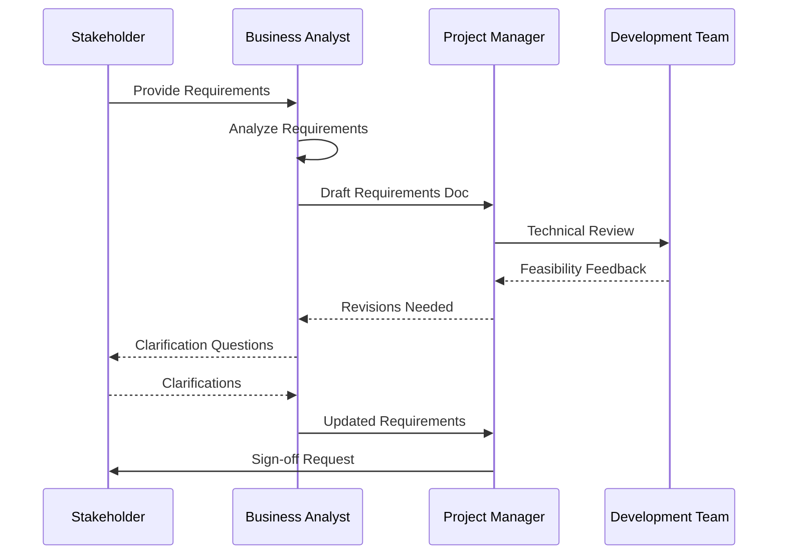
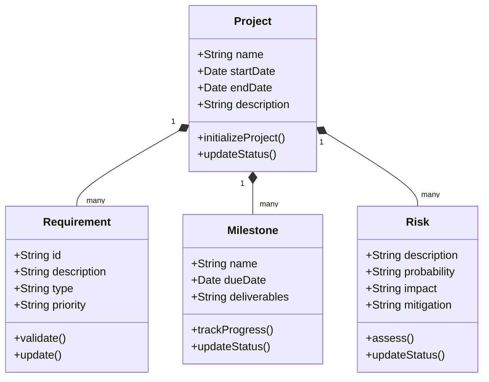
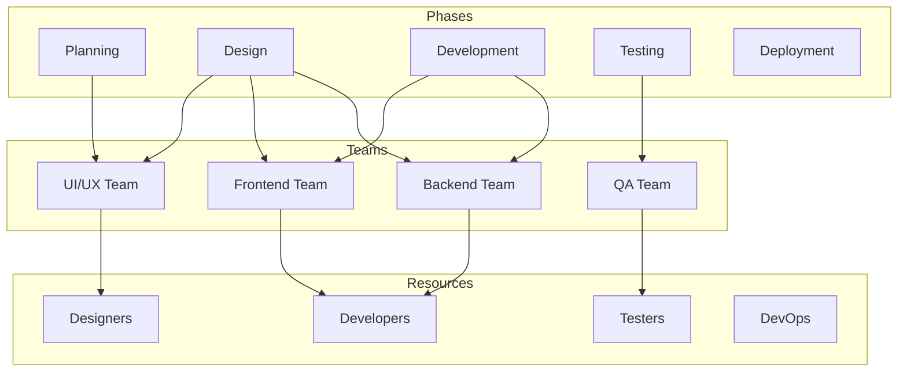
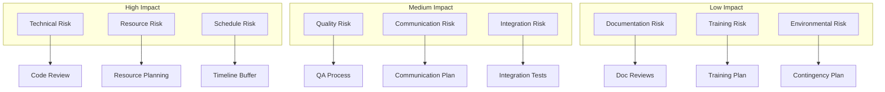
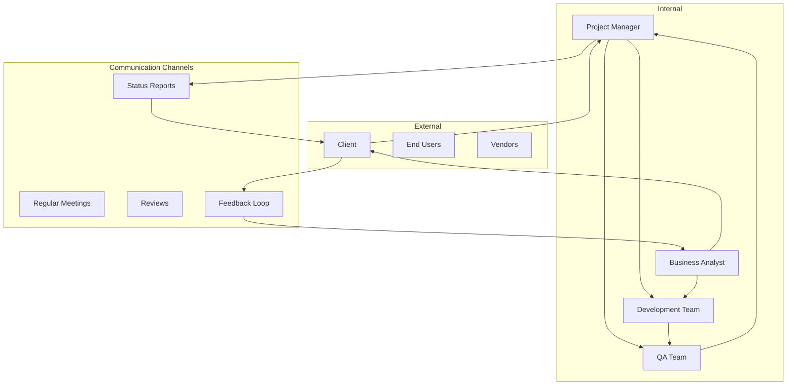
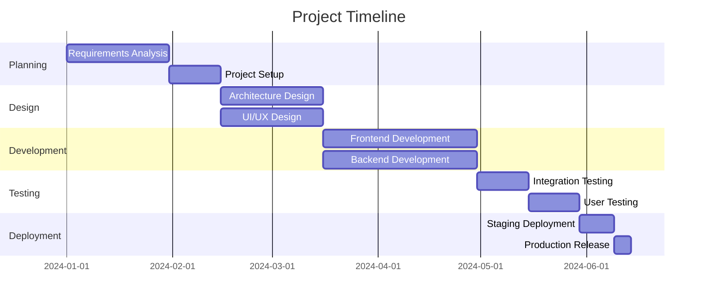
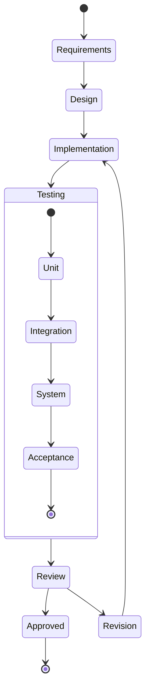
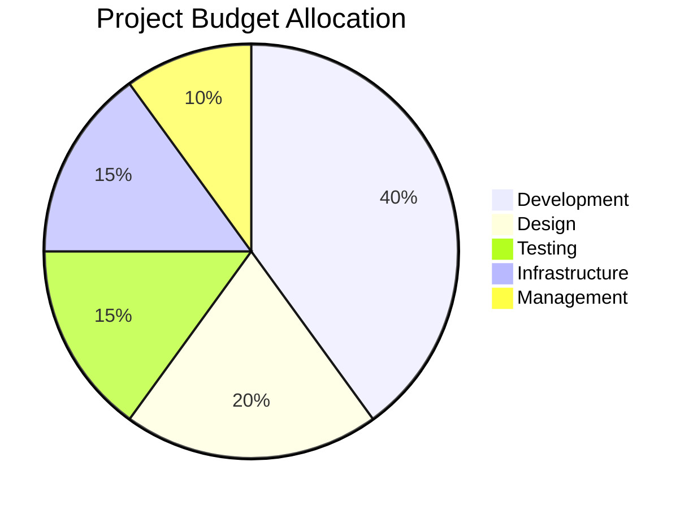

import { Callout } from 'nextra/components'

# Planning Phase UML Diagrams

<Callout type="info">
  This section contains detailed UML diagrams illustrating the planning phase processes, relationships, and workflows.
</Callout>

## Requirements Gathering Process

## Project Structure

## Resource Allocation

## Risk Assessment

## Stakeholder Communication

## Timeline Management

## Quality Assurance Planning

## Budget Allocation

## Next Steps
1. [ ] Review diagrams with stakeholders
2. [ ] Update based on feedback
3. [ ] Integrate with project documentation
4. [ ] Create detailed sub-diagrams
5. [ ] Maintain diagram versioning