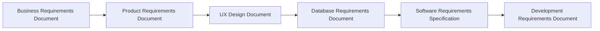
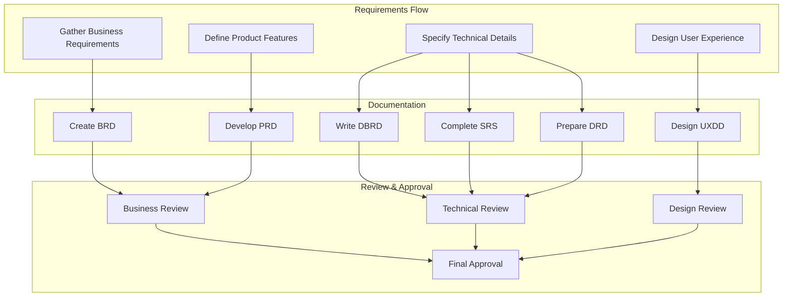

import { Callout, Steps } from 'nextra/components'

# Planning Phase Overview

<Callout type="info">
  The planning phase establishes the foundation for successful software development through a structured sequence of documentation.
</Callout>

## Documentation Sequence

## Key Deliverables

### 1. Business Requirements Document (BRD)
The [Business Requirements Document](/planning/deliverables/brd) defines business objectives and stakeholder needs:
- Executive Summary
- Business Requirements
- Stakeholder Analysis
- Market Analysis
- Cost-Benefit Analysis
- Risk Assessment

### 2. Product Requirements Document (PRD)
The [Product Requirements Document](/planning/deliverables/prd) outlines product specifications:
- Product Vision
- User Stories
- Feature Specifications
- Technical Requirements
- UI/UX Requirements
- Performance Criteria

### 3. User Experience Design Document (UXDD)
The [UX Design Document](/planning/deliverables/uxdd) details the user experience:
- User Research
- Interaction Design
- Visual Design System
- Wireframes & Prototypes
- Accessibility Guidelines
- Usability Testing

### 4. Database Requirements Document (DBRD)
The Database Requirements Document defines data architecture:
- Data Models
- Relationships
- Storage Requirements
- Security Measures
- Backup Procedures
- Performance Specs

### 5. Software Requirements Specification (SRS)
The Software Requirements Specification details technical implementation:
- Functional Requirements
- Non-functional Requirements
- System Architecture
- Integration Points
- Security Requirements
- Performance Criteria

### 6. Development Requirements Document (DRD)
The Development Requirements Document guides implementation:
- Development Standards
- Code Organization
- Testing Strategy
- Deployment Process
- Monitoring Plan
- Maintenance Procedures

## Documentation Process

## Next Steps
1. [ ] Begin with BRD development
2. [ ] Move to PRD after BRD approval
3. [ ] Create UXDD based on PRD
4. [ ] Develop DBRD and SRS in parallel
5. [ ] Complete DRD before development phase