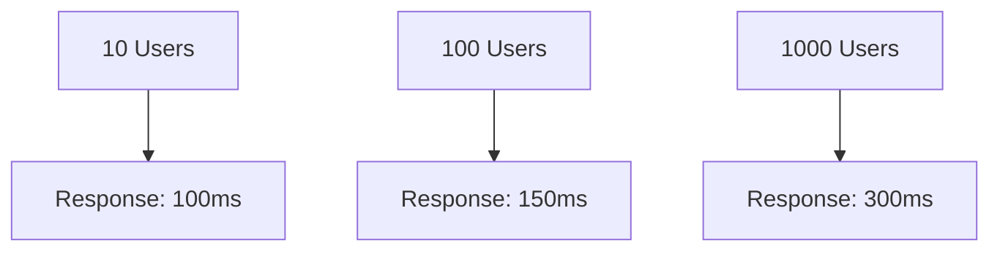
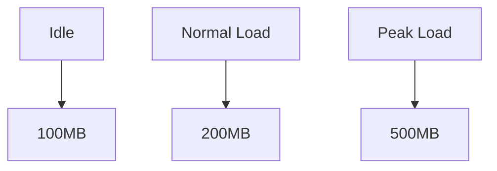
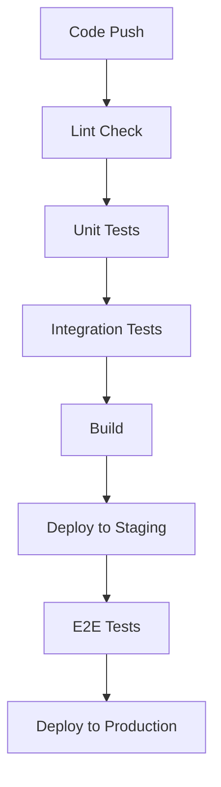

import { Callout } from 'nextra/components'
import { Steps } from 'nextra/components'

# Testing Phase Documentation

<Callout type="info">
  This section outlines our comprehensive testing strategy, including test plans, test cases, and quality assurance procedures.
</Callout>

## Testing Strategy

<Steps>
### Unit Testing
- Component testing
- Service testing
- Utility function testing

### Integration Testing
- API integration tests
- Component integration tests
- Service integration tests

### End-to-End Testing
- User flow testing
- Cross-browser testing
- Mobile responsiveness testing

### Performance Testing
- Load testing
- Stress testing
- Scalability testing
</Steps>

## Test Plans

### Frontend Testing

```typescript
// Component Test Example
import { render, screen, fireEvent } from '@testing-library/react'
import { Button } from '@/components/atoms/Button'

describe('Button Component', () => {
  it('renders correctly', () => {
    render(<Button>Click me</Button>)
    expect(screen.getByText('Click me')).toBeInTheDocument()
  })

  it('handles click events', () => {
    const handleClick = jest.fn()
    render(<Button onClick={handleClick}>Click me</Button>)
    fireEvent.click(screen.getByText('Click me'))
    expect(handleClick).toHaveBeenCalled()
  })
})
```

### Backend Testing

```typescript
// API Test Example
import request from 'supertest'
import { app } from '../app'

describe('User API', () => {
  it('should create a new user', async () => {
    const response = await request(app)
      .post('/api/users')
      .send({
        name: 'Test User',
        email: 'test@example.com'
      })
    expect(response.status).toBe(201)
    expect(response.body).toHaveProperty('id')
  })
})
```

## Test Cases

### User Authentication

| Test Case | Description | Expected Result | Status |
|-----------|-------------|-----------------|--------|
| TC001 | Valid login | User logged in successfully | ✅ |
| TC002 | Invalid password | Error message displayed | ✅ |
| TC003 | Account locked | Account locked message | ✅ |

### Data Validation

| Test Case | Description | Expected Result | Status |
|-----------|-------------|-----------------|--------|
| TC101 | Valid input | Data saved successfully | ✅ |
| TC102 | Invalid email | Validation error shown | ✅ |
| TC103 | Missing fields | Required field error | ✅ |

## Performance Testing

### Load Testing Results



### Memory Usage



## Security Testing

### Security Checklist
- [ ] SQL Injection prevention
- [ ] XSS protection
- [ ] CSRF protection
- [ ] Input validation
- [ ] Authentication
- [ ] Authorization
- [ ] Data encryption
- [ ] Session management

## Accessibility Testing

### WCAG Compliance
- [ ] Perceivable
- [ ] Operable
- [ ] Understandable
- [ ] Robust

## Bug Tracking

### Bug Report Template
```markdown
## Bug Description
[Describe the bug]

## Steps to Reproduce
1. Step 1
2. Step 2
3. Step 3

## Expected Behavior
[What should happen]

## Actual Behavior
[What actually happens]

## Environment
- Browser:
- OS:
- Version:

## Screenshots
[If applicable]
```

## Test Coverage

### Coverage Report
```bash
-----------------|---------|----------|---------|---------|-------------------
File            | % Stmts | % Branch | % Funcs | % Lines | Uncovered Line #s 
-----------------|---------|----------|---------|---------|-------------------
All files       |   85.71 |    78.57 |   89.47 |   85.71 |                   
 components/    |   89.47 |    83.33 |   88.89 |   89.47 |                   
  Button.tsx    |   91.67 |    85.71 |   90.00 |   91.67 | 15,28            
 utils/         |   81.82 |    73.68 |   90.00 |   81.82 | 45,67,89         
-----------------|---------|----------|---------|---------|-------------------
```

## Continuous Testing

### CI/CD Pipeline


## Next Steps
1. [ ] Complete unit test suite
2. [ ] Run integration tests
3. [ ] Perform security audit
4. [ ] Conduct performance testing
5. [ ] Generate test reports
``` 