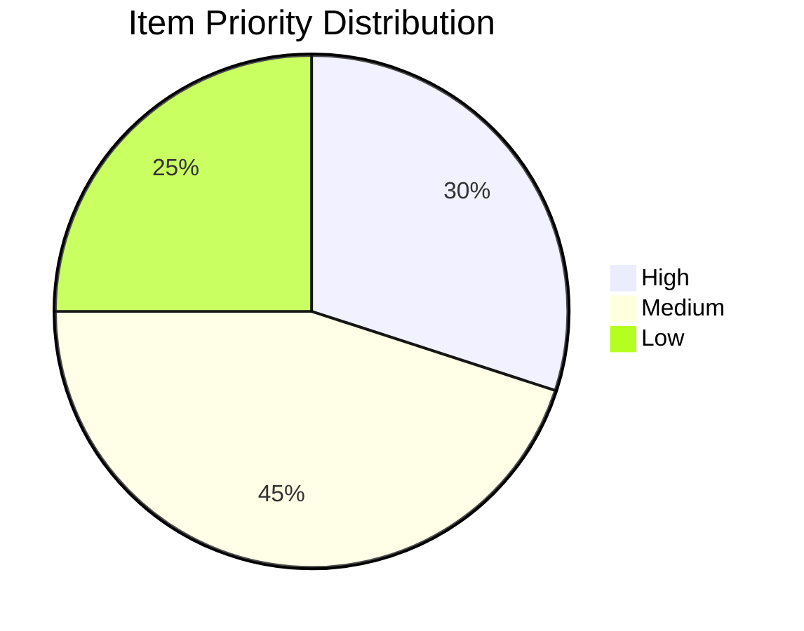
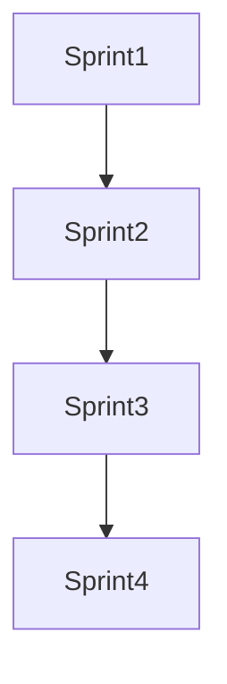
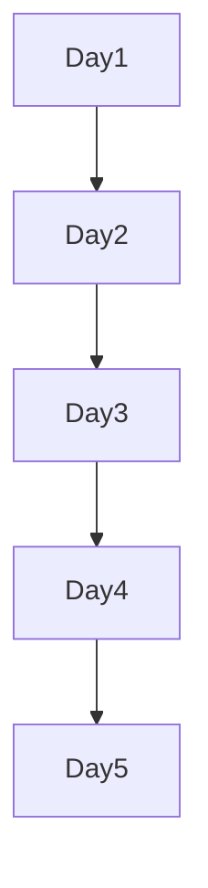

# Backlog Report Template

## Metadata
- **Type**: Project Management Report
- **Version**: 1.0.0
- **Last Updated**: YYYY-MM-DD
- **Sprint**: [Current Sprint Number]
- **Period**: [Date Range]

## Executive Summary
Brief overview of backlog status, key metrics, and important changes.

## Backlog Overview
### Key Metrics
```markdown
| Metric | Current | Previous | Change |
|--------|---------|----------|--------|
| Total Items | | | |
| Story Points | | | |
| Average Age | | | |
| Completion Rate | | | |
```

### Priority Distribution


## New Items
### Features
| ID | Title | Priority | Story Points | Status |
|----|-------|----------|--------------|--------|
|    |       |          |              |        |

### Bugs
| ID | Title | Severity | Priority | Status |
|----|-------|----------|----------|--------|
|    |       |          |          |        |

### Technical Debt
| ID | Title | Impact | Effort | Status |
|----|-------|--------|--------|--------|
|    |       |        |        |        |

## Progress Analysis
### Completed Items
- List of items completed in current period
- Key achievements and milestones
- Impact assessment

### In Progress
- Currently active items
- Blockers and dependencies
- Resource allocation

### Upcoming
- Next sprint priorities
- Resource requirements
- Risk assessment

## Velocity Tracking
### Sprint Velocity


### Burndown Chart


## Risk Assessment
### Current Risks
| Risk | Impact | Probability | Mitigation |
|------|--------|------------|------------|
|      |        |            |            |

### Blocked Items
- List of blocked items
- Reason for blockage
- Required actions
- Owner assignment

## Resource Allocation
### Team Capacity
| Team Member | Current Load | Available Capacity |
|-------------|--------------|-------------------|
|             |              |                   |

### Skill Coverage
- Required skills vs. available resources
- Training needs
- External resource requirements

## Quality Metrics
### Code Quality
- Test coverage
- Technical debt ratio
- Bug density

### Documentation Status
- Documentation coverage
- Update requirements
- Quality assessment

## Recommendations
### Process Improvements
- Identified bottlenecks
- Proposed solutions
- Implementation timeline

### Resource Adjustments
- Capacity planning
- Skill development
- Team composition

## Action Items
| Action | Owner | Due Date | Status |
|--------|-------|----------|--------|
|        |       |          |        |

## Notes
- Important observations
- Team feedback
- Special considerations

## Appendix
### Definitions
- Story point scale
- Priority levels
- Status definitions

### References
- Sprint planning documents
- Team capacity plans
- Related reports 