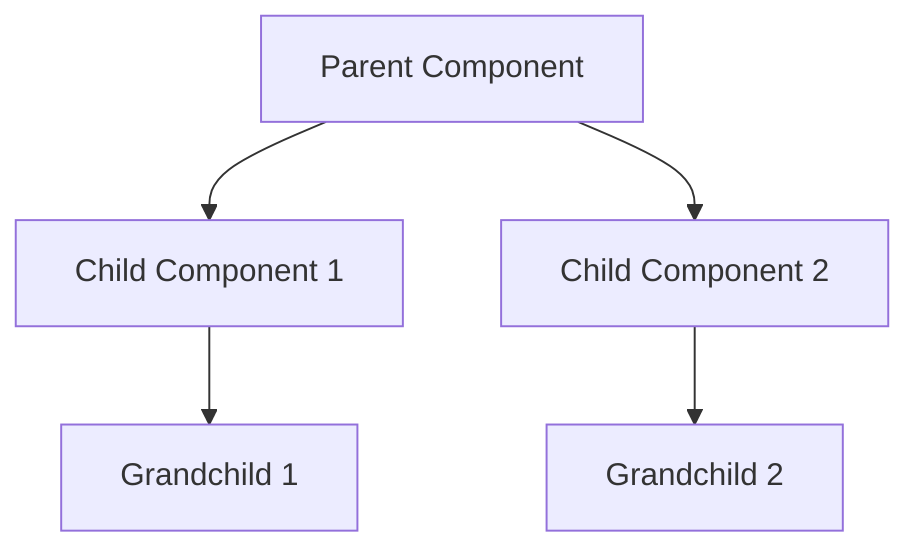

# Component Generator Template

## Metadata
- **Type**: Component Generation Template
- **Version**: 1.0.0
- **Last Updated**: YYYY-MM-DD
- **Framework**: [React/Next.js]
- **Design System**: [Reference to design system]

## Component Definition
### Basic Information
```yaml
name: ComponentName
description: Brief description of the component's purpose
category: [Atoms/Molecules/Organisms]
status: [Draft/In Development/Ready]
maintainer: [Name/Team]
```

### Component Architecture


## Component Structure
### File Organization
```bash
components/
└── ComponentName/
    ├── index.ts
    ├── component-name.tsx
    ├── component-name.test.tsx
    ├── component-name.stories.tsx
    └── component-name.css
```

### Component Template
```typescript
// component-name.tsx
import * as React from "react"
import { cn } from "@/lib/utils"

interface ComponentNameProps extends React.HTMLAttributes<HTMLElement> {
  // Custom props
  variant?: "default" | "primary" | "secondary"
  size?: "sm" | "md" | "lg"
  disabled?: boolean
  // Additional props
}

const ComponentName = React.forwardRef<HTMLElement, ComponentNameProps>(
  ({ className, variant = "default", size = "md", disabled, ...props }, ref) => {
    return (
      <div
        ref={ref}
        className={cn(
          "component-base-class",
          variantStyles[variant],
          sizeStyles[size],
          disabled && "opacity-50 cursor-not-allowed",
          className
        )}
        {...props}
      />
    )
  }
)

ComponentName.displayName = "ComponentName"

export { ComponentName, type ComponentNameProps }
```

## Styling System
### CSS Modules Template
```css
/* component-name.css */
.root {
  /* Base styles */
}

.variant-default {
  /* Default variant styles */
}

.variant-primary {
  /* Primary variant styles */
}

.size-sm {
  /* Small size styles */
}

/* Additional styles */
```

### Tailwind Configuration
```typescript
// tailwind.config.js extension
module.exports = {
  theme: {
    extend: {
      components: {
        'component-name': {
          base: 'base-classes',
          variants: {
            default: 'variant-classes',
            primary: 'variant-classes',
          },
          sizes: {
            sm: 'size-classes',
            md: 'size-classes',
            lg: 'size-classes',
          },
        },
      },
    },
  },
}
```

## Props Interface
### Required Props
```typescript
interface RequiredProps {
  // Essential props that must be provided
  label: string
  onAction: (value: any) => void
}
```

### Optional Props
```typescript
interface OptionalProps {
  // Additional customization props
  className?: string
  style?: React.CSSProperties
  disabled?: boolean
  loading?: boolean
}
```

## State Management
### Internal State
```typescript
const [state, setState] = React.useState<StateType>({
  // Initial state
  value: initialValue,
  error: null,
  loading: false
})
```

### Context Integration
```typescript
const ComponentContext = React.createContext<ContextType>({
  // Context values
  theme: 'light',
  locale: 'en',
})
```

## Event Handlers
### Basic Events
```typescript
const handleClick = (event: React.MouseEvent<HTMLElement>) => {
  // Click handler logic
}

const handleChange = (event: React.ChangeEvent<HTMLInputElement>) => {
  // Change handler logic
}
```

### Custom Events
```typescript
const handleCustomEvent = (data: CustomEventData) => {
  // Custom event logic
  onCustomEvent?.(data)
}
```

## Testing Template
### Unit Tests
```typescript
// component-name.test.tsx
import { render, screen, fireEvent } from '@testing-library/react'
import { ComponentName } from './component-name'

describe('ComponentName', () => {
  it('renders correctly', () => {
    render(<ComponentName />)
    // Test assertions
  })

  it('handles interactions', () => {
    render(<ComponentName />)
    fireEvent.click(screen.getByRole('button'))
    // Test assertions
  })
})
```

### Integration Tests
```typescript
describe('ComponentName Integration', () => {
  it('works with parent components', () => {
    render(
      <ParentComponent>
        <ComponentName />
      </ParentComponent>
    )
    // Test assertions
  })
})
```

## Documentation Template
### Component Documentation
```markdown
# ComponentName

Description of the component and its purpose.

## Usage

\`\`\`tsx
import { ComponentName } from "@/components/component-name"

export default function Example() {
  return (
    <ComponentName
      variant="primary"
      size="md"
      onClick={() => console.log("Clicked")}
    >
      Content
    </ComponentName>
  )
}
\`\`\`

## Props

| Name     | Type                              | Default     | Description     |
|----------|-----------------------------------|-------------|-----------------|
| variant  | 'default' \| 'primary'            | 'default'   | Style variant   |
| size     | 'sm' \| 'md' \| 'lg'             | 'md'        | Component size  |
| disabled | boolean                           | false       | Disabled state  |

## Examples

### Basic Usage
[Basic example code]

### With Variants
[Variant example code]

### With Sizes
[Size example code]
```

## Storybook Integration
### Story Template
```typescript
// component-name.stories.tsx
import type { Meta, StoryObj } from '@storybook/react'
import { ComponentName } from './component-name'

const meta: Meta<typeof ComponentName> = {
  title: 'Components/ComponentName',
  component: ComponentName,
  tags: ['autodocs'],
  argTypes: {
    variant: {
      control: 'select',
      options: ['default', 'primary', 'secondary'],
    },
    size: {
      control: 'select',
      options: ['sm', 'md', 'lg'],
    },
  },
}

export default meta
type Story = StoryObj<typeof ComponentName>

export const Default: Story = {
  args: {
    // Default props
  },
}

export const Primary: Story = {
  args: {
    variant: 'primary',
  },
}
```

## Accessibility
### ARIA Implementation
```typescript
const ariaProps = {
  role: "button",
  "aria-pressed": pressed,
  "aria-disabled": disabled,
  "aria-label": ariaLabel,
}
```

### Keyboard Navigation
```typescript
const handleKeyDown = (event: React.KeyboardEvent) => {
  switch (event.key) {
    case "Enter":
    case "Space":
      // Handle activation
      break
    // Additional key handlers
  }
}
```

## Performance Optimization
### Memoization
```typescript
const MemoizedComponent = React.memo(ComponentName, (prev, next) => {
  // Custom comparison logic
  return prev.value === next.value
})
```

### Lazy Loading
```typescript
const LazyComponent = React.lazy(() => import('./component-name'))
```

## Error Handling
### Error Boundaries
```typescript
class ComponentErrorBoundary extends React.Component {
  // Error boundary implementation
}
```

### Validation
```typescript
const validateProps = (props: ComponentNameProps) => {
  // Validation logic
}
```

## Notes
### Best Practices
- Component composition guidelines
- State management recommendations
- Performance considerations
- Accessibility requirements

### Known Issues
- Current limitations
- Browser compatibility
- Performance considerations
- Accessibility gaps