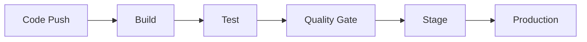
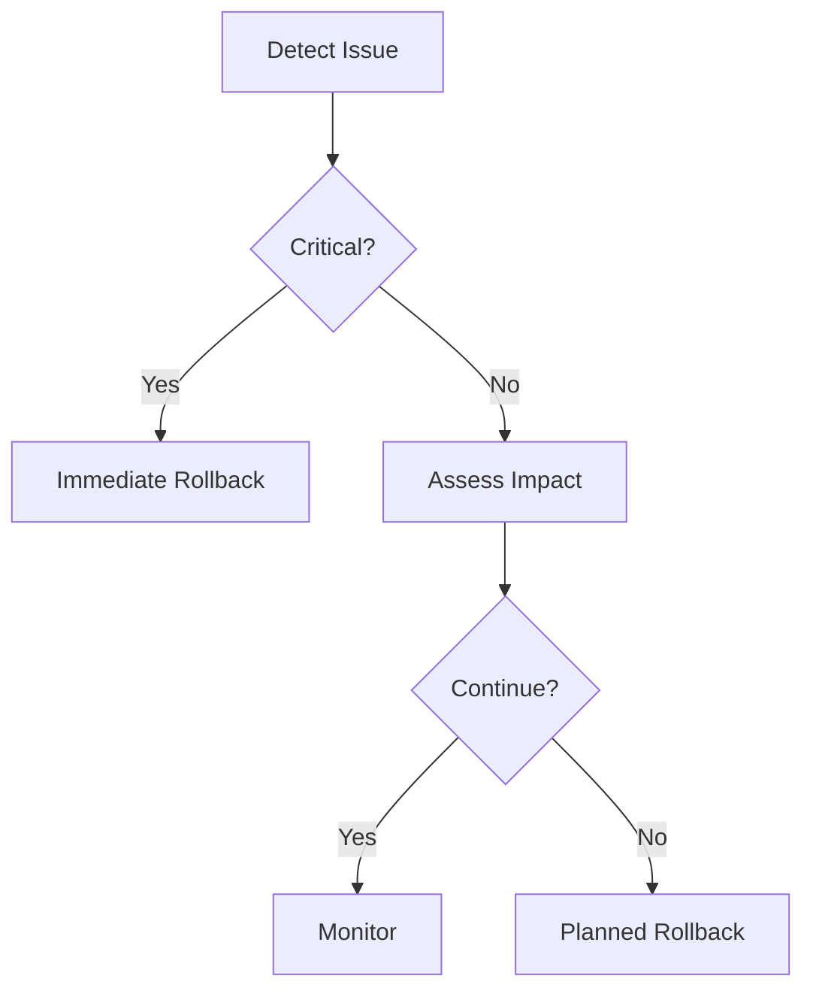
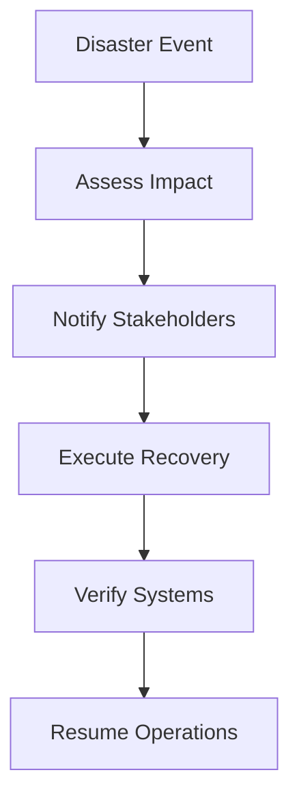

# Deployment Strategy Document

## Document Control
- **Project**: [Project name]
- **Version**: [Document version]
- **Last Updated**: [Date]
- **Status**: [Draft/Review/Approved]

## Deployment Overview
### Strategy Summary
- **Deployment Type**: [Rolling/Blue-Green/Canary]
- **Release Frequency**: [Release schedule]
- **Environments**: [List of environments]
- **Rollback Strategy**: [Rollback approach]

## CI/CD Pipeline
### Pipeline Architecture


### Pipeline Stages
1. **Build Stage**
   ```yaml
   # Build Configuration
   build:
     steps:
       - checkout
       - install_dependencies
       - compile
       - create_artifacts
     outputs:
       - dist/
       - artifacts/
   ```

2. **Test Stage**
   ```yaml
   # Test Configuration
   test:
     steps:
       - unit_tests
       - integration_tests
       - e2e_tests
     reports:
       - test-results/
       - coverage/
   ```

3. **Quality Gate**
   ```yaml
   # Quality Checks
   quality:
     metrics:
       coverage: 80%
       duplication: 5%
       complexity: 15
     security:
       vulnerability_scan: true
       dependency_check: true
   ```

## Environment Configuration
### Development
```yaml
# Development Environment
development:
  infrastructure:
    provider: [Cloud provider]
    region: [Region]
    resources:
      compute: [Compute specs]
      memory: [Memory specs]
      storage: [Storage specs]
  configuration:
    debug: true
    logging: verbose
    features:
      feature_flags: true
      hot_reload: true
```

### Staging
```yaml
# Staging Environment
staging:
  infrastructure:
    provider: [Cloud provider]
    region: [Region]
    resources:
      compute: [Compute specs]
      memory: [Memory specs]
      storage: [Storage specs]
  configuration:
    debug: false
    logging: normal
    features:
      feature_flags: true
      monitoring: true
```

### Production
```yaml
# Production Environment
production:
  infrastructure:
    provider: [Cloud provider]
    region: [Region]
    resources:
      compute: [Compute specs]
      memory: [Memory specs]
      storage: [Storage specs]
  configuration:
    debug: false
    logging: error
    features:
      feature_flags: false
      monitoring: true
```

## Deployment Process
### Pre-Deployment Checklist
- [ ] All tests passing
- [ ] Security scan completed
- [ ] Performance benchmarks met
- [ ] Documentation updated
- [ ] Stakeholder approval received

### Deployment Steps
1. **Preparation**
   - Verify build artifacts
   - Check environment health
   - Notify stakeholders
   - Prepare rollback plan

2. **Execution**
   - Deploy to staging
   - Run smoke tests
   - Deploy to production
   - Verify deployment

3. **Post-Deployment**
   - Monitor metrics
   - Check logs
   - Verify functionality
   - Update documentation

### Rollback Procedure


## Monitoring & Alerts
### Key Metrics
| Metric | Warning | Critical | Action |
|--------|---------|----------|---------|
| Error Rate | > 0.1% | > 1% | Alert & Review |
| Response Time | > 500ms | > 1s | Scale Up |
| CPU Usage | > 70% | > 90% | Scale Out |
| Memory Usage | > 80% | > 95% | Investigate |

### Alert Configuration
```yaml
# Alert Rules
alerts:
  error_rate:
    threshold: 1%
    window: 5m
    channels:
      - slack
      - email
  response_time:
    threshold: 1s
    window: 5m
    channels:
      - slack
      - pager
```

## Security Measures
### Access Control
| Role | Development | Staging | Production |
|------|------------|---------|------------|
| Developer | Full | Read | None |
| DevOps | Full | Full | Deploy |
| SRE | Full | Full | Full |

### Security Protocols
- **Secrets Management**: [Strategy]
- **Authentication**: [Method]
- **Authorization**: [Process]
- **Audit Logging**: [Approach]

## Disaster Recovery
### Backup Strategy
- **Frequency**: [Schedule]
- **Retention**: [Policy]
- **Verification**: [Process]

### Recovery Plan


## Documentation
### Deployment Documentation
- **Runbooks**: [Location]
- **Architecture Diagrams**: [Location]
- **Configuration Guide**: [Location]

### Support Documentation
- **Troubleshooting Guide**: [Location]
- **Contact List**: [Location]
- **Escalation Process**: [Location]

## Change Log
| Version | Date | Changes | Author |
|---------|------|---------|---------|
| [Version] | [Date] | [Changes] | [Author] | 