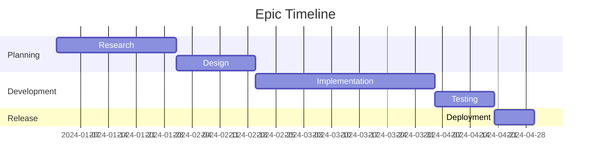
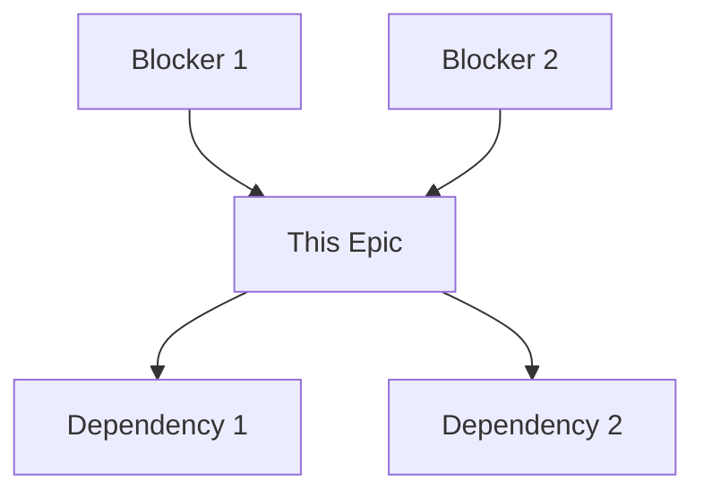
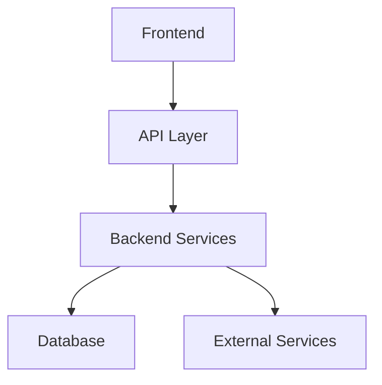

# Epic Template

## Metadata
- **Type**: Epic Documentation
- **Version**: 1.0.0
- **Last Updated**: YYYY-MM-DD
- **Project**: [Project Name]
- **Epic ID**: [EPIC-XXX]
- **Status**: [Draft/In Progress/Review/Done]

## Epic Overview
### Business Context
- Business driver
- Market opportunity
- Customer need
- Strategic alignment

### Success Metrics
```markdown
| Metric | Current | Target | Measurement Method |
|--------|---------|---------|-------------------|
| KPI 1  |         |         |                   |
| KPI 2  |         |         |                   |
```

## Scope
### Epic Timeline


### Dependencies


## User Stories
### Story Map
```markdown
| User Type | Goal | Story | Priority | Size |
|-----------|------|-------|----------|------|
|           |      |       |          |      |
```

### Story Details
#### Story 1: [Story Title]
```markdown
As a [user type]
I want to [action]
So that [benefit]

**Acceptance Criteria:**
1. Given [context]
   When [action]
   Then [outcome]

**Technical Notes:**
- Implementation considerations
- API requirements
- Data requirements
```

[Repeat for each story]

## Technical Requirements
### Architecture


### System Components
```markdown
| Component | Purpose | Tech Stack | Status |
|-----------|---------|------------|---------|
|           |         |            |         |
```

## Design Requirements
### UI/UX Deliverables
- Wireframes
- Mockups
- Prototypes
- User flows

### Design Specifications
```markdown
| Component | Design Requirements | Accessibility | Status |
|-----------|-------------------|---------------|---------|
|           |                   |               |         |
```

## Implementation Plan
### Development Phases
1. **Phase 1: Foundation**
   - Core functionality
   - Basic features
   - Infrastructure setup

2. **Phase 2: Enhancement**
   - Advanced features
   - Integration points
   - Performance optimization

3. **Phase 3: Polish**
   - UI refinements
   - Performance tuning
   - Final testing

### Resource Requirements
```markdown
| Role | Required Skills | Allocation | Duration |
|------|----------------|------------|-----------|
|      |                |            |           |
```

## Testing Strategy
### Test Coverage
```markdown
| Test Type | Scope | Tools | Responsibility |
|-----------|-------|-------|----------------|
| Unit      |       |       |                |
| Integration|      |       |                |
| E2E       |       |       |                |
```

### Test Scenarios
```markdown
| Scenario | Steps | Expected Result | Priority |
|----------|-------|-----------------|----------|
|          |       |                 |          |
```

## Risk Assessment
### Risk Matrix
```markdown
| Risk | Impact | Probability | Mitigation |
|------|--------|------------|------------|
|      |        |            |            |
```

### Contingency Plans
- Fallback options
- Alternative approaches
- Risk responses

## Release Planning
### Release Strategy
```markdown
| Phase | Features | Target Date | Dependencies |
|-------|----------|-------------|--------------|
|       |          |             |              |
```

### Rollout Plan
1. **Pre-release**
   - Feature flags
   - Beta testing
   - Performance monitoring

2. **Release**
   - Deployment steps
   - Verification checks
   - Rollback procedures

3. **Post-release**
   - Monitoring
   - User feedback
   - Performance metrics

## Documentation Requirements
### Technical Documentation
- API documentation
- System architecture
- Database schema
- Integration points

### User Documentation
- User guides
- Training materials
- FAQs
- Support documentation

## Stakeholder Communication
### Communication Plan
```markdown
| Stakeholder | Information Needs | Frequency | Channel |
|-------------|------------------|-----------|----------|
|             |                  |           |          |
```

### Progress Tracking
```markdown
| Milestone | Status | Due Date | Progress |
|-----------|--------|----------|----------|
|           |        |          |          |
```

## Success Criteria
### Acceptance Criteria
```markdown
| Criterion | Measurement | Target | Status |
|-----------|------------|---------|---------|
|           |            |         |         |
```

### Definition of Done
- [ ] All user stories completed
- [ ] Tests passing
- [ ] Documentation updated
- [ ] Performance requirements met
- [ ] Security requirements met
- [ ] Accessibility requirements met

## Review Process
### Review Checklist
- [ ] Business requirements met
- [ ] Technical requirements met
- [ ] Design requirements met
- [ ] Testing completed
- [ ] Documentation complete
- [ ] Stakeholder approval

### Sign-off Requirements
```markdown
| Role | Name | Sign-off Date | Comments |
|------|------|---------------|----------|
|      |      |               |          |
```

## Notes
### Assumptions
- Business assumptions
- Technical assumptions
- Resource assumptions
- Timeline assumptions

### Open Questions
```markdown
| Question | Owner | Status | Resolution |
|----------|-------|--------|------------|
|          |       |        |            |
```

### References
- Related epics
- Design documents
- Technical specifications
- Market research