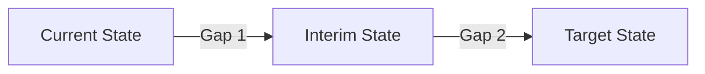
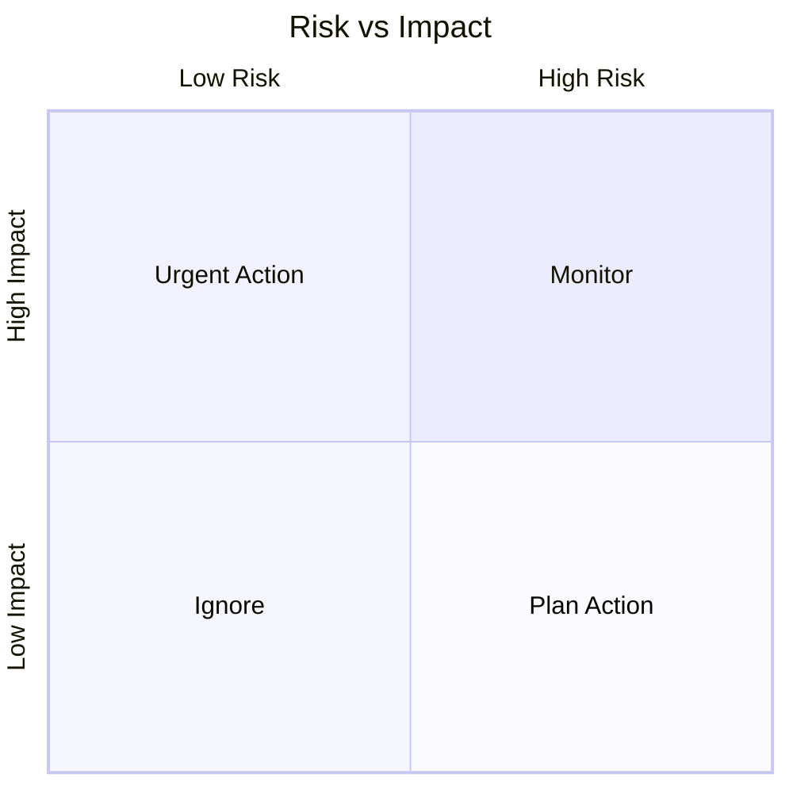
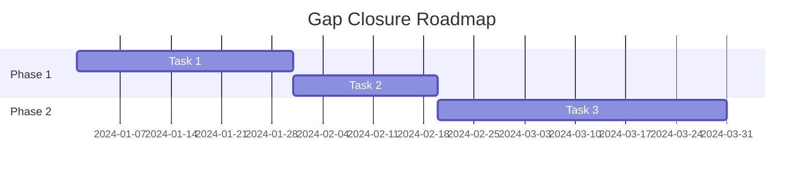

# Gap Analysis Template

## Metadata
- **Project**: [Project Name]
- **Date**: YYYY-MM-DD
- **Author(s)**: [Names]
- **Version**: 1.0.0
- **Status**: [Draft/In Review/Final]

## Executive Summary
[Brief overview of the gap analysis purpose, scope, and key findings]

## Analysis Scope
### Areas of Focus
- [Area 1]
- [Area 2]
- [Area 3]

### Stakeholders
```markdown
| Role | Department | Impact Level | Input Required |
|------|------------|--------------|----------------|
|      |            |              |                |
```

## Current State Assessment
### Process Analysis
```markdown
| Process | Current Performance | Benchmark | Gap |
|---------|-------------------|-----------|-----|
|         |                   |           |     |
```

### Resource Analysis
```markdown
| Resource Type | Available | Required | Deficit |
|--------------|-----------|-----------|---------|
| Personnel    |           |           |         |
| Technology   |           |           |         |
| Budget       |           |           |         |
```

### Capability Matrix
```markdown
| Capability | Current Level | Target Level | Gap Priority |
|------------|---------------|--------------|--------------|
|            |               |              |              |
```

## Desired State Definition
### Target State Characteristics
1. [Characteristic 1]
   - Key metrics
   - Success criteria
   - Timeline

2. [Characteristic 2]
   - Key metrics
   - Success criteria
   - Timeline

### Performance Targets
```markdown
| Metric | Current | Target | Gap | Impact |
|--------|---------|--------|-----|---------|
|        |         |        |     |         |
```

## Gap Identification
### Process Gaps


### Technical Gaps
```markdown
| Component | Current State | Desired State | Gap Description |
|-----------|--------------|---------------|-----------------|
|           |              |               |                 |
```

### Skills Gaps
```markdown
| Role | Current Skills | Required Skills | Development Needs |
|------|---------------|-----------------|-------------------|
|      |               |                 |                   |
```

## Impact Analysis
### Business Impact
```markdown
| Gap Area | Impact Level | Business Risk | Cost of Inaction |
|----------|--------------|---------------|------------------|
|          |              |               |                  |
```

### Risk Assessment


## Recommendations
### Priority Matrix
```markdown
| Gap | Priority | Effort | Cost | Timeline |
|-----|----------|--------|------|----------|
|     |          |        |      |          |
```

### Action Plan
1. Short-term Actions (0-3 months)
   - Action items
   - Resources needed
   - Expected outcomes

2. Medium-term Actions (3-6 months)
   - Action items
   - Resources needed
   - Expected outcomes

3. Long-term Actions (6+ months)
   - Action items
   - Resources needed
   - Expected outcomes

## Implementation Strategy
### Roadmap


### Resource Requirements
```markdown
| Phase | Resource Type | Quantity | Cost | Source |
|-------|--------------|----------|------|--------|
|       |              |          |      |        |
```

## Monitoring & Control
### Progress Tracking
```markdown
| Gap | Metric | Baseline | Current | Target | Status |
|-----|--------|----------|---------|---------|--------|
|     |        |          |         |         |        |
```

### Review Schedule
- Weekly reviews
- Monthly assessments
- Quarterly deep dives

## Dependencies
### Internal Dependencies
```markdown
| Dependency | Type | Impact | Owner | Status |
|------------|------|--------|-------|--------|
|            |      |        |       |        |
```

### External Dependencies
```markdown
| Dependency | Provider | Impact | Timeline | Status |
|------------|----------|--------|----------|---------|
|            |          |        |          |         |
```

## Budget & Resources
### Cost Analysis
```markdown
| Initiative | One-time Cost | Recurring Cost | ROI |
|------------|---------------|----------------|-----|
|            |               |                |     |
```

### Resource Allocation
```markdown
| Resource | Current | Required | Gap | Cost |
|----------|---------|----------|-----|------|
|          |         |          |     |      |
```

## Appendix
### Supporting Documentation
- Analysis methodology
- Data sources
- Assumptions
- Constraints

### Version History
```markdown
| Version | Date | Changes | Author |
|---------|------|---------|---------|
| 1.0     |      |         |         |
``` 