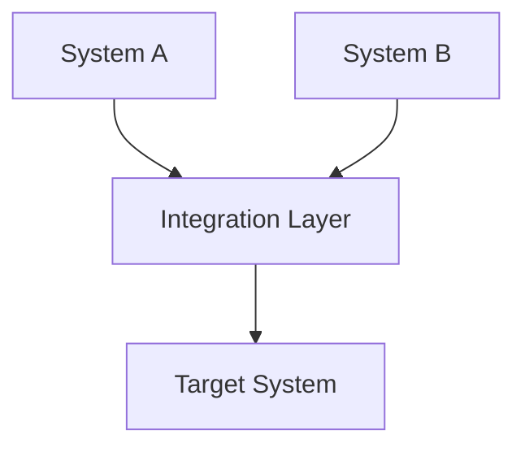
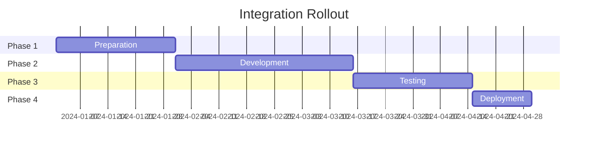

# Integration Plan Template

## Metadata
- **Type**: System Integration Plan
- **Version**: 1.0.0
- **Last Updated**: YYYY-MM-DD
- **Status**: [Draft/In Review/Approved]
- **Project**: [Project Name]

## Executive Summary
Brief overview of the integration objectives, scope, and expected outcomes.

## Integration Overview
### Scope
- Systems involved
- Integration points
- Data flows
- Business processes affected

### Architecture


## Technical Specifications
### System Requirements
| System | Version | Dependencies | Environment |
|--------|---------|--------------|-------------|
|        |         |              |             |

### Integration Points
| Source | Target | Protocol | Data Format | Frequency |
|--------|--------|----------|-------------|-----------|
|        |        |          |             |           |

### API Specifications
```json
{
  "endpoint": "/api/v1/resource",
  "method": "POST",
  "headers": {
    "Content-Type": "application/json"
  }
}
```

## Implementation Plan
### Phase 1: Preparation
- [ ] Environment setup
- [ ] Access permissions
- [ ] Initial configurations
- [ ] Test data preparation

### Phase 2: Development
- [ ] API development
- [ ] Data transformation
- [ ] Error handling
- [ ] Logging implementation

### Phase 3: Testing
- [ ] Unit testing
- [ ] Integration testing
- [ ] Performance testing
- [ ] Security testing

### Phase 4: Deployment
- [ ] Staging deployment
- [ ] Production deployment
- [ ] Monitoring setup
- [ ] Documentation updates

## Data Migration
### Data Mapping
| Source Field | Target Field | Transformation | Validation |
|--------------|--------------|----------------|------------|
|              |              |                |            |

### Data Validation Rules
- Data type validations
- Business rule validations
- Error handling procedures

## Security Considerations
### Authentication
- Authentication methods
- Token management
- Certificate details

### Authorization
- Access control
- Role mappings
- Permission sets

### Encryption
- Data in transit
- Data at rest
- Key management

## Testing Strategy
### Test Cases
| ID | Description | Prerequisites | Expected Result |
|----|-------------|---------------|-----------------|
|    |             |               |                 |

### Test Environments
- Development
- Integration
- Staging
- Production

## Rollout Strategy
### Timeline


### Rollback Plan
- Trigger conditions
- Rollback steps
- Data recovery procedures
- Communication plan

## Monitoring & Support
### Monitoring
- System health checks
- Performance metrics
- Error tracking
- Audit logging

### Support Plan
| Level | Description | Response Time | Escalation Path |
|-------|-------------|---------------|-----------------|
| L1    |             |               |                 |
| L2    |             |               |                 |
| L3    |             |               |                 |

## Risk Management
### Risk Assessment
| Risk | Impact | Probability | Mitigation |
|------|--------|------------|------------|
|      |        |            |            |

### Contingency Plans
- System failure
- Data corruption
- Performance issues
- Security breaches

## Documentation
### Required Documentation
- [ ] API documentation
- [ ] System architecture
- [ ] Operation manuals
- [ ] User guides

### Training Requirements
- Technical team training
- End-user training
- Support team training

## Sign-off Requirements
### Approval Matrix
| Role | Name | Sign-off Date | Comments |
|------|------|---------------|----------|
|      |      |               |          |

## Appendix
### Reference Documents
- System specifications
- API documentation
- Security policies
- Compliance requirements

### Contact Information
| Role | Name | Contact | Availability |
|------|------|---------|--------------|
|      |      |         |              |

## Notes
- Special considerations
- Dependencies
- Assumptions
- Constraints 