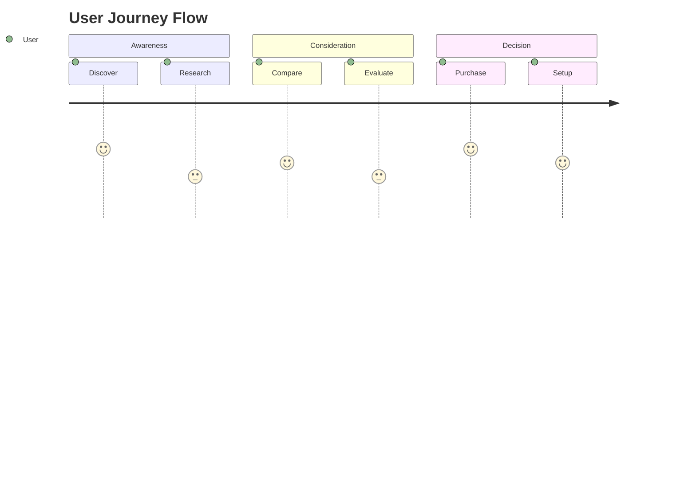
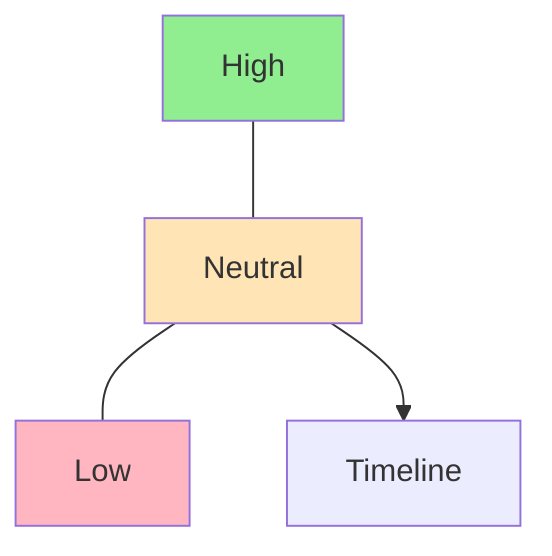

# User Journey Map Template

## Metadata
- **Type**: User Journey Documentation
- **Version**: 1.0.0
- **Last Updated**: YYYY-MM-DD
- **Project**: [Project Name]
- **Persona**: [Link to Persona Document]

## Journey Overview
### Scope
- **Journey Name**: [Name of the journey/flow]
- **Duration**: [Typical duration of journey]
- **Channels**: [List of channels involved]
- **Key Outcomes**: [Expected results]

### Journey Summary


## Journey Stages
### Stage 1: [Stage Name]
#### Context
- User's situation
- Entry point
- Initial expectations
- Prior knowledge

#### Actions
1. Primary actions
2. Secondary actions
3. Alternative paths
4. Decision points

#### Experience
```markdown
| Doing | Thinking | Feeling |
|-------|----------|---------|
|       |          | 😊/😐/😟 |
```

[Repeat for each stage]

## Touchpoint Analysis
### Channel Mapping
```markdown
| Stage | Channel | Interaction | Purpose | Success Metric |
|-------|---------|-------------|---------|----------------|
|       |         |             |         |                |
```

### Touchpoint Details
#### Digital Touchpoints
- Website interactions
- App usage
- Email communications
- Social media

#### Physical Touchpoints
- In-person interactions
- Physical products
- Printed materials
- Environmental factors

## Emotional Journey
### Emotion Mapping


### Key Moments
#### Positive Moments
- Highlights
- Successes
- Delighters
- Achievements

#### Pain Points
- Frustrations
- Barriers
- Confusion points
- Delays

## Opportunity Analysis
### Improvement Areas
| Stage | Pain Point | Impact | Opportunity | Priority |
|-------|------------|---------|-------------|-----------|
|       |            |         |             |           |

### Solutions Matrix
```markdown
| Opportunity | Solution | Effort | Impact | Timeline |
|-------------|----------|---------|---------|-----------|
|             |          |         |         |           |
```

## Requirements
### Functional Requirements
- System capabilities
- Feature needs
- Integration points
- Performance criteria

### User Requirements
- User needs
- Preferences
- Accessibility requirements
- Support needs

## Metrics and KPIs
### Success Metrics
| Stage | Metric | Current | Target | Method |
|-------|--------|---------|---------|---------|
|       |        |         |         |         |

### Journey Analytics
- Completion rates
- Drop-off points
- Time spent
- Satisfaction scores

## Implementation Guidelines
### Design Requirements
- UI components
- Interaction patterns
- Visual elements
- Content needs

### Technical Requirements
- System dependencies
- API requirements
- Data requirements
- Security needs

## Testing and Validation
### Testing Approach
- Usability testing
- A/B testing
- User feedback
- Analytics tracking

### Success Criteria
```markdown
| Criterion | Measurement | Target | Actual |
|-----------|-------------|---------|--------|
|           |             |         |        |
```

## Maintenance
### Review Schedule
- Regular reviews
- Update triggers
- Feedback loops
- Iteration cycles

### Version Control
| Version | Date | Changes | Author |
|---------|------|---------|---------|
|         |      |         |         |

## Supporting Documentation
### Related Documents
- User personas
- Process flows
- Technical specs
- Design systems

### Research Data
- User research
- Analytics
- Feedback data
- Market research

## Notes
### Assumptions
- Business assumptions
- User assumptions
- Technical assumptions
- Market assumptions

### Dependencies
- System dependencies
- Process dependencies
- Resource dependencies
- Timeline dependencies 