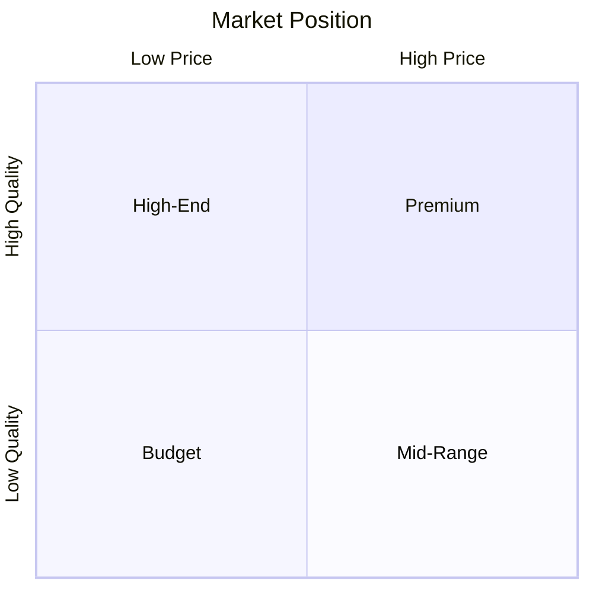

# Market Analysis Template

## Metadata
- **Project**: [Project Name]
- **Date**: YYYY-MM-DD
- **Author(s)**: [Names]
- **Version**: 1.0.0
- **Status**: [Draft/In Review/Final]

## Executive Summary
[Brief overview of market analysis findings and key recommendations]

## Market Overview
### Market Size
```markdown
| Segment | Size | Growth Rate | Market Share |
|---------|------|-------------|--------------|
|         |      |             |              |
```

### Market Trends
1. [Trend 1]
   - Impact
   - Duration
   - Relevance

2. [Trend 2]
   - Impact
   - Duration
   - Relevance

## Competitive Analysis
### Competitor Matrix
```markdown
| Competitor | Strengths | Weaknesses | Market Share | Threat Level |
|------------|-----------|------------|--------------|--------------|
|            |           |            |              |              |
```

### Competitive Positioning


## Target Market
### Customer Segments
```markdown
| Segment | Size | Needs | Pain Points | Opportunity |
|---------|------|-------|-------------|-------------|
|         |      |       |             |             |
```

### User Personas
1. [Persona 1]
   - Demographics
   - Behaviors
   - Needs
   - Goals

2. [Persona 2]
   - Demographics
   - Behaviors
   - Needs
   - Goals

## Market Opportunities
### Opportunity Analysis
```markdown
| Opportunity | Market Size | Growth Potential | Competition | Viability |
|-------------|-------------|------------------|-------------|-----------|
|             |             |                  |             |           |
```

### Risk Assessment
```markdown
| Risk | Probability | Impact | Mitigation |
|------|------------|--------|------------|
|      |            |        |            |
```

## Market Entry Strategy
### Go-to-Market Plan
1. Phase 1: [Timeline]
   - Activities
   - Resources
   - KPIs

2. Phase 2: [Timeline]
   - Activities
   - Resources
   - KPIs

### Distribution Channels
```markdown
| Channel | Reach | Cost | Effectiveness |
|---------|-------|------|---------------|
|         |       |      |               |
```

## Financial Analysis
### Market Metrics
```markdown
| Metric | Current | Target | Timeline |
|--------|---------|--------|----------|
| TAM    |         |        |          |
| SAM    |         |        |          |
| SOM    |         |        |          |
```

### Revenue Projections
```markdown
| Year | Revenue | Growth | Market Share |
|------|---------|--------|--------------|
| Y1   |         |        |              |
| Y2   |         |        |              |
| Y3   |         |        |              |
```

## Recommendations
### Strategic Priorities
1. [Priority 1]
   - Rationale
   - Implementation
   - Expected Impact

2. [Priority 2]
   - Rationale
   - Implementation
   - Expected Impact

### Action Plan
```markdown
| Action | Timeline | Resources | Owner | Status |
|--------|----------|-----------|-------|--------|
|        |          |           |       |        |
```

## Appendix
### Research Methodology
- Data sources
- Analysis methods
- Assumptions
- Limitations

### Market Data
- Industry reports
- Survey results
- Interview findings
- Statistical data

### Version History
```markdown
| Version | Date | Changes | Author |
|---------|------|---------|---------|
| 1.0     |      |         |         |
``` 