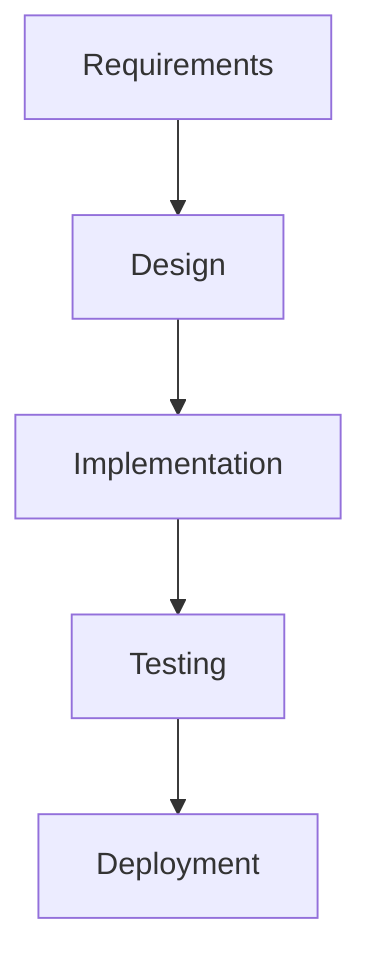
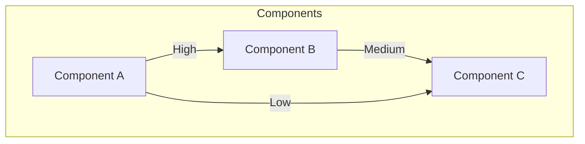
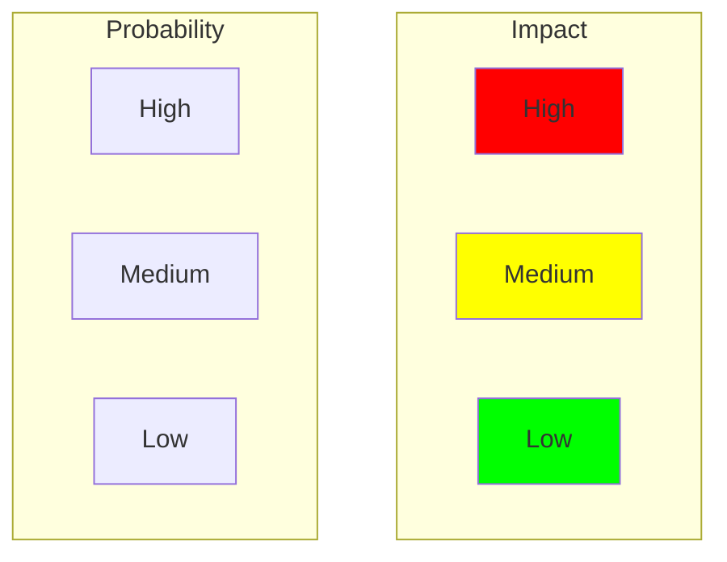
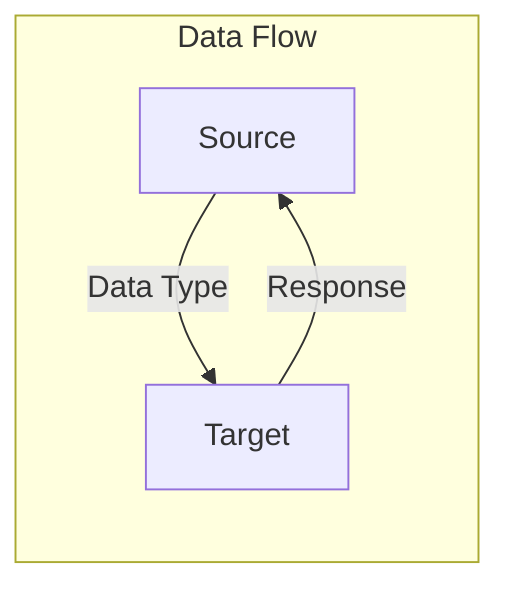

# Matrix Template

## Metadata
- **Type**: Matrix Documentation
- **Version**: 1.0.0
- **Last Updated**: YYYY-MM-DD
- **Project**: [Project Name]
- **Matrix Type**: [Traceability/Coverage/Impact/Risk]
- **Status**: [Draft/In Review/Approved]

## Matrix Overview
### Purpose
- Relationship tracking
- Coverage analysis
- Impact assessment
- Dependency mapping

### Scope


## Requirements Traceability
### Business to Technical Requirements
```markdown
| Business Req ID | Description | Technical Req ID | Status | Coverage |
|----------------|-------------|------------------|--------|----------|
| BR-001         |             | TR-001, TR-002   |        |          |
| BR-002         |             | TR-003           |        |          |
```

### Technical to Implementation
```markdown
| Technical Req ID | Component | Implementation | Test Cases | Status |
|-----------------|-----------|----------------|------------|---------|
| TR-001          |           | IMP-001        | TC-001     |         |
| TR-002          |           | IMP-002        | TC-002     |         |
```

## Test Coverage Matrix
### Functional Coverage
```markdown
| Feature ID | Test Case ID | Type | Priority | Status | Results |
|------------|-------------|------|-----------|---------|----------|
| F-001      | TC-001      |      |           |         |          |
| F-002      | TC-002      |      |           |         |          |
```

### Integration Points
```markdown
| System A | System B | Interface | Test Cases | Status |
|----------|----------|-----------|------------|---------|
|          |          |           |            |         |
```

## Impact Analysis
### Change Impact Matrix
```markdown
| Change ID | Component | Impact Level | Affected Areas | Risk |
|-----------|-----------|--------------|----------------|------|
| CH-001    |           | High         |                |      |
| CH-002    |           | Medium       |                |      |
```

### Dependency Matrix


## Risk Assessment Matrix
### Risk Evaluation
```markdown
| Risk ID | Description | Probability | Impact | Score | Mitigation |
|---------|-------------|-------------|---------|-------|------------|
| R-001   |             | High        | High    | 9     |            |
| R-002   |             | Medium      | Low     | 3     |            |
```

### Risk Heat Map


## Component Interaction Matrix
### Interface Matrix
```markdown
| Component | Provides | Consumes | Protocol | SLA |
|-----------|----------|----------|----------|-----|
| Comp-A    |          |          |          |     |
| Comp-B    |          |          |          |     |
```

### Data Flow Matrix


## Performance Matrix
### Response Time Matrix
```markdown
| Endpoint | Expected RT | Peak RT | Load | SLA Status |
|----------|-------------|---------|------|------------|
| /api/v1  | 200ms      | 350ms   | 1000 |            |
| /api/v2  | 150ms      | 250ms   | 500  |            |
```

### Resource Utilization
```markdown
| Component | CPU | Memory | Storage | Network |
|-----------|-----|---------|----------|----------|
| Service-A |     |         |          |          |
| Service-B |     |         |          |          |
```

## Security Matrix
### Access Control Matrix
```markdown
| Role | Resource | Create | Read | Update | Delete |
|------|----------|---------|------|---------|---------|
| Admin|          |         |      |         |         |
| User |          |         |      |         |         |
```

### Compliance Matrix
```markdown
| Requirement | Control | Implementation | Evidence | Status |
|-------------|---------|----------------|----------|---------|
| SEC-001     |         |                |          |         |
| SEC-002     |         |                |          |         |
```

## Quality Matrix
### Code Quality Metrics
```markdown
| Component | Coverage | Complexity | Duplication | Issues |
|-----------|----------|------------|-------------|---------|
| Module-A  |          |            |             |         |
| Module-B  |          |            |             |         |
```

### Documentation Coverage
```markdown
| Area | Required Docs | Available | Quality | Status |
|------|---------------|-----------|----------|---------|
|      |               |           |          |         |
```

## Validation
### Matrix Completeness
```markdown
| Section | Coverage % | Missing Items | Action Items |
|---------|------------|---------------|--------------|
|         |            |               |              |
```

### Quality Checks
- [ ] All relationships mapped
- [ ] Bidirectional validation
- [ ] Completeness check
- [ ] Consistency check

## Maintenance
### Update Process
1. Regular review schedule
2. Change tracking
3. Version control
4. Approval workflow

### Version History
```markdown
| Version | Date | Changes | Author | Approver |
|---------|------|---------|---------|-----------|
| 1.0     |      |         |         |           |
```

## Notes
### Usage Guidelines
- Matrix update procedures
- Review requirements
- Approval process
- Change management

### References
- Related documents
- Standards
- Procedures
- Templates 