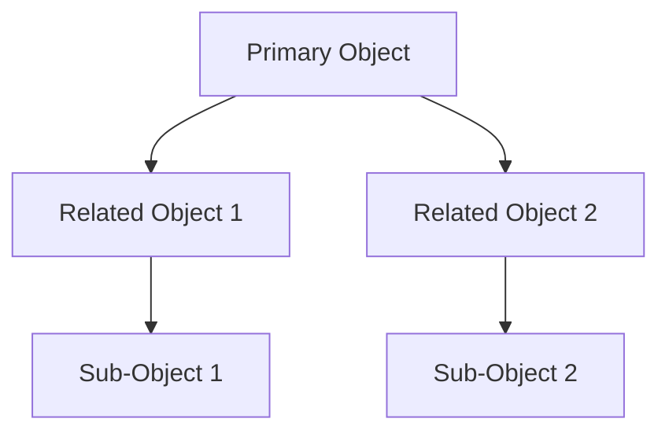
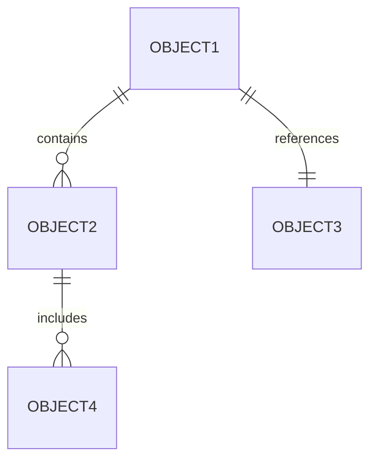
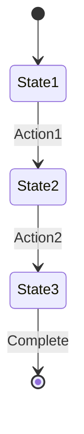
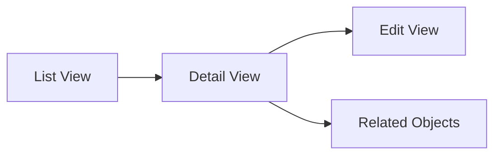
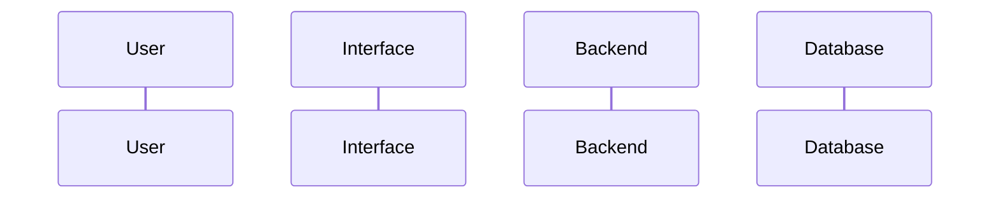

# Object-Oriented UX (OOUX) Template

## Metadata
- **Type**: OOUX Documentation
- **Version**: 1.0.0
- **Last Updated**: YYYY-MM-DD
- **Project**: [Project Name]
- **Status**: [Draft/In Review/Approved]

## System Overview
### Project Context
- Business objectives
- User goals
- System scope
- Design constraints

### Core Objects Map


## Object Definition
### Object Inventory
```markdown
| Object Name | Type | Description | Priority |
|-------------|------|-------------|-----------|
|             |      |             |           |
```

### Object Relationships


## Core Objects
### [Object Name 1]
#### Properties
```markdown
| Property | Type | Required | Description |
|----------|------|----------|-------------|
|          |      |          |             |
```

#### States
```markdown
| State | Description | Triggers | Next States |
|-------|-------------|----------|-------------|
|       |             |          |             |
```

#### Actions
```markdown
| Action | Description | Permissions | Outcomes |
|--------|-------------|-------------|----------|
|        |             |             |          |
```

[Repeat for each core object]

## Object Relationships
### Relationship Types
#### Contains (Parent-Child)
- Parent objects
- Child objects
- Cardinality
- Constraints

#### References (Associations)
- Related objects
- Relationship type
- Directionality
- Dependencies

## Object Behaviors
### Core Actions
```markdown
| Object | Action | Input | Output | Rules |
|--------|--------|-------|---------|-------|
|        |        |       |         |       |
```

### State Transitions


## User Interface Objects
### UI Components
#### Primary Objects
- Object representation
- Core properties displayed
- Primary actions
- State indicators

#### Secondary Objects
- Related object displays
- Reference indicators
- Action triggers
- State reflections

## Data Structure
### Object Schema
```json
{
  "objectName": {
    "properties": {
      "property1": "type",
      "property2": "type"
    },
    "required": ["property1"],
    "relationships": {
      "relatedObject": "type"
    }
  }
}
```

### Validation Rules
```markdown
| Object | Property | Rule | Error Message |
|--------|----------|------|---------------|
|        |          |      |               |
```

## Content Modules
### Module Structure
#### Core Content
- Essential properties
- Required elements
- Default states
- Primary actions

#### Extended Content
- Optional properties
- Secondary elements
- Advanced states
- Complex actions

## Navigation Structure
### Object-Based Navigation


### Context Switching
- Between objects
- Within object states
- Across object relationships
- Through object hierarchies

## Interaction Patterns
### Object Manipulation
#### Create
- Required fields
- Default values
- Validation rules
- Success states

#### Update
- Editable fields
- Validation rules
- State transitions
- Change tracking

#### Delete
- Confirmation rules
- Cascade effects
- Recovery options
- State cleanup

## System Integration
### API Structure
```markdown
| Endpoint | Method | Object | Action |
|----------|--------|--------|---------|
|          |        |        |         |
```

### Data Flow


## Implementation Guidelines
### Development Considerations
- Object lifecycle
- State management
- Relationship handling
- Performance optimization

### Best Practices
- Object consistency
- State predictability
- Relationship clarity
- Action reliability

## Testing Strategy
### Object Testing
```markdown
| Test Type | Object | Scenario | Expected Result |
|-----------|--------|----------|-----------------|
|           |        |          |                 |
```

### Relationship Testing
- Parent-child integrity
- Reference validity
- State consistency
- Action propagation

## Documentation
### Object Documentation
- Technical specifications
- User documentation
- API documentation
- Implementation guides

### Maintenance
- Version control
- Change tracking
- Update procedures
- Migration plans

## Version History
### Changes
| Version | Date | Changes | Author |
|---------|------|---------|---------|
|         |      |         |         |

## Notes
### Design Decisions
- Architectural choices
- Pattern selections
- Trade-offs made
- Future considerations

### References
- Design patterns
- System documentation
- User research
- Technical specifications 