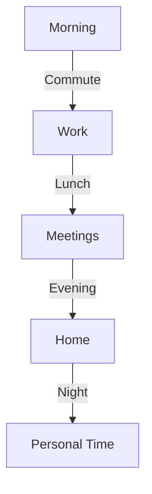

# User Persona Template

## Metadata
- **Type**: User Persona Documentation
- **Version**: 1.0.0
- **Last Updated**: YYYY-MM-DD
- **Project**: [Project Name]
- **Category**: [Primary/Secondary/Tertiary] User

## Persona Overview
### Identity
- **Name**: [Persona Name]
- **Age**: [Age Range]
- **Occupation**: [Job Title/Role]
- **Location**: [Geographic Location]
- **Education**: [Education Level]

### Profile Image
[Include a representative image or avatar]

## Demographics
### Personal Background
- Family status
- Living situation
- Income level
- Urban/Suburban/Rural

### Professional Background
- Industry experience
- Career stage
- Company size
- Work environment

## Psychographics
### Goals and Motivations
- Primary goals
- Secondary goals
- Personal motivations
- Professional motivations

### Pain Points and Frustrations
- Current challenges
- Unmet needs
- Barriers to success
- Common frustrations

### Values and Beliefs
- Core values
- Decision drivers
- Brand preferences
- Trust factors

## Behavioral Patterns
### Technology Usage
- Devices owned
- Software proficiency
- Online activities
- Technology adoption rate

### Daily Routine


### Decision Making
- Research methods
- Information sources
- Purchase behaviors
- Influence factors

## Product Interaction
### Usage Patterns
- Frequency of use
- Primary features used
- Time spent
- Access methods

### User Journey Touchpoints
```markdown
| Stage | Touchpoint | Goals | Pain Points |
|-------|------------|-------|-------------|
|       |            |       |             |
```

### Feature Preferences
- Must-have features
- Nice-to-have features
- Unnecessary features
- Feature priorities

## Communication
### Preferred Channels
- Communication methods
- Social media usage
- Content consumption
- Response preferences

### Language and Tone
- Communication style
- Technical literacy
- Vocabulary level
- Cultural considerations

## Scenarios
### Use Case Scenarios
1. Primary scenario
   - Context
   - Actions
   - Outcomes
   - Success metrics

2. Secondary scenario
   - Context
   - Actions
   - Outcomes
   - Success metrics

### User Stories
```markdown
As a [role]
I want to [action]
So that [benefit]
```

## Research Insights
### Data Sources
- User interviews
- Survey results
- Analytics data
- Market research

### Key Findings
- Behavioral patterns
- Need validation
- Problem validation
- Solution validation

## Design Implications
### UI Considerations
- Visual preferences
- Navigation patterns
- Interaction patterns
- Accessibility needs

### Content Strategy
- Content types
- Information architecture
- Language style
- Content format

### Feature Requirements
- Critical features
- Priority order
- Integration needs
- Performance requirements

## Validation
### Research Validation
- Interview quotes
- Survey data
- Usage analytics
- Market validation

### Assumptions and Hypotheses
```markdown
| Assumption | Validation Method | Status | Notes |
|------------|------------------|---------|-------|
|            |                  |         |       |
```

## Updates and Maintenance
### Version History
| Version | Date | Changes | Author |
|---------|------|---------|---------|
|         |      |         |         |

### Review Schedule
- Regular review periods
- Update triggers
- Validation methods
- Stakeholder input

## Notes
### Additional Insights
- Market trends
- Competitive analysis
- Future predictions
- Special considerations

### References
- Research documents
- Interview transcripts
- Survey results
- Analytics reports 