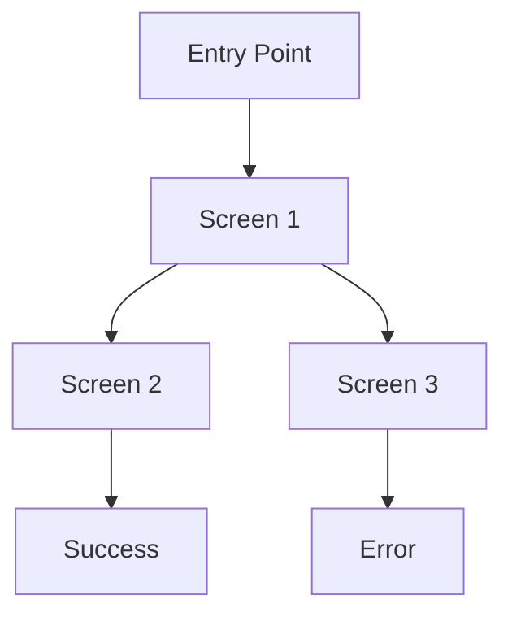

# Prototype Template

## Metadata
- **Type**: Interactive Prototype Documentation
- **Version**: 1.0.0
- **Last Updated**: YYYY-MM-DD
- **Project**: [Project Name]
- **Design System**: [Reference to design system]
- **Status**: [Draft/In Development/Ready]

## Prototype Overview
### Purpose
- User flow demonstration
- Interaction patterns
- Design validation
- User testing objectives

### Scope


## Technical Setup
### Project Structure
```bash
prototype/
├── app/
│   ├── layout.tsx
│   ├── page.tsx
│   └── globals.css
├── components/
│   └── ui/
├── lib/
│   └── utils.ts
└── public/
    └── assets/
```

### Dependencies
```json
{
  "dependencies": {
    "next": "^14.0.0",
    "react": "^18.2.0",
    "react-dom": "^18.2.0",
    "tailwindcss": "^3.3.0",
    "@radix-ui/react-*": "^1.0.0",
    "lucide-react": "^0.292.0"
  }
}
```

## Screen Templates
### Base Layout
```typescript
// app/layout.tsx
export default function RootLayout({
  children,
}: {
  children: React.ReactNode
}) {
  return (
    <html lang="en">
      <body className={cn("min-h-screen bg-background antialiased", fontSans.className)}>
        <ThemeProvider attribute="class" defaultTheme="system" enableSystem>
          <div className="relative flex min-h-screen flex-col">
            <Header />
            <main className="flex-1">{children}</main>
            <Footer />
          </div>
        </ThemeProvider>
      </body>
    </html>
  )
}
```

### Page Template
```typescript
// app/page.tsx
export default function Page() {
  return (
    <div className="container mx-auto py-8">
      <h1 className="text-4xl font-bold">Page Title</h1>
      <div className="mt-8 grid gap-6">
        {/* Page content */}
      </div>
    </div>
  )
}
```

## Interaction Patterns
### Navigation Flow
```typescript
// Navigation implementation
const navigation = [
  { name: "Home", href: "/" },
  { name: "Features", href: "/features" },
  { name: "Pricing", href: "/pricing" },
  { name: "About", href: "/about" },
]
```

### State Management
```typescript
// Global state
const GlobalContext = createContext<GlobalState>({
  user: null,
  theme: 'light',
  navigation: []
})

// Local state
const [state, setState] = useState({
  step: 1,
  data: {},
  errors: {}
})
```

## Data Management
### Mock Data
```typescript
const MOCK_DATA = {
  users: [
    { id: 1, name: "User 1", email: "user1@example.com" },
    { id: 2, name: "User 2", email: "user2@example.com" }
  ],
  products: [
    { id: 1, name: "Product 1", price: 99.99 },
    { id: 2, name: "Product 2", price: 149.99 }
  ]
}
```

### API Mocking
```typescript
// Mock API handlers
export const handlers = [
  rest.get('/api/users', (req, res, ctx) => {
    return res(ctx.json(MOCK_DATA.users))
  }),
  rest.post('/api/login', async (req, res, ctx) => {
    const { email, password } = await req.json()
    // Mock authentication logic
  })
]
```

## UI Components
### Common Components
```typescript
// Button variants
const buttonVariants = {
  primary: "bg-primary text-white hover:bg-primary/90",
  secondary: "bg-secondary text-white hover:bg-secondary/90",
  outline: "border border-input bg-background hover:bg-accent"
}

// Form components
const formComponents = {
  Input: styled("input", inputVariants),
  Select: styled("select", selectVariants),
  Checkbox: styled("input", checkboxVariants)
}
```

### Layout Components
```typescript
// Grid system
const Grid = styled("div", {
  display: "grid",
  gap: "$4",
  variants: {
    cols: {
      1: { gridTemplateColumns: "1fr" },
      2: { gridTemplateColumns: "repeat(2, 1fr)" },
      3: { gridTemplateColumns: "repeat(3, 1fr)" }
    }
  }
})
```

## Animation System
### Transition Definitions
```typescript
const transitions = {
  fade: {
    initial: { opacity: 0 },
    animate: { opacity: 1 },
    exit: { opacity: 0 }
  },
  slide: {
    initial: { x: -20, opacity: 0 },
    animate: { x: 0, opacity: 1 },
    exit: { x: 20, opacity: 0 }
  }
}
```

### Animation Components
```typescript
const AnimatedPage = motion(Page, {
  initial: "initial",
  animate: "animate",
  exit: "exit",
  variants: transitions.fade
})
```

## Responsive Design
### Breakpoint System
```typescript
const breakpoints = {
  sm: "640px",
  md: "768px",
  lg: "1024px",
  xl: "1280px",
  "2xl": "1536px"
}
```

### Media Queries
```typescript
const mediaQueries = {
  sm: `@media (min-width: ${breakpoints.sm})`,
  md: `@media (min-width: ${breakpoints.md})`,
  lg: `@media (min-width: ${breakpoints.lg})`
}
```

## Testing Setup
### User Flow Tests
```typescript
describe('User Flow', () => {
  it('completes registration process', async () => {
    render(<Prototype />)
    // Test user journey
  })
})
```

### Interaction Tests
```typescript
describe('Interactions', () => {
  it('handles form submission', async () => {
    render(<Form />)
    // Test form interactions
  })
})
```

## Documentation
### User Flows
```markdown
1. Entry Point
   - Initial state
   - Available actions
   - Expected outcomes

2. Flow Steps
   - Step description
   - User actions
   - System responses
   - Validation rules

3. Exit Points
   - Success states
   - Error states
   - Recovery paths
```

### Interaction Guide
```markdown
## Component Interactions

### Buttons
- Click actions
- Loading states
- Disabled states

### Forms
- Input validation
- Error handling
- Success feedback
```

## Performance Optimization
### Code Splitting
```typescript
// Dynamic imports
const DynamicComponent = dynamic(() => import('./heavy-component'), {
  loading: () => <Skeleton />,
  ssr: false
})
```

### Asset Optimization
```typescript
// Image optimization
const optimizedImage = {
  src: "/image.jpg",
  width: 800,
  height: 600,
  alt: "Description",
  loading: "lazy"
}
```

## Deployment
### Build Configuration
```json
{
  "scripts": {
    "dev": "next dev",
    "build": "next build",
    "start": "next start",
    "lint": "next lint"
  }
}
```

### Environment Setup
```bash
# .env.local
NEXT_PUBLIC_API_URL=http://localhost:3000/api
NEXT_PUBLIC_ASSETS_URL=http://localhost:3000/assets
```

## Notes
### Best Practices
- Performance considerations
- Accessibility guidelines
- Testing strategies
- Documentation standards

### Known Limitations
- Browser support
- Device compatibility
- Network requirements
- Feature constraints