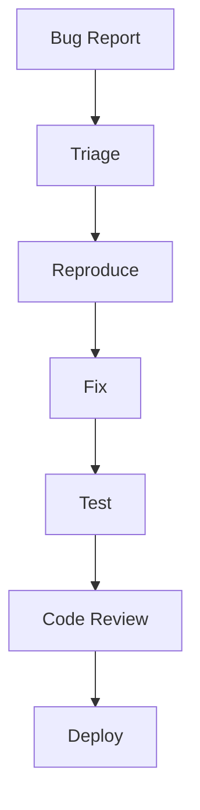

# Quality Assurance Plan

## Document Control
- **Project**: [Project name]
- **Version**: [Document version]
- **Last Updated**: [Date]
- **Status**: [Draft/Review/Approved]

## Testing Strategy
### Unit Testing
- **Framework**: [Test framework]
- **Coverage Target**: [Coverage percentage]
- **Key Areas**:
  - Component testing
  - Service testing
  - Utility testing

### Integration Testing
- **Scope**: [Integration test scope]
- **Environment**: [Test environment]
- **Key Flows**:
  - API integration
  - Service communication
  - Database operations

### End-to-End Testing
- **Framework**: [E2E framework]
- **Test Scenarios**:
  - User journeys
  - Critical paths
  - Edge cases

## Performance Testing
### Load Testing
- **Tool**: [Load testing tool]
- **Scenarios**:
  - Normal load
  - Peak load
  - Stress conditions
- **Metrics**:
  - Response time
  - Throughput
  - Error rate

### Stress Testing
- **Tool**: [Stress testing tool]
- **Scenarios**:
  - Maximum load
  - Resource limits
  - Recovery testing
- **Metrics**:
  - Breaking points
  - Recovery time
  - System stability

## Security Testing
### Vulnerability Scanning
- **Tools**: [Security tools]
- **Frequency**: [Scan frequency]
- **Focus Areas**:
  - Code scanning
  - Dependency scanning
  - Infrastructure scanning

### Penetration Testing
- **Scope**: [Pen test scope]
- **Schedule**: [Test schedule]
- **Areas**:
  - API security
  - Authentication
  - Authorization
  - Data protection

## Accessibility Testing
### Standards Compliance
- **Guidelines**: [Accessibility standards]
- **Tools**: [Testing tools]
- **Requirements**:
  - Screen reader compatibility
  - Keyboard navigation
  - Color contrast
  - ARIA implementation

### User Testing
- **Test Groups**: [User groups]
- **Scenarios**: [Test scenarios]
- **Success Criteria**: [Success metrics]

## Quality Metrics
### Code Quality
| Metric | Target | Warning | Critical |
|--------|--------|---------|----------|
| Test Coverage | > 80% | < 70% | < 60% |
| Code Duplication | < 5% | > 10% | > 15% |
| Complexity | < 15 | > 20 | > 25 |
| Technical Debt | < 8h | > 16h | > 24h |

### Performance Metrics
| Metric | Target | Warning | Critical |
|--------|--------|---------|----------|
| Page Load Time | < 2s | > 3s | > 5s |
| API Response Time | < 200ms | > 500ms | > 1s |
| Error Rate | < 0.1% | > 0.5% | > 1% |
| CPU Usage | < 70% | > 80% | > 90% |

## Testing Process
### Development Testing
1. **Unit Tests**
   - Write tests during development
   - Run tests before commit
   - Maintain coverage targets

2. **Integration Tests**
   - Test component integration
   - Verify service communication
   - Check data flow

### CI/CD Testing
1. **Build Pipeline**
   ```mermaid
   graph LR
   A[Code Push] --> B[Unit Tests]
   B --> C[Integration Tests]
   C --> D[Build]
   D --> E[Deploy to Test]
   E --> F[E2E Tests]
   ```

2. **Release Pipeline**
   ```mermaid
   graph LR
   A[Release Branch] --> B[Security Scan]
   B --> C[Performance Tests]
   C --> D[UAT]
   D --> E[Production Deploy]
   ```

## Bug Management
### Severity Levels
| Level | Description | Response Time | Resolution Time |
|-------|-------------|---------------|-----------------|
| Critical | System down | 1 hour | 4 hours |
| High | Major feature broken | 4 hours | 24 hours |
| Medium | Feature impaired | 24 hours | 72 hours |
| Low | Minor issue | 48 hours | 1 week |

### Bug Workflow


## Test Environments
### Environment Setup
| Environment | Purpose | Data | Access |
|-------------|---------|------|---------|
| Development | Daily testing | Synthetic | Developers |
| Staging | Pre-release | Anonymized | QA Team |
| UAT | User acceptance | Production copy | Stakeholders |
| Production | Live system | Real data | Users |

### Data Management
- **Test Data**: [Data generation strategy]
- **Data Refresh**: [Refresh schedule]
- **Data Security**: [Security measures]

## Monitoring and Reporting
### Quality Dashboard
- **Metrics Display**:
  - Test coverage trends
  - Bug statistics
  - Performance metrics
  - Security status

### Reports
- **Daily Report**: Test execution summary
- **Weekly Report**: Quality metrics review
- **Monthly Report**: Trend analysis

## Change Log
| Version | Date | Changes | Author |
|---------|------|---------|---------| 