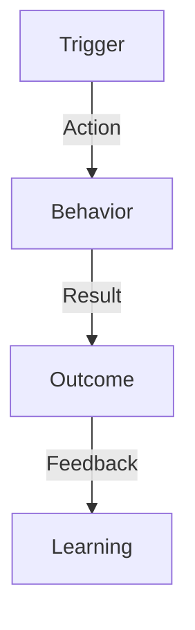
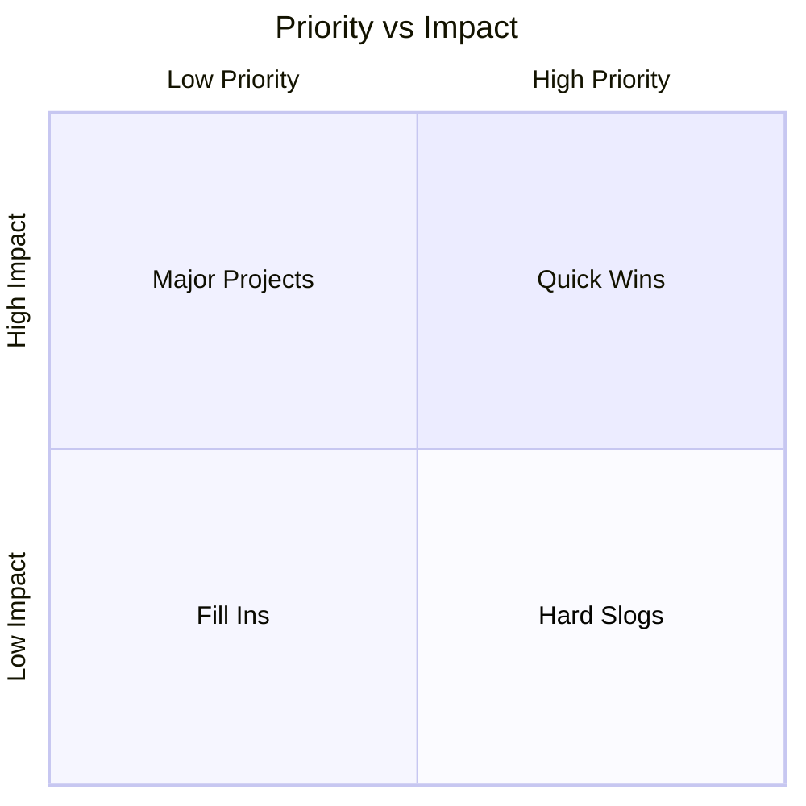

# Research Report Template

## Metadata
- **Project**: [Project Name]
- **Research Phase**: [Discovery/Validation/Evaluation]
- **Date**: YYYY-MM-DD
- **Author(s)**: [Names]
- **Version**: 1.0.0
- **Status**: [Draft/In Review/Final]

## Executive Summary
[Brief 2-3 paragraph summary of key findings and recommendations]

## Research Overview
### Objectives
- Primary objective
- Secondary objectives
- Research questions

### Methodology
- Research type: [Qualitative/Quantitative/Mixed Methods]
- Methods used:
  - [Method 1]
  - [Method 2]
- Timeline: [Start Date] to [End Date]
- Number of participants: [N]
- Participant demographics:
  ```markdown
  | Demographic | Distribution |
  |------------|--------------|
  | Age        |              |
  | Gender     |              |
  | Location   |              |
  | Role       |              |
  ```

## Key Findings
### 1. [Finding Category 1]
- Observation
- Supporting data
- Impact
- Recommendations

### 2. [Finding Category 2]
- Observation
- Supporting data
- Impact
- Recommendations

## Detailed Analysis
### Quantitative Data
```markdown
| Metric | Result | Benchmark | Delta |
|--------|--------|-----------|-------|
|        |        |           |       |
```

### Qualitative Insights
#### Themes
1. [Theme 1]
   - Supporting quotes
   - Frequency
   - Impact

2. [Theme 2]
   - Supporting quotes
   - Frequency
   - Impact

### User Behavior Patterns


## Pain Points & Opportunities
### Pain Points Matrix
```markdown
| Pain Point | Severity | Frequency | Impact | Opportunity |
|------------|----------|-----------|---------|-------------|
|            |          |           |         |             |
```

### Opportunity Assessment
```markdown
| Opportunity | Value | Effort | Priority |
|-------------|-------|---------|-----------|
|             |       |         |           |
```

## Recommendations
### Priority Matrix


### Actionable Steps
1. Short-term (0-3 months)
   - Action item
   - Expected outcome
   - Success metrics

2. Medium-term (3-6 months)
   - Action item
   - Expected outcome
   - Success metrics

3. Long-term (6+ months)
   - Action item
   - Expected outcome
   - Success metrics

## Impact Analysis
### Business Impact
```markdown
| Area | Current State | Future State | Impact |
|------|--------------|--------------|---------|
|      |              |              |         |
```

### User Impact
```markdown
| User Type | Pain Points Addressed | Expected Benefits |
|-----------|----------------------|-------------------|
|           |                      |                   |
```

## Research Artifacts
### Data Collection
- Raw data location
- Analysis files
- Recording links
- Interview transcripts

### Supporting Materials
- Research protocol
- Participant consent forms
- Screening criteria
- Discussion guide

## Next Steps
1. Immediate actions
2. Follow-up research needed
3. Validation plans

## Appendix
### Research Limitations
- Potential biases
- Constraints
- Data gaps

### Methodology Details
- Participant recruitment
- Session structure
- Analysis methods

### References
- Previous research
- Industry benchmarks
- Competitive analysis

### Version History
```markdown
| Version | Date | Changes | Author |
|---------|------|---------|---------|
| 1.0     |      |         |         |
``` 