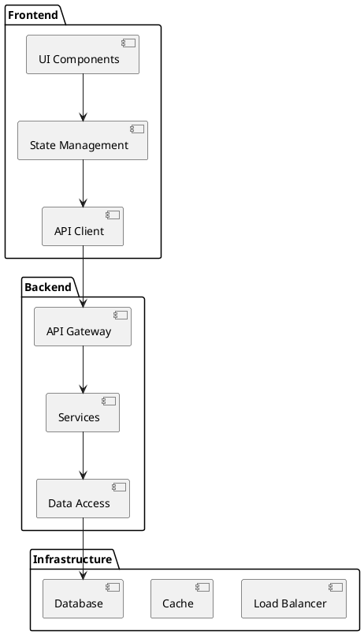
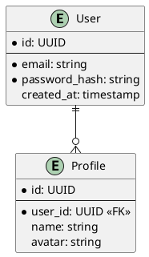

# Technical Architecture Document (TAD)

## Document Control
- **Project**: [Project name]
- **Version**: [Document version]
- **Last Updated**: [Date]
- **Status**: [Draft/Review/Approved]

## System Architecture
### High-Level Architecture


## Component Architecture
### Frontend Components
```typescript
// Component Architecture Example
interface ComponentArchitecture {
  atoms: {
    Button: ButtonProps;
    Input: InputProps;
    // ... other atomic components
  };
  molecules: {
    Form: FormProps;
    Card: CardProps;
    // ... other molecular components
  };
  organisms: {
    Navigation: NavigationProps;
    Dashboard: DashboardProps;
    // ... other organism components
  };
}
```

### Backend Services
```typescript
// Service Architecture Example
interface ServiceArchitecture {
  api: {
    routes: Route[];
    middleware: Middleware[];
    controllers: Controller[];
  };
  services: {
    business: BusinessService[];
    integration: IntegrationService[];
    utility: UtilityService[];
  };
  data: {
    models: Model[];
    repositories: Repository[];
    migrations: Migration[];
  };
}
```

## Integration Architecture
### API Integration
```typescript
// API Integration Example
interface APIArchitecture {
  endpoints: {
    path: string;
    method: HTTPMethod;
    auth: AuthRequirement;
    rate_limit: RateLimit;
  }[];
  middleware: {
    auth: AuthMiddleware;
    validation: ValidationMiddleware;
    logging: LoggingMiddleware;
  };
}
```

### Event Architecture
```typescript
// Event System Example
interface EventArchitecture {
  publishers: {
    name: string;
    events: string[];
    retry_policy: RetryPolicy;
  }[];
  subscribers: {
    name: string;
    events: string[];
    handler: EventHandler;
  }[];
}
```

## Data Architecture
### Database Schema


### Data Flow
```embed:plantuml
@startuml
actor User
participant Frontend
participant Backend
database Database

User -> Frontend: Action
Frontend -> Backend: API Request
Backend -> Database: Query
Database --> Backend: Result
Backend --> Frontend: Response
Frontend --> User: Update UI
@enduml
```

## Security Architecture
### Authentication Flow
```embed:plantuml
@startuml
actor User
participant Frontend
participant AuthService
participant Backend
database UserDB

User -> Frontend: Login
Frontend -> AuthService: Authenticate
AuthService -> UserDB: Validate
UserDB --> AuthService: User Data
AuthService --> Frontend: JWT Token
Frontend -> Backend: API Request + Token
@enduml
```

### Authorization Matrix
| Role | Resource | Create | Read | Update | Delete |
|------|----------|--------|------|--------|---------|
| Admin | All | ✓ | ✓ | ✓ | ✓ |
| User | Own Data | ✓ | ✓ | ✓ | ✘ |
| Guest | Public | ✘ | ✓ | ✘ | ✘ |

## Infrastructure Architecture
### Deployment Architecture
```embed:plantuml
@startuml
node "Production" {
  [Load Balancer]
  package "Application Cluster" {
    [App Server 1]
    [App Server 2]
  }
  package "Database Cluster" {
    [Primary DB]
    [Replica DB]
  }
}

[Load Balancer] --> [App Server 1]
[Load Balancer] --> [App Server 2]
[App Server 1] --> [Primary DB]
[App Server 2] --> [Primary DB]
[Primary DB] --> [Replica DB]
@enduml
```

### Scaling Strategy
- **Horizontal Scaling**: [Strategy details]
- **Vertical Scaling**: [Strategy details]
- **Auto-scaling Rules**: [Rules details]

## Performance Architecture
### Caching Strategy
```typescript
// Caching Configuration Example
interface CacheArchitecture {
  layers: {
    browser: BrowserCache;
    cdn: CDNCache;
    application: ApplicationCache;
    database: DatabaseCache;
  };
  policies: {
    ttl: TTLPolicy;
    invalidation: InvalidationPolicy;
    refresh: RefreshPolicy;
  };
}
```

### Performance Metrics
| Metric | Target | Alert Threshold |
|--------|--------|----------------|
| Response Time | < 200ms | > 500ms |
| Error Rate | < 0.1% | > 1% |
| Availability | > 99.9% | < 99.5% |

## Monitoring Architecture
### Logging Strategy
```typescript
// Logging Configuration Example
interface LoggingArchitecture {
  levels: {
    error: ErrorConfig;
    warn: WarnConfig;
    info: InfoConfig;
    debug: DebugConfig;
  };
  sinks: {
    console: ConsoleConfig;
    file: FileConfig;
    service: LogServiceConfig;
  };
}
```

### Alerting Matrix
| Condition | Severity | Action | Notification |
|-----------|----------|--------|--------------|
| Error Spike | High | Auto-scale | Immediate |
| High Latency | Medium | Cache Refresh | Warning |
| Low Resources | Low | Optimize | Daily Report |

## Disaster Recovery
### Backup Strategy
- **Frequency**: [Backup schedule]
- **Retention**: [Retention policy]
- **Recovery Point Objective (RPO)**: [RPO target]
- **Recovery Time Objective (RTO)**: [RTO target]

### Failover Process
```embed:plantuml
@startuml
start
:Detect Failure;
if (Primary Available?) then (yes)
  :Continue Normal Operation;
else (no)
  :Initiate Failover;
  :Switch to Backup;
  :Verify Services;
  :Update DNS;
endif
stop
@enduml
```

## Change Log
| Version | Date | Changes | Author |
|---------|------|---------|---------|
| [Version] | [Date] | [Changes] | [Author] | 