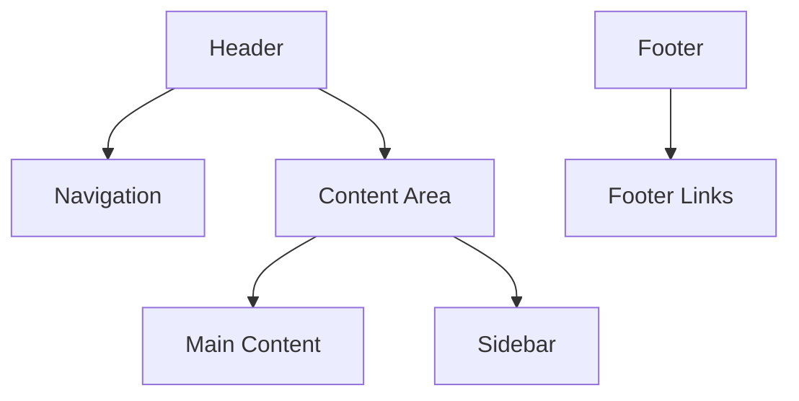

# Wireframe Documentation Template

## Metadata
- **Type**: UI Wireframe Documentation
- **Version**: 1.0.0
- **Last Updated**: YYYY-MM-DD
- **Project**: [Project Name]
- **Screen/Component**: [Name]
- **User Journey Stage**: [Link to Journey Stage]

## Overview
### Purpose
- Primary function
- User goals
- Business objectives
- Key interactions

### Context
- User flow position
- Entry points
- Exit points
- Related screens

## Wireframe Visualization
### Layout Structure


### Grid System
```markdown
| Breakpoint | Columns | Margin | Gutter |
|------------|---------|---------|---------|
| Mobile     | 4       | 16px    | 8px     |
| Tablet     | 8       | 24px    | 16px    |
| Desktop    | 12      | 32px    | 24px    |
```

## Component Specifications
### Navigation Components
#### Primary Navigation
- Type: [Horizontal/Vertical]
- Position: [Fixed/Relative]
- Items: [List of items]
- Behavior: [Dropdown/Hover states]

#### Secondary Navigation
- Type: [Breadcrumbs/Tabs]
- Position: [Location]
- Interaction: [Click/Hover behavior]

### Content Components
#### Headers
```markdown
| Element | Font | Size | Weight | Color |
|---------|------|------|---------|-------|
| H1      |      |      |         |       |
| H2      |      |      |         |       |
| H3      |      |      |         |       |
```

#### Content Blocks
- Layout type
- Padding/Margins
- Background
- Border treatment

### Interactive Elements
#### Buttons
```markdown
| State    | Background | Text  | Border | Shadow |
|----------|------------|-------|---------|---------|
| Default  |            |       |         |         |
| Hover    |            |       |         |         |
| Active   |            |       |         |         |
| Disabled |            |       |         |         |
```

#### Forms
- Input fields
- Labels
- Validation states
- Error messages

## Interaction Specifications
### User Actions
```markdown
| Element | Action | Response | State Change |
|---------|---------|-----------|--------------|
|         |         |           |              |
```

### State Management
#### Loading States
- Initial load
- Data fetching
- Submission states
- Error states

#### Progressive Disclosure
- Expandable sections
- Modal triggers
- Tooltip triggers
- Dropdown behaviors

## Responsive Behavior
### Breakpoints
```markdown
| Device      | Width  | Layout Changes |
|-------------|--------|----------------|
| Mobile      | 320px  |                |
| Tablet      | 768px  |                |
| Desktop     | 1024px |                |
| Large       | 1440px |                |
```

### Component Adaptations
- Mobile adjustments
- Tablet modifications
- Desktop optimizations
- Touch considerations

## Accessibility Requirements
### ARIA Roles
```markdown
| Component | Role | Properties | States |
|-----------|------|------------|---------|
|           |      |            |         |
```

### Keyboard Navigation
- Tab order
- Focus states
- Keyboard shortcuts
- Screen reader considerations

## Content Guidelines
### Text Content
- Headings
- Body text
- Button labels
- Error messages

### Media Content
- Image placeholders
- Video placeholders
- Icon usage
- Illustration placement

## Technical Specifications
### Component Library
```markdown
| Component | Library | Version | Props |
|-----------|---------|---------|-------|
|           |         |         |       |
```

### Data Requirements
- API endpoints
- Data models
- State management
- Cache requirements

## Design Tokens
### Colors
```markdown
| Token | Value | Usage |
|-------|-------|-------|
|       |       |       |
```

### Typography
```markdown
| Style | Font | Size | Line Height |
|-------|------|------|-------------|
|       |      |      |             |
```

### Spacing
```markdown
| Token | Value | Usage |
|-------|-------|-------|
|       |       |       |
```

## Annotations
### Interaction Notes
1. Click behaviors
2. Hover states
3. Animation specs
4. Transition details

### Development Notes
1. Implementation considerations
2. Performance requirements
3. Browser support
4. Device support

## Version History
### Changes
| Version | Date | Changes | Author |
|---------|------|---------|---------|
|         |      |         |         |

### Review Comments
```markdown
| Reviewer | Comment | Status | Resolution |
|----------|---------|--------|------------|
|          |         |        |            |
```

## References
### Design System
- Component references
- Pattern library
- Style guide
- Icon set

### Related Documents
- User flows
- Journey maps
- Technical specs
- Research findings

## Notes
### Implementation Considerations
- Browser support
- Performance targets
- Accessibility compliance
- Security requirements

### Future Iterations
- Planned improvements
- Feature additions
- Design debt
- Technical debt 